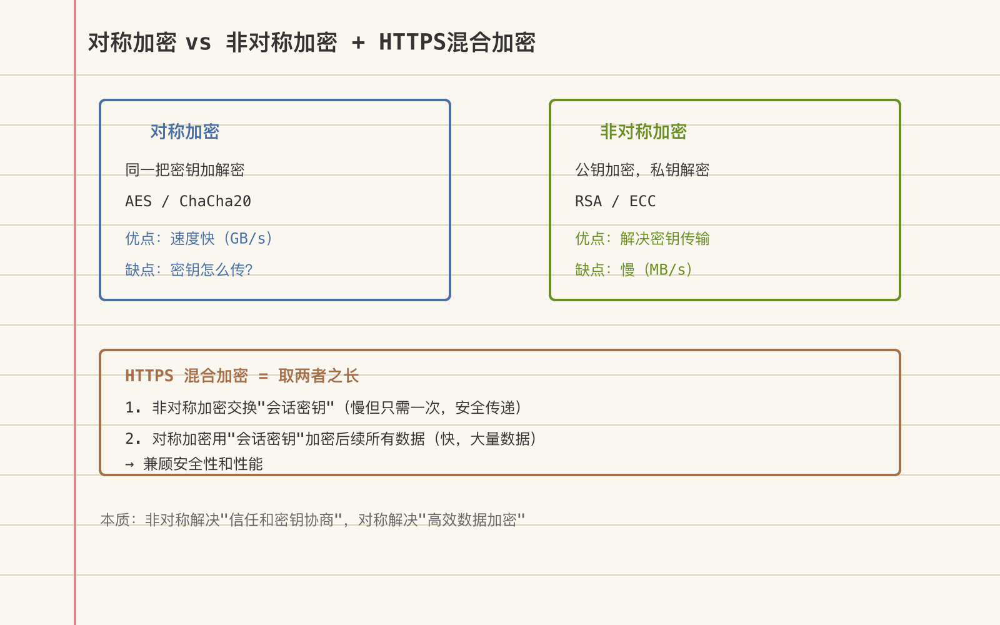

# 对称与非对称加密：混合加密体系的工作原理与分工



---

> 📌 **关注「程序员臻叔」，获取更多硬核技术干货**


---

如果非对称加密（RSA/ECC）能安全地加密数据，为什么TLS不直接用它加密所有流量？

因为非对称加密比对称加密慢1000倍。加密1MB数据，AES需要0.5毫秒，RSA需要500毫秒。一个HTTPS页面包含几十个请求、几MB数据，如果全用RSA加密，每次页面加载要多等几秒。

TLS的聪明之处在于：用非对称加密只做一件事——安全地交换一个对称密钥。之后所有数据传输都用对称加密。两种加密各取所长，非对称管安全（密钥分发），对称管性能（数据加密）。

## 核心结论

1. **对称加密快但密钥分发难**：双方共享同一密钥，怎么安全传给对方是核心难题
2. **非对称加密解决了密钥分发**：公钥加密私钥解密，公钥可公开
3. **TLS的混合策略**：非对称协商对称密钥 → 对称加密数据
4. **前向安全性（Forward Secrecy）**——即使长期私钥泄露，过去的通信也无法解密
5. **ECC正在替代RSA**：同样安全级别下，ECC密钥更短、运算更快

## 深度拆解

### 对称加密：一把钥匙开锁

```
加密: ciphertext = encrypt(plaintext, key)
解密: plaintext = decrypt(ciphertext, key)
```

**特点**：
- 加密解密用同一个密钥
- 速度快（AES硬件加速后可达Gbps级）
- 适合加密大量数据
- 核心问题：**密钥怎么安全地传给对方？**

**常见算法**：

| 算法 | 密钥长度 | 速度 | 安全性 | 模式 |
|------|---------|------|--------|------|
| AES-128 | 128bit | 极快 | 安全 | GCM推荐 |
| AES-256 | 256bit | 快 | 很安全 | GCM推荐 |
| ChaCha20 | 256bit | 快(无AES-NI时更快) | 安全 | Poly1305 |

**AES的GCM模式**：同时提供加密+完整性校验。如果密文被篡改一个bit，解密时GCM标签校验失败，拒绝解密。旧的CBC模式不提供完整性校验，容易遭受填充 oracle 攻击。

### 非对称加密：两把钥匙

```
加密: ciphertext = encrypt(plaintext, public_key)
解密: plaintext = decrypt(ciphertext, private_key)

签名: signature = sign(message, private_key)
验证: verify(message, signature, public_key)
```

**特点**：
- 公钥可以公开，私钥必须保密
- 解决了密钥分发问题
- 速度慢（比对称加密慢100-1000倍）
- 不适合加密大量数据（RSA有数据长度限制：密钥长度-padding）

**RSA vs ECC**：

| 维度 | RSA-2048 | ECC-256 |
|------|----------|---------|
| 安全强度 | 112bit | 128bit |
| 密钥长度 | 2048bit | 256bit |
| 签名速度 | 慢 | 快3-5倍 |
| 验证速度 | 快 | 慢 |
| 密钥交换速度 | 慢 | 快 |
| TLS握手开销 | 大 | 小 |

ECC用更短的密钥达到更高的安全级别。现代TLS 1.3优先使用ECDHE（椭圆曲线Diffie-Hellman临时密钥交换）。

### TLS握手的混合加密

**TLS 1.2 握手流程**（简化）：
```
1. Client Hello: 客户端发送支持的加密套件列表 + 随机数A
2. Server Hello: 服务器选择加密套件 + 随机数B + 服务器证书(含公钥)
3. 客户端验证证书 (证书链验证, )
4. 客户端生成Pre-Master Secret, 用服务器公钥加密发送
5. 双方用 随机数A + 随机数B + Pre-Master Secret 计算 Master Secret
6. 双方用 Master Secret 生成对称会话密钥
7. 之后所有数据用对称加密 (AES-GCM)
```

**TLS 1.3 的改进**：
```
1. 简化握手: 2-RTT → 1-RTT (减少一个往返)
2. 强制前向安全: 只允许ECDHE, 不允许RSA密钥交换
3. 废弃弱算法: 移除RC4, DES, 3DES, MD5, SHA-1
4. 加密更多握手: Server Hello之后的内容也加密 (防指纹)
5. 0-RTT恢复: 之前连过的服务器可以0延迟恢复 (但牺牲前向安全)

核心变化:
  TLS 1.2: 客户端生成Pre-Master → 用RSA公钥加密 → 服务器RSA私钥解密
  → 如果RSA私钥泄露 → 所有历史通信可解密 (无前向安全)
  
  TLS 1.3: 双方用ECDHE生成临时密钥对 → 协商出共享密钥
  → 临时密钥对用完即弃 → 私钥泄露无法解密历史通信 (前向安全)
```

### 前向安全性（Forward Secrecy）

```
没有前向安全 (RSA密钥交换):
  时间T1: 客户端用服务器公钥加密Pre-Master → 通信
  时间T2: 服务器RSA私钥泄露
  时间T3: 攻击者用泄露的私钥解密T1时截获的通信 → 历史数据暴露
  
  问题: 攻击者可以先录所有加密流量, 等私钥泄露后再解密

有前向安全 (ECDHE密钥交换):
  时间T1: 双方生成临时ECDHE密钥对 → 协商共享密钥 → 通信 → 用完丢弃临时密钥
  时间T2: 服务器长期私钥泄露
  时间T3: 攻击者想解密T1的通信 → 需要T1时的临时ECDHE私钥 → 但已经丢弃了 → 无法解密
  
  效果: 即使长期私钥泄露, 历史通信仍然安全
```

**为什么重要**：斯诺登事件揭示，NSF等机构会大量录制加密流量，等将来密钥泄露或算力提升后再解密。前向安全让"先录制后解密"的策略失效。

### 什么时候用哪种加密

```
场景1: 数据传输 (HTTPS/TLS)
  → 混合: 非对称协商密钥 + 对称加密数据

场景2: 文件加密 (加密存储)
  → 对称: AES-256加密文件, 密钥用密码派生 (PBKDF2/Argon2)

场景3: 数字签名 (代码签名/合同签名)
  → 非对称: 用私钥签名, 公钥验证

场景4: 邮件加密 (PGP/GPG)
  → 混合: 随机生成对称密钥加密邮件内容 + 用收件人公钥加密对称密钥

场景5: 聊天加密 (Signal协议)
  → 混合: X3DH密钥协商 (非对称) + Double Ratchet (对称+前向安全)
  → 每条消息用不同的密钥, 用完丢弃

场景6: API认证 (JWT)
  → 非对称: 服务器用私钥签JWT, 验证方用公钥验签
  → 或对称: HMAC-SHA256, 双方共享密钥

场景7: 数据库字段加密
  → 对称: AES加密敏感字段, 密钥存在KMS中
```

## 实战要点

### 工程落地

**TLS配置最佳实践**：
```nginx
# Nginx TLS 1.3 配置
ssl_protocols TLSv1.3;                    # 只用TLS 1.3
ssl_prefer_server_ciphers off;            # TLS 1.3忽略此项
# TLS 1.3 cipher suites由协议自动选择

# 如果需要兼容TLS 1.2:
ssl_protocols TLSv1.2 TLSv1.3;
ssl_ciphers 'ECDHE-ECDSA-AES256-GCM-SHA384:ECDHE-RSA-AES256-GCM-SHA384';
# 只用ECDHE (前向安全), 只用GCM (完整性), 只用AES-256

# HSTS: 强制HTTPS
add_header Strict-Transport-Security "max-age=63072000" always;
```

**密钥管理（KMS）**：
```
对称密钥不能硬编码在代码或配置文件中:
  → 密钥存在KMS (Key Management Service) 中
  → 应用启动时从KMS获取密钥
  → 密钥定期轮转 (如每90天)
  → KMS本身用HSM (硬件安全模块) 保护

云服务:
  AWS KMS / Google Cloud KMS / Azure Key Vault
  → 密钥永远不出KMS, 加密解密在KMS内完成
  → 应用调用KMS API, 传入明文/密文, KMS返回结果
```

### 臻叔踩坑笔记

1. **用RSA加密大数据**：RSA-2048最多加密245字节。大数据必须用对称加密，RSA只加密对称密钥
2. **AES用ECB模式**——ECB模式相同明文产生相同密文，模式泄露。必须用GCM或CBC+HMAC
3. **没有前向安全**：TLS配置用了RSA密钥交换（非ECDHE），私钥泄露后历史通信可解密。强制ECDHE
4. **密钥硬编码在代码里**。代码泄露=密钥泄露。密钥必须从KMS或环境变量获取
5. **密钥不轮转**：同一个密钥用3年，泄露窗口期太长。应该定期轮转，旧密钥解密旧数据，新密钥加密新数据

### 一句话总结

对称加密快但密钥分发难，非对称加密安全但慢。TLS的混合策略用非对称协商对称密钥、用对称加密数据，ECDHE提供前向安全让"先录制后解密"失效，现代趋势是ECC替代RSA、TLS 1.3替代1.2。

---

### 🎯 觉得有帮助？关注「程序员臻叔」


---
