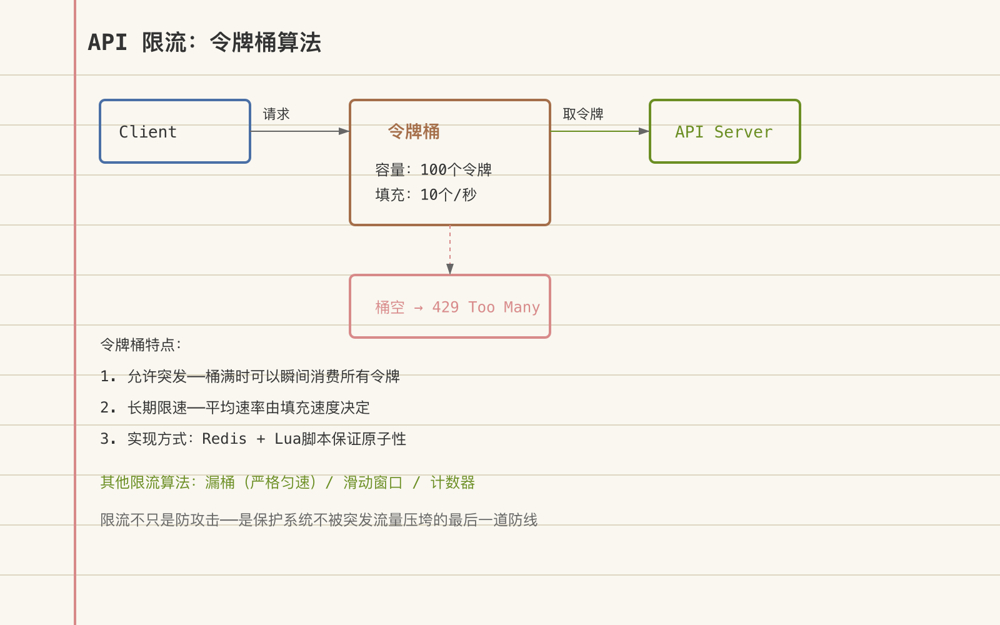

# 接口防刷系统设计：限流算法与风控规则引擎



---

> 📌 **关注「程序员臻叔」，获取更多硬核技术干货**


---

你做了一个免费天气查询API。上线第一天，有人写了个脚本每秒请求10000次，把服务器打挂了。你加了IP限流，对方换了代理IP池继续爬。你加了登录限制，对方注册了1000个账号轮流调。你加了设备指纹，对方用无头浏览器改Canvas指纹绕过。

接口防刷不止加一道限流那么简单。它是一个多层防御体系，在IP层、业务层、数据层分别布防，让对方绕过一层的成本远高于收益。

## 核心结论

1. **防刷是多层策略组合**：IP限流 → 身份识别 → 行为分析 → 成本对抗
2. **单层限流必被绕过**：IP池绕IP限制、多账号绕账号限制、设备指纹伪造绕设备限制
3. **限流算法四种**：固定窗口、滑动窗口、令牌桶、漏桶，各有适用场景
4. **最高境界是成本不对称**——让攻击成本（时间/金钱/算力）远高于收益
5. **防刷要分层但不冗余**：每层负责不同维度，IP层管频率，业务层管行为，数据层管异常

## 深度拆解

### 第一层：网络层——IP频率限制

**四种限流算法**：

```
1. 固定窗口 (Fixed Window)
   每60秒重置计数器，窗口内允许N次请求
   问题: 窗口边界突刺 — 59秒发N次 + 61秒发N次 = 2秒内2N次

2. 滑动窗口 (Sliding Window)
   统计最近60秒内的请求数
   解决了边界突刺，但需要记录每次请求时间

3. 令牌桶 (Token Bucket)
   桶容量N, 以R速率补充令牌, 每次请求消耗1个令牌
   特点: 允许突发(桶满时可以瞬间发N个), 但长期平均不超过R
   适合: 允许短时突发但限制平均速率的场景

4. 漏桶 (Leaky Bucket)
   请求先入桶, 以固定速率R从桶底流出处理
   特点: 严格平滑输出, 不允许突发
   适合: 保护下游系统（如数据库）不被突发请求打挂
```

**Redis实现滑动窗口限流**：
```python
import redis
import time

r = redis.Redis()

def rate_limit(key, max_requests, window_seconds):
    now = time.time()
    pipe = r.pipeline()
    
    # 移除窗口外的请求记录
    pipe.zremrangebyscore(key, 0, now - window_seconds)
    # 添加当前请求
    pipe.zadd(key, {str(now): now})
    # 统计窗口内请求数
    pipe.zcard(key)
    # 设置key过期时间
    pipe.expire(key, window_seconds)
    
    results = pipe.execute()
    count = results[2]
    
    if count > max_requests:
        return False  # 限流
    return True  # 放行

# 使用: 每IP每秒最多10次
if not rate_limit(f"rate:ip:{client_ip}", 10, 1):
    return 429  # Too Many Requests
```

**IP限流的局限**：
- 攻击者用代理IP池（1000个IP），每个IP限10次/秒 = 总共10000次/秒
- 公共NAT出口（公司、校园）下大量正常用户共用一个IP，限流会误杀
- IPv6地址空间巨大（2^128），IP限流几乎无效

### 第二层：业务层——身份+行为分析

**API Key / Token限流**：
```
每个调用者分配唯一API Key
按Key限流: 每个Key每分钟100次
按等级限流: 免费版100次/天, 付费版10000次/天

优势: IP变了不影响限流
劣势: 攻击者注册多个账号轮流用
```

**设备指纹识别**：
```
采集维度:
  - Canvas指纹 (浏览器渲染差异)
  - WebGL指纹 (GPU信息)
  - 字体列表 (安装的字体集合)
  - AudioContext指纹 (音频处理差异)
  - 屏幕参数 (分辨率+色深+刷新率)
  
组合唯一性: 5个维度组合 → 同一设备的概率 > 99%

按设备限流: 同一设备指纹每分钟最多10次
对抗: 无头浏览器可以修改这些指纹
     → 检测指纹一致性（如果Canvas指纹变了但WebGL没变 → 异常）
```

**行为模式分析**：
```
正常用户行为:
  - 请求间隔不均匀（0.5s, 3s, 1s, 8s...）
  - 请求路径有逻辑（先查列表再查详情）
  - 有页面交互（滚动、点击）
  - User-Agent与设备指纹一致

脚本行为:
  - 请求间隔精确（每0.1秒一次）
  - 只调数据接口，不加载静态资源
  - 请求路径过于规律（按ID顺序遍历）
  - User-Agent与指纹不一致（声称Chrome但行为像curl）
```

### 第三层：数据层——异常检测

```
监控指标:
  - 单用户下单频率: 正常<5次/天, 异常>50次/天
  - 单用户查询深度: 正常看3-5页, 异常翻到第100页
  - 数据访问覆盖率: 正常访问10%的商品, 异常遍历100%
  - 请求成功率: 正常>95%, 攻击者试错可能<30%
  - 响应时间分布: 正常集中在50-200ms, 攻击者可能集中在极快或极慢

检测策略:
  实时统计 → 超过阈值 → 触发告警 → 自动降级或拦截
  离线分析 → 发现新模式 → 更新规则引擎
```

### 成本不对称设计

**让攻击不划算**：
```
策略1: 每次API调用消耗积分
  → 攻击者需要注册大量账号获取积分
  → 注册需要手机验证 + 设备指纹 + 行为验证
  → 注册成本 > 数据价值 → 放弃

策略2: 高频调用降级返回
  → 前100次返回完整数据
  → 101-1000次返回部分数据（去掉敏感字段）
  → 1000+次返回缓存数据或空结果
  → 攻击者爬到的是低价值数据

策略3: 蜜罐响应
  → 检测到爬虫行为后，返回假数据（带水印）
  → 攻击者不知道哪些是真数据哪些是假数据
  → 如果假数据出现在竞品网站上 → 确认攻击者身份

策略4: 验证码升级
  → 低频: 无验证
  → 中频: 滑块验证
  → 高频: 图像选择 + 短信验证
  → 极高频: 直接封禁
```

### 全局限流 vs 分布式限流

```
单机限流: 
  本地内存计数器, 简单快
  问题: 多台服务器各自计数, 总量可能超标

分布式限流:
  用Redis/etcd做全局计数器
  所有服务器共享计数
  问题: Redis是单点, 网络延迟

折中方案: 本地预分配 + 定期同步
  每台服务器预分配100次/秒的配额
  本地计数, 每秒同步到中心
  中心动态调整配额
```

## 实战要点

### 工程落地

**限流响应规范**：
```json
// HTTP 429 Too Many Requests
{
  "error": "RATE_LIMITED",
  "message": "请求过于频繁，请稍后再试",
  "retry_after": 60,  // 建议等待秒数
  "limit": 100,       // 总配额
  "remaining": 0,     // 剩余配额
  "reset_at": 1234567890  // 重置时间
}
```

**响应头**：
```
X-RateLimit-Limit: 100
X-RateLimit-Remaining: 0
X-RateLimit-Reset: 60
Retry-After: 60
```

**多级限流配置**：
```yaml
rate_limit:
  global:           # 全局限流
    qps: 10000
  per_ip:           # 单IP限流
    qps: 100
    daily: 10000
  per_user:         # 单用户限流
    qps: 10
    daily: 1000
  per_api:          # 单接口限流
    /api/search:
      qps: 5        # 搜索接口更严格
    /api/export:
      daily: 10     # 导出接口极严格
```

### 臻叔踩坑笔记

1. **只限IP不限身份**：攻击者换IP就绕过。IP是第一道防线不是唯一防线，必须叠加API Key/设备指纹/用户ID维度
2. **限流不返回Retry-After**——用户不知道等多久，反复重试加重负载。429响应必须包含Retry-After头
3. **限流策略全局限流**：一个恶意用户把全局限流打满，所有正常用户都被限流。应该按用户/Key维度限流，不是全局
4. **异步接口不限流**。同步接口限了，但异步回调/ webhook没限。攻击者大量触发回调打挂下游。所有入口都要限流
5. **降级策略缺失**：限流后直接返回429，用户体验差。应该有降级方案：返回缓存数据、返回部分结果、排队等待

### 一句话总结

接口防刷是三层纵深：IP层管频率（令牌桶/滑动窗口），业务层管身份和行为（设备指纹+模式分析），数据层管异常检测，终极目标是让攻击成本远高于收益。

---

### 🎯 觉得有帮助？关注「程序员臻叔」


---
