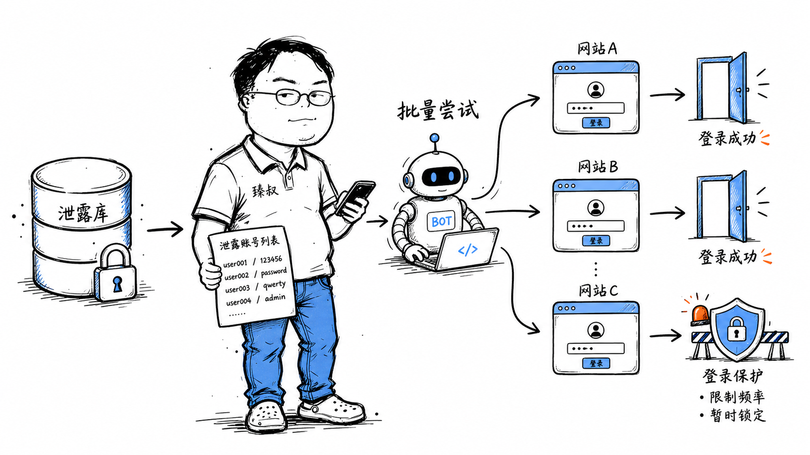

# 撞库——你在A站的密码，正在被试B站的锁




某天你收到一条短信："您的XX邮箱在异地登录，如非本人操作请立即修改密码。"你很困惑——这个邮箱你用了10年，密码从没告诉过任何人。

真相是：你3年前注册过一个小论坛，用了和邮箱一样的密码。那个论坛去年被拖库了，你的邮箱+密码在暗网以0.01元/条的价格被公开售卖。攻击者拿着这组邮箱+密码，用脚本在全网几百个网站上批量尝试登录——邮箱、网银、微博、云盘。只要有一个网站你没改密码，攻击者就进去了。

这就是撞库——不是攻击你的安全措施，而是攻击你复用密码的习惯。

## 核心结论

1. **撞库利用密码复用**——不是暴力破解，是拿着已泄露的账号密码去试其他网站
2. **成功率惊人**——约30%用户在多个网站使用相同密码
3. **防御是双向的**：平台侧检测异常登录 + 用户侧用密码管理器
4. **密码泄露是不可逆的**——一旦泄露，永远在暗网流传
5. **密码管理器是终极解法**——每个网站唯一强密码，一个被泄露不影响其他

## 深度拆解

### 撞库的完整攻击链

```
阶段1: 获取泄露数据
  来源:
    - 暗网市场购买 "combo列表" (邮箱+密码对)
    - 公开泄露数据库 (如 Have I Been Pwned 收录的)
    - 自己拖库获取
  
  成本: 几十元到几百元/百万条
  
  数据质量:
    - 明文密码: 最有价值（约10%的泄露是明文）
    - MD5哈希: 需要先破解（彩虹表/暴力破解）
    - bcrypt哈希: 几乎无法批量破解

阶段2: 批量登录尝试
  工具: 自动化脚本 + 代理IP池 + 多线程
  
  策略:
    - 一个账号在每个目标网站试1次（避免触发限流）
    - 用不同IP发请求（绕过IP限制）
    - 模拟正常浏览器行为（绕过WAF）
    - 控制请求频率（避免触发风控）
  
  目标网站:
    - 邮箱 (QQ/Gmail/Outlook) → 控制邮箱后可重置其他账号
    - 银行/支付 → 直接资金损失
    - 社交媒体 → 发垃圾广告/钓鱼
    - 云盘 → 窃取文件
    - 电商平台 → 盗刷

阶段3: 成功登录后的利用
  邮箱: 搜索"密码""账号""银行卡"等关键词 → 发现更多账号信息
  交易所: 直接提币（不可逆）
  电商: 用余额消费/绑定新银行卡
  社交: 发钓鱼链接给好友（好友信任度高→二次传播）
```

### 为什么撞库成功率这么高

```
统计数据:
  - 65%的用户在多个网站使用相同密码
  - 其中30%在所有网站用同一个密码
  - 平均每个用户注册了90个在线账号
  - 但只记住5-7个密码

撞库成功率:
  如果A站泄露了100万组账号密码
  其中30万组在B站也能登录
  → 成功率30%
  → 100万条数据 → 30万个B站账号被攻破
```

人类记忆的限制是密码复用的根源——人脑记不住90个不同的强密码。这是系统设计问题，不是用户偷懒问题。

### 平台侧防御

**异常登录检测**：
```
检测维度:
  1. 同一IP短时间内尝试大量不同账号
     → 正常: 一个IP登录5个账号（家庭/公司）
     → 异常: 一个IP1分钟内登录500个不同账号
  
  2. 登录成功率异常
     → 正常: 登录成功率>90%
     → 撞库: 登录成功率<5%（大量失败尝试）
  
  3. 登录地理突变
     → 正常: 用户在北京登录
     → 异常: 10分钟后同一账号在境外登录
  
  4. 设备指纹突变
     → 正常: 用户用同一台手机/电脑
     → 异常: 新设备 + 多个不同账号登录

处置策略:
  检测到异常 → 要求二次验证 (短信/TOTP/验证码)
  确认攻击 → 批量强制重置可能受影响用户的密码
  通知用户 → "您的账号可能在其他网站泄露, 建议修改密码"
```

**密码泄露检测**：
```
利用 Have I Been Pwned API (k-anonymity协议):
  1. 用户输入密码
  2. 客户端计算 SHA-1(password)
  3. 取前5个字符: "AB23D"
  4. 发给HIBP API: GET https://api.pwnedpasswords.com/range/AB23D
  5. API返回所有以AB23D开头的哈希后缀+出现次数
  6. 客户端检查完整哈希是否在返回列表中
  
  优势: 用户的完整密码哈希永远不出客户端
  如果发现密码在泄露库中 → 注册时拒绝/提醒修改
```

**登录限流**：
```
策略:
  - 单IP: 10次失败/小时 → 加验证码
  - 单账号: 5次失败/小时 → 临时锁定
  - 全局: 登录成功率<50% → 全站加验证码
  
问题: 撞库攻击者用IP池 + 每账号只试1次 → 绕过单IP/单账号限流
解决: 全局成功率监控 + 设备指纹聚类
```

### 用户侧防御：密码管理器

```
密码管理器的工作方式:
  1. 一个主密码保护所有其他密码 (加密存储)
  2. 每个网站自动生成随机强密码 (如 x9#K$mP2!vL8)
  3. 自动填充, 用户不需要记忆
  4. 跨设备同步 (加密后同步到云端)

主流选择:
  - Bitwarden: 开源, 免费版功能足够
  - 1Password: 付费, 体验好, 支持多因素认证
  - KeePass: 纯本地, 适合安全偏执狂
  - 浏览器内置: Chrome/Firefox/Safari 密码管理器

效果:
  → 每个网站唯一密码, 互不影响
  → A站泄露不影响B站
  → 自动生成强密码, 暴力破解不可行
  → 撞库攻击完全失效
```

### 撞库 vs 暴力破解的区别

| 维度 | 撞库 | 暴力破解 |
|------|------|---------|
| 攻击对象 | 其他网站 | 目标网站本身 |
| 密码来源 | 已泄露数据库 | 穷举所有可能 |
| 成功率 | 30%+ | 取决于密码强度 |
| 速度 | 快（只需试1次/账号） | 慢（需要试大量组合） |
| 防御 | 异常登录检测+密码管理器 | 慢哈希+登录限流 |
| 触发条件 | A站被拖库 | 无（随时可发起） |

## 实战要点

### 工程落地

**登录异常检测系统**：
```python
# 检测规则
def check_login_anomaly(user_id, ip, device_fingerprint, success):
    # 1. IP-账号交叉检测
    ip_account_count = redis.get(f"ip_accounts:{ip}")  # 该IP试了多少个账号
    if ip_account_count > 10:
        return "CHALLENGE"  # 要求验证码
    
    # 2. 登录成功率
    if not success:
        fail_count = redis.incr(f"fail_count:{ip}")
        if fail_count > 10:
            redis.expire(f"fail_count:{ip}", 3600)
            return "BLOCK_IP"
    
    # 3. 地理突变
    last_login = get_last_login(user_id)
    if last_login and geo_distance(last_login.location, current_location) > 1000:
        if time_since_last_login < 2:  # 2小时内跨1000km
            return "REQUIRE_MFA"
    
    return "PASS"
```

**强制密码策略**：
```
注册/改密码时:
  1. 检查密码是否在已知泄露库中 (HIBP API)
  2. 检查密码是否与用户其他信息相似 (不能用用户名+123)
  3. 最少12位 (NIST建议)
  4. 不强制复杂度规则 (用户会写password123!@#)
```

### 臻叔踩坑笔记

1. **登录失败只限单账号**——攻击者每账号只试1次，不会触发"5次失败锁定"。必须监控单IP的跨账号尝试次数
2. **不检测密码泄露**——用户用了已在暗网泄露的密码，系统不提醒。注册和改密码时应该检查HIBP
3. **异地登录不验证**——用户突然在境外登录，直接放行。地理突变应该触发MFA验证
4. **密码重置只用短信**——撞库成功后攻击者重置密码，只验短信就过了。重置密码应该多因素验证
5. **不通知用户异常登录**——被撞库成功了用户不知道。应该推送通知"您的账号在XX设备登录"，让用户及时处理

### 一句话总结

撞库利用的是密码复用——一个网站泄露牵连所有用相同密码的网站，防御靠平台异常检测+密码泄露检查+用户密码管理器，每个网站唯一密码是终极解法。
