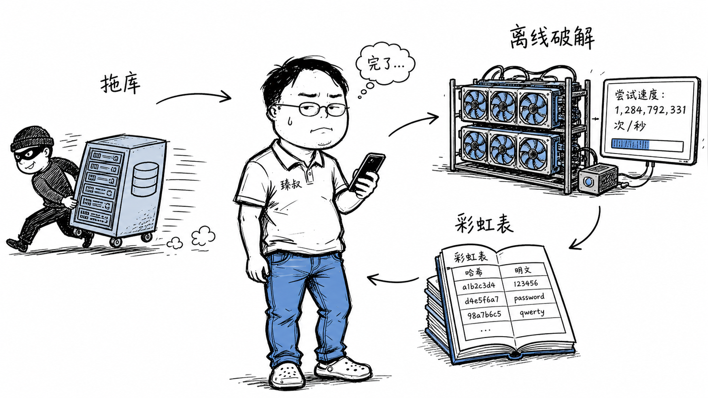

# 数据泄露分析：拖库后数据的利用链路与防护措施



---

> 📌 **关注「程序员臻叔」，获取更多硬核技术干货**


---

你三年前注册了一个小论坛，用了常用的邮箱+密码。那个论坛早就倒闭了，你也忘了它的存在。

但你的数据没忘。去年它在暗网被卖了一次，今年又被整合进了一个更大的"社工库"。你的邮箱+密码+手机号+身份证号，现在在几十个攻击者手里。他们不急着用——这些信息可以慢慢消化。

某天你收到一封邮件："我们知道您的密码是xxxxx，我们入侵了您的摄像头录下了您的私密视频，请向以下地址转账0.5比特币。"邮件里的密码是对的。你慌了。

这就是数据泄露的长尾效应——泄露是一瞬间的事，但影响可能持续十年。

## 核心结论

1. **数字信息泄露是不可逆的**：可以无限复制，无法追回所有副本
2. **影响持续多年**，个人信息不变（姓名/身份证/手机号），密码复用导致连锁泄露
3. **数据整合放大危害**：多个泄露源交叉关联，形成完整个人画像
4. **防御是双向的**：平台侧最小化收集+加密存储，用户侧密码管理器+MFA
5. **泄露后响应比预防更紧急**——止损、通知、加固、监控，48小时黄金窗口

## 深度拆解

### 泄露后数据的生命周期

```
T+0: 数据被拖走
  → 攻击者拿到数据库副本
  → 数据可能在暗网标价出售
  
T+1天~T+7天: 竞价期
  → 独家买家高价购买 (价值最高)
  → 同时可能被勒索 (攻击者威胁公开)

T+1周~T+1月: 扩散期
  → 没有买家 → 降价 → 公开免费释放
  → 数据出现在各种"社工库"中
  → 开始被用于: 撞库攻击、钓鱼、诈骗

T+3月~T+1年: 整合期
  → 多个泄露源被整合
  → "你的邮箱在A站的密码 + B站的手机号 + C站的身份证号" → 完整画像
  → 社工库搜索: 输入邮箱 → 返回所有关联信息

T+1年~T+10年: 长尾期
  → 数据持续在暗网流通
  → 新的攻击者获得数据 → 发起新一轮攻击
  → 你的身份证号永远不变 → 信息永远有效
  → 即使你改了所有密码 → 身份信息仍然可被用于社工攻击
```

### 数据整合的威力

单个泄露源的危害有限。但当多个泄露源被整合后，危害指数级放大：

```
泄露源A (小论坛, 2019年):
  邮箱: zhangsan@qq.com
  密码: abc123456
  
泄露源B (电商平台, 2020年):
  邮箱: zhangsan@qq.com
  手机: 138xxxx1234
  地址: 北京市朝阳区xx路xx号
  
泄露源C (外卖平台, 2021年):
  手机: 138xxxx1234
  姓名: 张三
  身份证: 110xxx19900101xxxx
  
泄露源D (快递信息, 2022年):
  手机: 138xxxx1234
  地址: 北京市朝阳区xx路xx号
  消费记录: 经常买电子产品

整合后的完整画像:
  姓名: 张三
  身份证: 110xxx19900101xxxx
  手机: 138xxxx1234
  邮箱: zhangsan@qq.com
  地址: 北京市朝阳区xx路xx号
  常用密码: abc123456 (如果没改)
  消费习惯: 电子产品
  社交关系: (通过通讯录泄露关联)
  
攻击方式:
  1. 撞库: 用邮箱+密码试银行/交易所/邮箱
  2. 钓鱼: "您的快递丢失, 点击领取理赔" (知道你的购物习惯)
  3. 社工: 打电话给客服 "我是张三, 身份证号110xxx..." (通过身份验证)
  4. 精准诈骗: "张先生, 您在XX购买的商品有质量问题, 我们退款给您" (知道消费记录)
  5. 身份盗用: 用你的身份信息注册新账号/贷款
```

### 密码泄露的连锁反应

```
场景: 你在A站用了密码 Pa, 在B站也用了 Pa

T1: A站被拖库 → Pa泄露
T2: 攻击者用 Pa 试B站 → 登录成功
T3: B站绑定邮箱 → 攻击者进入邮箱
T4: 邮箱里有"忘记密码"的邮件 → 攻击者重置C/D/E站的密码
T5: C站是云盘 → 攻击者下载你的所有文件
T6: D站是交易所 → 攻击者提走所有加密货币
T7: E站是社交 → 攻击者向你的好友发钓鱼链接

连锁反应: 一个密码泄露 → 全盘沦陷
关键节点: 邮箱 → 邮箱是所有账号的"重置入口"
→ 保护邮箱 = 保护所有账号的最后一道防线
```

### 泄露后的应急响应

**48小时黄金窗口**：

```
T+1小时: 确认泄露范围
  → 哪些数据泄露了? (密码/手机号/身份证/银行卡?)
  → 多少用户受影响?
  → 泄露入口是什么? (SQL注入? 内鬼? 第三方供应商?)

T+4小时: 紧急止损
  → 关闭泄露入口 (修复漏洞/切断访问)
  → 重置受影响用户的密码 (强制下次登录改密码)
  → 吊销泄露的Token/Session
  → 冻结可疑账号
  → 通知安全团队和法务

T+24小时: 通知和合规
  → 按法规通知监管部门 (GDPR 72小时内, 个人信息保护法及时通知)
  → 通知受影响用户 (告知泄露了什么数据、建议改密码、开启MFA)
  → 准备公关声明

T+48小时: 加固和监控
  → 安全审计 (找还有没有其他漏洞)
  → 加强数据库访问控制
  → 加密敏感字段 (如果之前没做)
  → 暗网监控 (追踪泄露数据的流通)
  → 异常登录监控 (防范撞库攻击)
```

### 预防：最小化数据收集

```
原则: 不收集的数据不会泄露

数据分级:
  L1 (公开): 用户名、昵称、头像 → 不需要加密
  L2 (敏感): 邮箱、手机号 → 加密存储 + 访问审计
  L3 (高敏感): 身份证号、银行卡号 → 加密 + 脱敏显示 + 严格权限
  L4 (极敏感): 密码 → 慢哈希 (Argon2id)

最小化收集:
  → 注册时只收集必要信息 (邮箱+密码就够)
  → 不强制填手机号/身份证 (除非法律要求)
  → 历史数据定期清理 (不活跃用户的数据定期删除)
  → 测试环境用脱敏数据 (不要用真实用户数据做测试)

数据脱敏:
  手机号: 138****1234
  身份证: 110***********0011
  邮箱: z***n@qq.com
  银行卡: 6222 **** **** 1234
```

### 用户个人能做什么

```
1. 密码管理器 (最重要的措施)
   → 每个网站唯一强密码
   → 一个泄露不影响其他
   → 推荐Bitwarden/1Password

2. 开启MFA
   → 重要账号 (邮箱/银行/交易所) 必须开MFA
   → TOTP优于短信 (防SIM Swap)
   → 硬件密钥 (YubiKey) 最强

3. 检查是否已泄露
   → 访问 haveibeenpwned.com 输入邮箱
   → 看看在哪些泄露事件中出现
   → 出现过 → 改那个网站的密码

4. 邮箱安全
   → 邮箱是所有账号的"重置入口"
   → 邮箱用独立强密码 + 硬件密钥MFA
   → 开启"新设备登录通知"

5. 信用监控
   → 定期查个人征信报告
   → 发现不明贷款/信用卡 → 可能身份被盗用
   → 发现异常 → 立即冻结信用
```

## 实战要点

### 工程落地

**数据库加密设计**：
```python
from cryptography.fernet import Fernet

# 敏感字段加密 (字段级加密)
class User(db.Model):
    id = db.Column(db.Integer, primary_key=True)
    email = db.Column(db.String(255))  # 索引需要, 不加密
    phone_encrypted = db.Column(db.LargeBinary)  # 加密存储
    id_card_encrypted = db.Column(db.LargeBinary)  # 加密存储
    
    @property
    def phone(self):
        return fernet.decrypt(self.phone_encrypted).decode()
    
    @phone.setter
    def phone(self, value):
        self.phone_encrypted = fernet.encrypt(value.encode())
```

**访问审计**：
```
所有敏感数据访问记录日志:
  who: 哪个员工/服务
  when: 什么时间
  what: 访问了什么数据
  how: 通过什么接口
  result: 返回了什么

异常访问检测:
  → 单员工1小时内查询>100条用户数据 → 告警
  → 非工作时间访问敏感数据 → 告警
  → 批量导出操作 → 需要审批
```

### 臻叔踩坑笔记

1. **敏感数据不加密**：手机号/身份证号明文存储，拖库后直接暴露。敏感字段必须加密存储
2. **日志里记录敏感数据**。请求日志、异常堆栈、APM链路追踪都可能记录密码/身份证号。必须在入口层脱敏
3. **测试环境用真实数据**：测试库用了生产数据的副本，测试库安全措施更弱，更容易泄露。测试环境必须用脱敏数据
4. **泄露后不通知用户**——怕影响声誉而隐瞒泄露，违反法规（GDPR罚全球营收4%）。必须及时通知
5. **没有暗网监控**：不知道自己的数据已经在暗网流通。应该订阅暗网监控服务，及时发现泄露

### 一句话总结

数据泄露是不可逆事件：信息一旦泄露就永远存在于暗网，多个泄露源整合后形成完整画像放大危害，预防靠最小化收集+加密存储，应急靠48小时黄金窗口止损，用户靠密码管理器+MFA自保。

---

### 🎯 觉得有帮助？关注「程序员臻叔」


---
