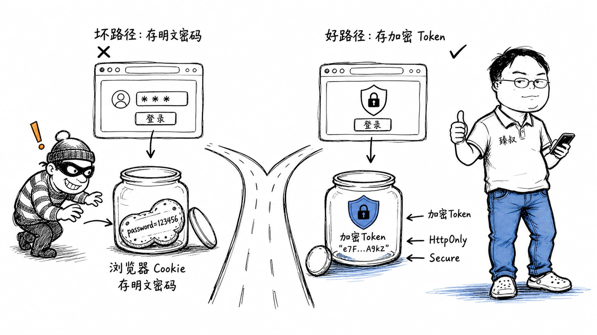

# 自动登录机制：Token存储方案与安全设计



---

> 📌 **关注「程序员臻叔」，获取更多硬核技术干货**


---

你做一个App，产品经理说："用户每次都要输密码太烦了，加个'记住密码'和'自动登录'。"开发说："好，密码存SharedPreferences，Token存localStorage。"

安全团队看完差点背过气去：明文密码存在本地文件里，App被反编译或手机被Root后，密码直接暴露。Token存在localStorage里，一个XSS就能偷走。

"记住密码"和"自动登录"让用户体验极好，但安全极差。这个矛盾怎么解？

## 核心结论

1. **"记住密码"不等于存明文密码**：应该存可刷新的Token，不是密码本身
2. **Token存httpOnly Cookie优于localStorage**：XSS读不到httpOnly Cookie
3. **Refresh Token是核心设计**——短期Access Token + 长期Refresh Token，被盗影响可控
4. **Token旋转+绑定**：每次刷新发新Refresh Token，旧Token失效，绑定设备指纹
5. **安全vs体验没有完美解法**，只能通过多层防护把风险降到可接受范围

## 深度拆解

### 错误做法：明文存密码

```java
// 最危险的写法：密码明文存在本地
SharedPreferences prefs = getSharedPreferences("config", MODE_PRIVATE);
prefs.putString("password", userInputPassword);  // ❌ 明文存储

// 下次自动登录
String savedPassword = prefs.getString("password", "");
login(username, savedPassword);
```

**风险**：
- 手机Root后直接读文件
- App反编译后硬编码的加密密钥暴露
- 备份到iCloud/Google Drive时可能被提取
- 恶意App利用系统漏洞读取其他App的SharedPreferences

### 正确做法：Token机制

**双Token设计**：
```
Access Token:
  - 有效期短（15分钟-1小时）
  - 存在内存中（App运行期间）
  - 每次API请求带上: Authorization: Bearer xxx
  - 泄露影响: 只能在有效期内冒充用户

Refresh Token:
  - 有效期长（7-30天）
  - 存在安全存储中（Keychain/Keystore）
  - 只在Access Token过期时使用
  - 泄露影响: 可以持续获取新Access Token
  - 但: 可以远程吊销
```

```
登录流程:
  1. 用户输入账号密码
  2. 服务器验证 → 返回 access_token + refresh_token
  3. access_token 存内存
  4. refresh_token 存系统安全存储 (iOS Keychain / Android Keystore)
  5. 密码不存储

自动登录流程:
  1. App启动 → 检查内存中有没有有效access_token
  2. 有且未过期 → 直接用，无需登录
  3. 过期了 → 用refresh_token换新的access_token
  4. refresh_token也过期了 → 跳转登录页，需要重新输密码
```

### Token存储位置对比

| 存储位置 | XSS可读 | CSRF风险 | 跨Tab共享 | 推荐度 |
|---------|---------|---------|----------|--------|
| localStorage | ✅ 可读 | 无 | ✅ | ❌ 不推荐 |
| sessionStorage | ✅ 可读 | 无 | ❌ 仅同Tab | ⚠️ 仅短期 |
| httpOnly Cookie | ❌ 不可读 | ✅ 有风险 | ✅ | ✅ 推荐 |
| 内存变量 | ❌ | 无 | ❌ | ✅ Access Token |
| Keychain/Keystore | ❌ | 无 | N/A | ✅ Refresh Token |

**Web应用的推荐方案（BFF模式）**：
```
BFF (Backend For Frontend) 模式:
  浏览器 ←→ BFF后端 ←→ API服务器

  1. BFF后端持有refresh_token (存在后端Session中)
  2. BFF给浏览器发一个httpOnly Cookie (Session ID)
  3. 浏览器请求BFF时自动带Cookie
  4. BFF用Session里的refresh_token去API换access_token
  5. access_token只在BFF后端内存中, 不暴露给浏览器

  优势: refresh_token永远不出后端, XSS偷不到
  劣势: 多了一层BFF, 架构复杂
```

### Refresh Token的安全设计

**Token旋转**（Rotation）：
```
每次用refresh_token换access_token时:
  1. 返回新的access_token + 新的refresh_token
  2. 旧的refresh_token立即失效
  3. 如果旧refresh_token被使用 → 说明可能被盗 → 吊销整个Token族
  
攻击场景:
  攻击者偷了refresh_token (T1)
  正常用户也用T1刷新 → 服务器发T2, T1失效
  攻击者用T1刷新 → T1已失效 → 请求被拒
  → 服务器检测到"已失效的Token被使用" → 吊销T2及整个族
  → 强制用户重新登录
```

**设备绑定**：
```
refresh_token绑定设备指纹:
  - 发Token时记录设备指纹
  - 刷新时验证设备指纹是否匹配
  - 不匹配 → 要求重新登录
  
攻击者偷了Token但没有正确的设备指纹 → 无法使用
```

**Token吊销**：
```
场景: 用户改密码/退出登录/设备丢失
  → 服务器标记该用户的refresh_token为已吊销
  → 即使Token没过期也无法使用

问题: JWT是无状态的, 无法单独吊销
解决: 
  - 维护黑名单 (Redis, 存已吊销的Token ID)
  - 或用有状态Token (服务器端Session)
```

### "记住密码"的正确实现

如果产品非要"记住密码"功能（不是自动登录，是自动填充密码框）：

**Web端**：
```html
<!-- 让浏览器密码管理器处理 -->
<form>
  <input type="password" name="password" autocomplete="current-password">
  <input type="text" name="username" autocomplete="username">
</form>
<!-- 浏览器会提示"保存密码"，存在浏览器加密存储中 -->
```

**App端**：
```
iOS: 使用 keychain 存密码 (加密, 设备绑定)
  → 即使App卸载重装, keychain也可以恢复(如果用户允许)
  
Android: 使用 EncryptedSharedPreferences + Master Key
  → 用Android Keystore生成的密钥加密存储
  → Root设备上也不容易提取
```

```swift
// iOS Keychain存储
let passwordData = password.data(using: .utf8)
let query: [String: Any] = [
    kSecClass as String: kSecClassGenericPassword,
    kSecAttrAccount as String: username,
    kSecValueData as String: passwordData!,
    kSecAttrAccessible as String: kSecAttrAccessibleWhenUnlocked
]
SecItemAdd(query as CFDictionary, nil)
```

### 安全与体验的平衡

```
高安全场景 (银行/支付):
  - Access Token: 5分钟过期
  - Refresh Token: 不存, 每次需要输密码
  - 敏感操作: 生物识别 (指纹/FaceID)
  - 后台切换: 30秒后自动退出

中等安全 (电商/社交):
  - Access Token: 1小时过期
  - Refresh Token: 30天, 存安全存储
  - 自动登录: 支持, 但新设备需要验证
  - 敏感操作: 支付密码或短信验证

低安全 (内容/工具):
  - Access Token: 7天过期
  - Refresh Token: 90天
  - 自动登录: 默认开启
  - 敏感操作: 无额外验证
```

## 实战要点

### 工程落地

**Token过期处理（前端）**：
```javascript
// Axios拦截器: 自动刷新Token
axios.interceptors.response.use(null, async (error) => {
  if (error.response?.status === 401 && !error.config._retry) {
    error.config._retry = true;
    const newToken = await refreshToken();
    if (newToken) {
      error.config.headers.Authorization = `Bearer ${newToken}`;
      return axios(error.config);  // 重发原请求
    }
  }
  return Promise.reject(error);
});
```

**设备变更检测**：
```
用户在新设备登录:
  1. 账号密码验证通过
  2. 检测到新设备指纹 → 发短信验证码
  3. 验证码通过 → 登录成功
  4. 通知用户: "您的新设备已登录"
  5. 如果不是本人 → 一键踢出
```

### 臻叔踩坑笔记

1. **Token存在localStorage**——XSS可以直接读取。Web应用应该用httpOnly Cookie或BFF模式，App应该用Keychain/Keystore
2. **Refresh Token不旋转**：一个Refresh Token用到过期，被盗后可以持续冒充。每次刷新都发新Token，旧Token失效
3. **Token不绑定设备**：Token被盗后在任何设备都能用。绑定设备指纹，异常设备要求额外验证
4. **改密码不吊销Token**。用户改了密码但旧Token还有效。改密码必须吊销所有现有Token，强制重新登录
5. **"记住密码"存明文**：密码明文存在本地文件，手机Root后被直接读取。应该用系统安全存储（Keychain/Keystore）或浏览器密码管理器

### 一句话总结

"记住密码"的正确姿势是存Token不存密码：Access Token短期+Refresh Token长期+Token旋转+设备绑定，安全存储用httpOnly Cookie或Keychain，安全与体验的平衡取决于业务场景。

---

### 🎯 觉得有帮助？关注「程序员臻叔」


---
