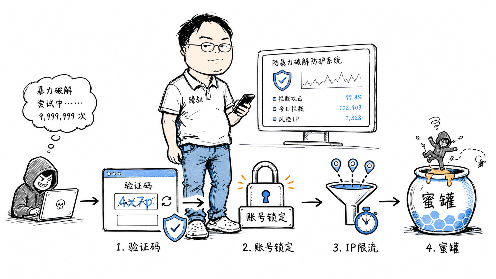

# 登录接口防爆破：频率限制、验证码与账号锁定策略



---

> 📌 **关注「程序员臻叔」，获取更多硬核技术干货**


---

你的登录接口被攻击者盯上了。他用一个包含10000个常见密码的字典，配合1000个代理IP，对100个用户账号同时试密码。每个账号每个IP每小时只试1次——你的IP限流和账号锁定都触发了，但攻击者完美绕过了。

更恶毒的是，他故意用错误密码试别人的账号——如果你的系统"5次失败锁定账号"，攻击者故意试错5次，把真实用户的账号锁了。这不是暴力破解，这是用你的安全策略当武器做DDoS。

防暴力破解看似简单实则暗藏玄机——你要同时防IP池绕过、防账号锁定被武器化、防时序泄露、还要不影响正常用户。

## 核心结论

1. **暴力破解有两种**：密码猜测（试对密码）和账户DDoS（故意试错锁定别人的账号）
2. **单维度限流必被绕过**：IP池绕IP限制，多账号绕账号限制，必须多维度交叉限流
3. **指数退避比硬锁定更优雅**：失败次数越多等待越久，不影响正常用户但让攻击者成本指数增长
4. **时序攻击防不胜防**——密码验证的响应时间差异泄露信息，必须用恒定时间比较
5. **验证码是成本调节器**，不是安全银弹。它的作用是让自动化攻击成本从0.001元升到0.05元

## 深度拆解

### 暴力破解的类型

```
类型1: 密码猜测
  目标: 试出正确密码
  策略: 字典攻击 (用常见密码列表) / 纯暴力 (穷举所有组合)
  特点: 需要大量尝试, 容易被限流检测

类型2: 账户DDoS (Credential Stuffing变体)
  目标: 故意试错把别人的账号锁定
  策略: 对目标账号故意提交错误密码5次 → 触发锁定 → 用户无法登录
  特点: 不需要试出密码, 只需要触发锁定逻辑
  
类型3: 用户名枚举
  目标: 探测哪些用户名存在
  策略: 对大量用户名试同一密码, 根据响应差异判断账号是否存在
  特点: "用户不存在"和"密码错误"的响应不同 → 泄露用户名信息
```

### 多维度限流设计

```
维度1: 单IP限流
  规则: 单IP 10次失败/小时 → 加验证码; 50次/小时 → 封IP 1小时
  绕过: IP池 (1000个IP × 10次 = 10000次/小时)

维度2: 单账号限流
  规则: 单账号 5次失败/小时 → 锁定15分钟
  绕过: 攻击者用100个账号各试5次 (但单账号限流有效防密码猜测)
  风险: 被武器化 (故意试错5次锁定真实用户)

维度3: 全局限流
  规则: 全站登录成功率<30% → 全站加验证码
  作用: 不管攻击者怎么分散IP和账号, 全局成功率低就会触发

维度4: IP-账号交叉检测
  规则: 单IP尝试>5个不同账号 → 可疑
  规则: 单账号被>10个不同IP尝试 → 可疑
  作用: 检测撞库/分布式暴力破解的典型特征

维度5: 设备指纹限流
  规则: 同一设备指纹 10次失败/小时
  绕过: 修改设备指纹 (但有成本)
  作用: 比IP更难绕过
```

### 指数退避：比硬锁定更好的方案

硬锁定的问题：
```
5次失败 → 锁定15分钟
→ 攻击者故意试错5次 → 真实用户被锁15分钟 → 客诉
→ 攻击者换一个账号继续, 真实用户持续受害
```

指数退避的方案：
```
失败次数 → 等待时间
  1次 → 0秒 (正常)
  2次 → 1秒
  3次 → 2秒
  4次 → 4秒
  5次 → 8秒
  6次 → 16秒
  7次 → 32秒
  8次 → 64秒
  9次 → 128秒 (2分钟)
  10次 → 256秒 (4分钟)

实现:
  if fail_count > 0:
      wait_time = 2 ** (fail_count - 1)  # 指数增长
      sleep(wait_time)
  
效果:
  正常用户: 最多输错1-2次, 几乎无感
  攻击者: 试10次密码需要花费8.5分钟
  试100次: 需要数天
  试10000次: 需要数百年
  
  → 不锁定账号, 正常用户不受影响
  → 攻击者成本指数增长
```

**CAPTCHA触发策略**：
```
失败次数 → 处置
  1-2次 → 正常
  3次 → 要求验证码 (降低自动化速度)
  5次 → 指数退避 + 验证码
  10次 → 通知用户 "您的账号可能有异常登录尝试"
  20次 → 要求MFA验证 (TOTP/短信) 才能继续
```

### 防用户名枚举

```python
# 危险: 响应不同泄露用户名是否存在
def login(username, password):
    user = db.find(username)
    if not user:
        return {"error": "用户不存在"}  # ← 泄露: 这个用户名没注册
    if not verify_password(password, user.password_hash):
        return {"error": "密码错误"}  # ← 泄露: 这个用户名注册了
    return {"token": "xxx"}

# 安全: 统一错误信息 + 恒定时间
def login(username, password):
    user = db.find(username)
    if not user:
        # 即使用户不存在, 也执行密码验证的耗时操作
        verify_password(password, DUMMY_HASH)  # 假的哈希, 消耗相同时间
        return {"error": "用户名或密码错误"}  # ← 统一错误信息
    if not verify_password(password, user.password_hash):
        return {"error": "用户名或密码错误"}  # ← 同样的错误信息
    return {"token": "xxx"}
```

**响应时间一致性**：
```
用户存在 + 密码错误: 查DB(1ms) + 验证哈希(50ms) = 51ms
用户不存在: 查DB(1ms) + 验证假哈希(50ms) = 51ms

→ 攻击者无法通过响应时间判断用户是否存在
```

### 防时序攻击

```python
# 危险: 字符串比较提前返回
def verify_token(input_token, stored_token):
    return input_token == stored_token  # 第一个不匹配字符就返回

# 攻击者测量响应时间:
# "AAAA" → 0.001ms (第一个字符就错了)
# "BAAA" → 0.001ms
# ...
# "SAAA" → 0.002ms (第一个字符对了, 比到第二个才发现错)
# → 逐字符猜测Token

# 安全: 恒定时间比较
import hmac
def verify_token(input_token, stored_token):
    return hmac.compare_digest(input_token, stored_token)
    # 无论哪个位置不匹配, 执行时间完全相同
```

### 完整的防暴力破解设计

```
登录接口防御体系:

1. 输入层:
   - 请求体大小限制 (防慢速攻击)
   - JSON格式校验
   - 必填字段检查

2. 频率层:
   - IP限流: 滑动窗口 10次/分钟
   - 账号限流: 指数退避
   - 全局限流: 成功率监控

3. 身份层:
   - 验证码触发 (失败3次后)
   - MFA触发 (失败10次后或新设备)
   - 设备指纹检测

4. 验证层:
   - 恒定时间密码比较
   - 统一错误信息 (防用户名枚举)
   - 假哈希消耗 (用户不存在时也消耗时间)

5. 响应层:
   - 不返回具体失败原因 ("用户名或密码错误")
   - 响应时间恒定
   - 不泄露账号是否存在

6. 监控层:
   - 异常登录告警 (IP/地理/设备突变)
   - 暴力破解检测 (全局失败率飙升)
   - 账户DDoS检测 (单账号被大量IP试错)
```

## 实战要点

### 工程落地

**指数退避实现**：
```python
import redis
import time

r = redis.Redis()

def check_login_rate(username):
    key = f"login_fail:{username}"
    fail_count = int(r.get(key) or 0)
    
    if fail_count >= 3:
        wait_time = 2 ** (fail_count - 2)  # 3次→2s, 4次→4s, 5次→8s...
        last_fail = float(r.get(f"{key}:time") or 0)
        elapsed = time.time() - last_fail
        if elapsed < wait_time:
            return False, wait_time - elapsed  # 需要等待
    
    return True, 0  # 可以尝试

def record_login_fail(username):
    key = f"login_fail:{username}"
    r.incr(key)
    r.expire(key, 3600)  # 1小时后重置
    r.set(f"{key}:time", time.time())
    r.expire(f"{key}:time", 3600)

def record_login_success(username):
    r.delete(f"login_fail:{username}")
    r.delete(f"login_fail:{username}:time")
```

### 臻叔踩坑笔记

1. **硬锁定被武器化**：5次失败锁定15分钟，攻击者故意试错把真实用户锁了。改用指数退避，不锁定只增加延迟
2. **错误信息泄露用户存在性**——"用户不存在"和"密码错误"返回不同信息，攻击者枚举用户名。统一返回"用户名或密码错误"
3. **响应时间泄露信息**：用户存在时验证哈希50ms，不存在时直接返回0ms。用户不存在时也要执行假哈希验证
4. **只限IP不限设备**。IP池绕过IP限流。叠加设备指纹限流，比IP更难绕过
5. **验证码太容易过**：纯文本验证码OCR秒破。至少用滑动验证+轨迹分析，让每次自动化尝试有成本

### 一句话总结

防暴力破解要多维度交叉限流（IP+账号+设备+全局）+ 指数退避（比硬锁定更优雅）+ 恒定时间验证（防时序攻击）+ 统一错误信息（防用户名枚举），同时防密码猜测和账户DDoS两种攻击。

---

### 🎯 觉得有帮助？关注「程序员臻叔」


---
