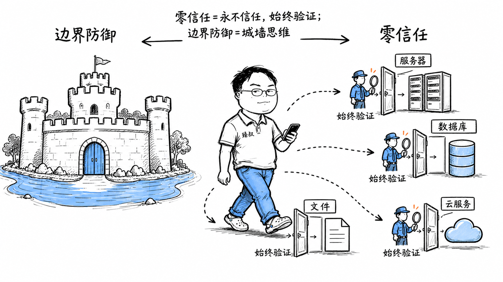

# 零信任与边界防御：安全架构演进与零信任原则



---

> 📌 **关注「程序员臻叔」，获取更多硬核技术干货**


---

2013年，某大型企业内网被入侵。攻击者通过钓鱼邮件让一个员工的电脑中了木马，然后以这台电脑为跳板，在内网横向移动——先攻破了文件服务器，拿到更多凭据；再攻破了域控服务器，控制了整个内网。从第一台电脑被感染到全盘沦陷，只用了72小时。

这家企业花了上千万买的防火墙、IPS、WAF，一道都没拦住。因为攻击者已经在内网了，不是从外网打进来的。传统安全模型假设"外网危险、内网安全"，一旦进了内网就给予较高信任。这个假设是致命的。

Google在2011年遭遇类似攻击后（极光行动），启动了BeyondCorp项目，彻底重构了安全模型：不再区分内外网，每个访问请求都要验证。这就是"零信任"。

## 核心结论

1. **传统边界防御的核心假设是错的**："内网安全"在钓鱼邮件+横向移动面前不堪一击
2. **零信任的核心理念**：永不信任，始终验证，不管你在哪、你是谁
3. **三个支柱**：身份验证（你是谁）、设备验证（设备是否安全）、上下文感知（行为是否正常）
4. **Google BeyondCorp是零信任的标杆实践**：所有访问经过统一代理，基于设备+身份动态授权
5. **零信任是安全架构的全面重构**，不是买一个产品

## 深度拆解

### 传统边界防御模型

```
架构:
  互联网 ←→ 防火墙 ←→ DMZ (Web服务器) ←→ 防火墙 ←→ 内网 (应用+数据库)

信任模型:
  外网 = 不信任
  内网 = 信任 (进了内网就放开权限)
  VPN = 半信任 (从外网VPN进来也给予内网信任)

致命问题:
  1. 边界一旦被突破, 内网畅通无阻
  2. 钓鱼邮件 → 员工电脑中招 → 攻击者获得内网初始据点
  3. 横向移动 → 利用内网信任逐个攻破服务器
  4. VPN凭据泄露 → 攻击者直接获得内网访问权
  5. 内部威胁 → 恶意员工利用内网信任窃取数据

真实案例:
  - Target 2013: 空调供应商VPN账号被攻破 → 横向移动到支付系统 → 4000万信用卡泄露
  - Sony 2014: 钓鱼邮件 → 内网横向 → 全部数据+邮件泄露
  - Colonial Pipeline 2021: VPN密码泄露 → 勒索软件加密内网 → 全美能源中断
```

### 零信任模型

```
核心理念: Never Trust, Always Verify
  - 没有内外网之分
  - 每个请求都要验证身份、设备、上下文
  - 权限最小化: 只给访问所需资源的最小权限
  - 持续验证: 不是一次登录就一劳永逸

对比:
  传统: "你是内网的? 进去吧" → 一次验证, 终身信任(本次会话内)
  零信任: "你是谁? 设备安全吗? 行为正常吗? 每次都要查" → 持续验证
```

### 零信任的三个支柱

**1. 身份验证**：
```
每个用户每次访问都要验证:
  - 多因素认证 (MFA): 密码 + TOTP/生物识别
  - 单点登录 (SSO): 统一身份提供商
  - 基于角色的访问控制 (RBAC): 权限按角色分配
  - 基于属性的访问控制 (ABAC): 更细粒度, 按属性动态决策

验证频率:
  传统: 登录一次, 8小时内不问
  零信任: 高敏感操作每次都验证; 低敏感操作每小时验证; 异常行为立即验证
```

**2. 设备验证**：
```
设备健康检查:
  - 是否公司管理的设备? (MDM注册)
  - 操作系统是否打了最新补丁?
  - 是否安装了杀毒软件且病毒库最新?
  - 是否越狱/Root?
  - 磁盘是否加密?
  - 最近一次安全扫描是什么时候?

不合规设备:
  → 拒绝访问 或 只允许访问低敏感资源
  → 提示用户修复后重试
```

**3. 上下文感知**：
```
风险评估维度:
  - 地理位置: 登录地点是否异常? (突然从境外登录)
  - 时间: 凌晨3点的数据导出?
  - 网络: 是否使用公共WiFi? 是否在已知恶意IP段?
  - 行为: 访问频率是否异常? 是否在访问平时不接触的资源?
  - 设备: 是否换了新设备? 设备指纹是否变化?

动态授权:
  低风险 (正常地点+正常设备+正常行为) → 放行
  中风险 (新设备+正常行为) → 要求MFA
  高风险 (异常地点+异常行为) → 拒绝 + 告警
```

### Google BeyondCorp的实践

```
架构:
  用户 → BeyondCorp Access Proxy → 后端服务
  
  所有访问经过统一代理, 代理做:
    1. 验证用户身份 (SSO + MFA)
    2. 检查设备健康 (设备证书 + 健康状态)
    3. 评估上下文风险 (位置/时间/行为)
    4. 动态授权 (基于策略引擎)
    5. 访问后持续监控 (异常行为实时告警)

关键设计:
  - 没有VPN: 不需要VPN接入内网, 所有服务通过代理访问
  - 服务不直接暴露: 后端服务只接受来自代理的请求
  - 设备清单: 每台设备有唯一证书, 持续上报健康状态
  - 策略引擎: 基于用户+设备+上下文做实时授权决策

效果:
  - 员工在任何地方都能安全办公 (不需要VPN)
  - 一台电脑被攻破, 攻击者无法横向移动 (每个服务都要验证)
  - 设备不合规自动降权 (补丁没打全只能访问低敏感资源)
```

### 零信任的实现技术栈

```
身份层:
  - IAM (身份与访问管理): Okta/Auth0/Keycloak
  - MFA: TOTP/硬件密钥/生物识别
  - SSO: OIDC/SAML

设备层:
  - MDM (移动设备管理): 企业设备注册+策略下发
  - EDR (终端检测与响应): 持续监控设备安全状态
  - 设备证书: 设备身份的唯一标识

网络层:
  - SDP (软件定义边界): 动态建立一对一安全连接
  - 微隔离 (Micro-segmentation): 把内网切成小区域, 限制横向移动
  - Service Mesh: 服务间通信加密+认证 (mTLS)

数据层:
  - 数据分类分级: 敏感数据加密+访问控制
  - DLP (数据防泄漏): 监控数据外传
  - 审计日志: 谁在什么时候访问了什么数据

策略层:
  - 策略引擎: 综合身份+设备+上下文做决策
  - 风险引擎: 实时评估风险, 动态调整授权
```

### 零信任的落地挑战

```
挑战1: 改造成本巨大
  → 所有应用要接入统一身份认证
  → 所有设备要纳入MDM管理
  → 网络架构要重构 (微隔离)
  → Google花了7年才完成BeyondCorp

挑战2: 用户体验
  → 频繁验证影响体验
  → 解决: 做好SSO+无感MFA+合理验证频率

挑战3: 遗留系统
  → 老系统不支持现代认证协议
  → 需要加适配层或逐步替换

挑战4: 不是买一个产品就完事
  → 零信任是架构不是产品
  → 需要身份、设备、网络、数据多层协同
```

## 实战要点

### 工程落地

**分阶段实施**：
```
Phase 1: 身份统一
  → 所有系统接入SSO
  → 高权限账号开启MFA
  → 清理多余权限

Phase 2: 设备管理  
  → 员工设备纳入MDM
  → 设备健康检查接入访问决策

Phase 3: 网络微隔离
  → 按业务域划分网络区域
  → 限制区域间横向访问

Phase 4: 持续验证
  → 实时风险评估
  → 异常行为自动响应
```

**最小权限原则**：
```
传统: 开发有生产数据库的读权限 "方便排查问题"
零信任: 开发默认没有生产数据库权限
  → 需要时申请, 审批后限时开放
  → 操作全程审计
  → 超时自动收回
```

### 臻叔踩坑笔记

1. **零信任=买一个ZTNA产品**：零信任是架构重构不是买产品，ZTNA只是网络层的一个组件，没有身份统一和设备管理就是空壳
2. **VPN换了个名字**——把VPN改成ZTNA但认证逻辑没变（一次登录全场通行），这不是零信任，是穿了马甲的VPN
3. **设备健康检查流于形式**：只检查"是否安装了杀毒软件"但不检查"病毒库是否最新"，等于没检查
4. **忽略内部威胁**。零信任防外部攻击，但恶意员工有合法身份+合法设备，仍然能访问。需要叠加行为分析和数据防泄漏
5. **一次性大改不渐进**：想一步到位全改，结果项目延期3年还没上线。应该分阶段：先SSO统一身份→再设备管理→再网络隔离

### 一句话总结

零信任是对"内网安全"假设的否定：永不信任、始终验证，每次访问基于身份+设备+上下文动态授权，Google BeyondCorp是标杆实践，但零信任是架构不是产品，需要分阶段落地。

---

### 🎯 觉得有帮助？关注「程序员臻叔」


---
