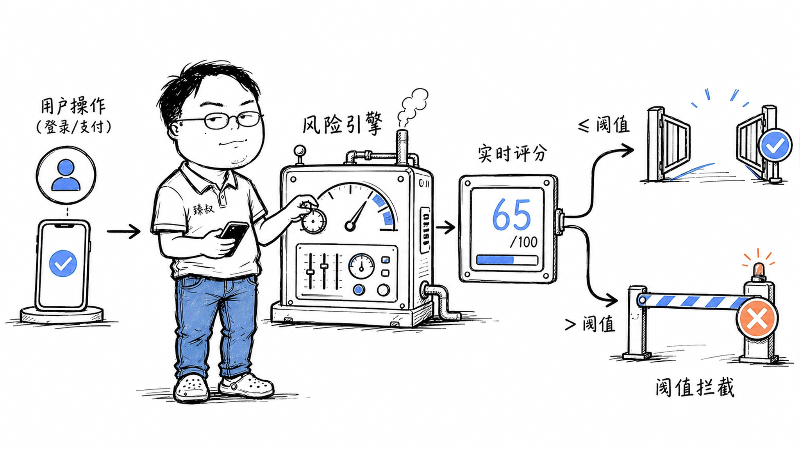

# 设计一个风控系统——拦截黄牛、羊毛党、刷单客




某电商平台大促，9.9元的空气炸锅限量1000台。开抢后0.3秒，库存全部清零。运营一看后台：1000台里970台被同一个设备指纹的脚本抢走，然后加价199元挂在二手平台。

黄牛脚本的速度有多快？从页面加载到下单完成，人类需要15-30秒，脚本只需0.2秒。当你还在找"立即购买"按钮的时候，黄牛已经抢完下线了。

风控系统就是互联网公司的"免疫系统"——它需要在几十毫秒内判断：这个请求是真人还是机器？是正常消费还是恶意薅羊毛？

## 核心结论

1. **风控的三层架构**：数据采集（设备指纹+行为日志）→ 规则引擎（快判断）→ 模型决策（深判断）
2. **规则引擎抓已知模式**——"同IP 1分钟注册>10个→拦"，快、可解释、但容易被绕过
3. **机器学习抓未知模式**——行为轨迹异常、社交关系聚类，准、但延迟高、黑盒
4. **误杀和漏杀永远在拉扯**——严格了误杀正常用户（客诉+流失），宽松了放过黑产（资损）
5. **风控是持续对抗**——黑产会不断试探和绕过规则，风控策略必须持续迭代

## 深度拆解

### 数据采集：风控的眼睛

**设备指纹**：
```
收集维度:
  - 硬件: CPU核心数、内存大小、屏幕分辨率、GPU信息
  - 软件: 操作系统版本、浏览器版本、安装字体列表、浏览器插件
  - 网络: IP地址、IP类型(机房/家庭/4G)、运营商、时区
  - 行为: Canvas指纹（浏览器渲染差异）、WebGL指纹、音频指纹

组合唯一性:
  Canvas指纹 + 字体列表 + 屏幕分辨率 → 同一台设备的概率 > 99.9%
  
对抗:
  黄牛用无头浏览器（Puppeteer）+ 代理IP池 + 修改Canvas指纹 → 设备指纹失效
  风控升级: 检测无头浏览器特征（navigator.webdriver、缺失API等）
```

**行为日志**：
```
记录内容:
  - 鼠标轨迹: 移动路径、速度、加速度、是否直线
  - 点击模式: 点击间隔、点击位置精确度
  - 输入行为: 打字速度、退格频率、粘贴vs手打
  - 页面停留: 从打开到操作的时间间隔

真人特征:
  - 鼠标移动有抖动和加速曲线，不是直线
  - 点击间隔不均匀（0.3s-2s随机）
  - 打字速度有波动，会按退格

脚本特征:
  - 鼠标瞬移或完美直线
  - 点击间隔精确到毫秒级一致
  - 输入瞬间完成（粘贴或程序注入）
  - 页面打开0.1秒就完成下单（人类根本来不及看完页面）
```

### 规则引擎：快速拦截已知模式

规则引擎用硬编码规则做实时判断，延迟<10ms：

```python
# 规则示例
rules = [
    # 注册场景
    {"condition": "same_ip_register_count_1min > 10", "action": "block", "reason": "同IP批量注册"},
    {"condition": "same_device_register_count_1hour > 5", "action": "block", "reason": "同设备批量注册"},
    {"condition": "register_time_since_open < 2s", "action": "challenge", "reason": "秒注册"},
    
    # 抢购场景
    {"condition": "same_device_order_count_1min > 3", "action": "block", "reason": "同设备高频下单"},
    {"condition": "order_time_since_page_load < 1s", "action": "challenge", "reason": "秒杀脚本"},
    {"condition": "same_ip_order_success_rate > 80% AND total > 20", "action": "review", "reason": "异常成功率"},
    
    # 支付场景
    {"condition": "new_account + large_amount + night_time", "action": "verify", "reason": "新号大额夜间"},
    {"condition": "pay_device != login_device", "action": "verify", "reason": "设备切换"},
]
```

**规则的优势**：快、可解释（被封的用户可以告诉他为什么）、确定性高。
**规则的劣势**：容易被绕过——黄牛知道"同IP 1分钟>10个会封"，就改成"每IP每分钟9个"。

### 机器学习模型：识别隐蔽模式

模型处理规则引擎无法覆盖的复杂模式：

**异常检测模型**：
```
输入特征:
  - 用户历史行为序列（过去7天的浏览/下单/支付模式）
  - 当前会话行为特征（页面停留、操作间隔、鼠标轨迹）
  - 社交关系特征（同设备/IP的好友关系、资金往来）
  - 时间特征（注册时长、活跃时段、操作频率分布）

模型输出:
  - 风险分数: 0-100
  - 风险类型: "批量注册" / "刷单" / "盗刷" / "薅羊毛"
  
决策:
  - 0-30: 放行
  - 30-60: 人工审核或加验证
  - 60-80: 拦截 + 通知用户
  - 80-100: 封号 + 冻结资金
```

**团伙识别**（图算法）：
```
构建关系图:
  节点: 用户账号、设备、IP、收货地址、银行卡
  边: "同设备"、"同IP"、"同地址"、"同银行卡"、"资金转账"

发现: 
  50个账号 → 共享3个设备指纹 → 收货地址集中在同一小区 → 资金最终汇入同一银行卡
  
结论: 这是一个黑产团伙，批量注册刷单
```

### 误杀与漏杀的权衡

```
严格策略（低阈值拦截）:
  误杀率高 → 正常用户被封 → 客诉增加 → 用户流失
  漏杀率低 → 黑产被拦 → 资损减少

宽松策略（高阈值拦截）:
  误杀率低 → 用户体验好
  漏杀率高 → 黑产得逞 → 资损增加

关键指标:
  - 误杀率: 被拦截的正常用户 / 总正常用户（目标 < 0.1%）
  - 漏杀率: 漏过的黑产 / 总黑产（目标 < 5%）
  - 拦截准确率: 正确拦截 / 总拦截（目标 > 95%）
```

**灰度处置**——不是非黑即白：
```
低风险: 放行
中风险: 加验证（滑块/短信/人脸）
高风险: 人工审核（订单挂起，人工确认后放行）
极高风险: 直接拦截 + 记录黑名单
```

### 风控的实时性挑战

```
时间预算:
  用户点击"下单" → 风控判断 → 放行或拦截 → 总耗时 < 100ms

  设备指纹采集: 5ms
  规则引擎查询: 2ms (Redis)
  模型推理: 20-50ms (模型服务)
  总计: ~30-60ms

挑战:
  - 模型不能太复杂（推理延迟）
  - 特征查询要走缓存（不能查慢SQL）
  - 规则引擎要支持热更新（不改代码上线新规则）
```

## 实战要点

### 工程落地

**规则引擎架构**：
```
规则配置 (后台管理界面)
  → 存入Redis/规则数据库
  → 风控引擎实时加载
  → 每个请求经过规则链
  → 命中规则 → 执行动作 (拦截/验证/审核)
  → 未命中 → 放行
```

规则引擎要支持热更新——风控运营人员能在后台直接配规则，不改代码不上线。

**黑名单管理**：
- 设备黑名单、IP黑名单、账号黑名单
- 黑名单有TTL（自动过期），避免永久误封
- 支持手动解封 + 申诉流程

**攻击回溯**：
- 所有被拦截的请求记录详细日志（请求参数、设备信息、规则命中情况）
- 风控分析师定期review拦截记录，发现新攻击模式，更新规则

### 臻叔踩坑笔记

1. **只靠规则不靠模型**——规则被绕过后没有后备防线。规则+模型双层防御，规则处理已知模式，模型兜底未知模式
2. **误杀没有申诉通道**——正常用户被封找不到申诉入口，直接流失。必须提供申诉流程（客服+自助解封），误杀后24小时内解封
3. **规则更新太慢**——发现新攻击模式后，走代码发布流程上线规则需要1-2天。规则引擎必须支持热更新，运营人员后台一键上线
4. **设备指纹被绕过不知道**——黄牛用工具修改Canvas指纹，设备指纹变了但风控没察觉。需要监控指纹突变频率，同一账号短时间内指纹变化=异常
5. **只拦截不处置**——只封了账号但没冻结资金/订单，黑产已经把薅到的券用了/东西卖了。拦截要联动业务层：取消订单、冻结余额、撤销优惠券

### 一句话总结

风控系统的核心是"数据采集→规则引擎→模型决策"三层架构——规则快但易绕过，模型准但延迟高，误杀和漏杀永远在拉扯，风控是持续对抗不是一劳永逸。
