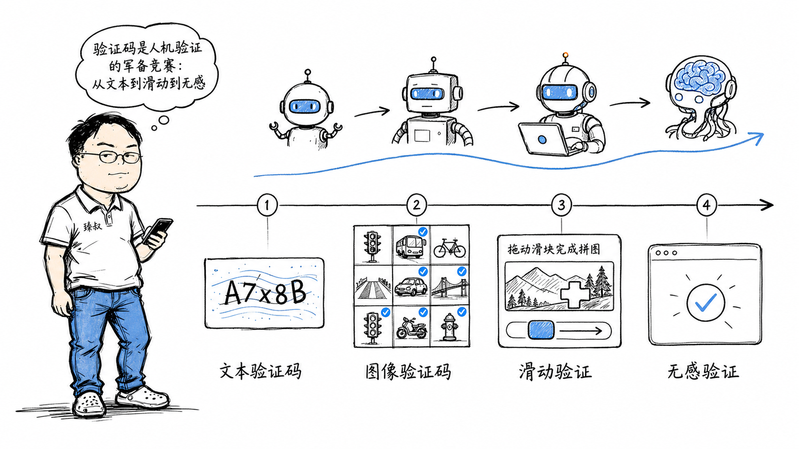

# 验证码的演变——从扭曲字符到无感验证的军备竞赛




2014年，Google做了一件出人意料的事：reCAPTCHA v2变成了一个复选框——"我不是机器人"。用户只需点一下，系统就放行了。看起来比扭曲字符验证码简单了100倍。

但背后的逻辑恰恰相反：那个复选框收集的信息比任何扭曲字符都多——鼠标轨迹、点击位置精度、浏览器Cookie、历史行为、Canvas指纹。Google不是让验证变简单了，而是让验证变得"看不见"了。

验证码的本质不是"出一道题让人答"，而是"区分人和机器"。出题只是手段，而且是被AI逐步碾压的手段。

## 核心结论

1. **验证码的目标是区分人和机器**——不是出难题，是提高自动化攻击成本
2. **五代演变**：文本→图像→滑动→行为→无感，每一代都被AI破解后被迫升级
3. **现代验证码不只看"答案对不对"**——更看"你怎么答的"（轨迹、时间、设备特征）
4. **打码平台是终极绕过**——把验证码发给真人解答，AI+人工混合，成本极低
5. **军备竞赛的出口是行为风控**——不弹验证码，在后台持续评估风险，只在可疑时才挑战

## 深度拆解

### 第一代：文本验证码

```
形态: 扭曲的字母数字图片
破解: OCR (光学字符识别)

演变:
  v1: 简单扭曲 → 早期OCR可破 (准确率60%)
  v2: 加干扰线+背景噪点 → OCR准确率降到20%
  v3: 字符重叠+变形透视 → 深度学习CNN准确率回升到90%+
  
结果: 2014年后，主流OCR对文本验证码的识别率超过95% → 文本验证码死亡
```

文本验证码的致命问题：它是一个"封闭问题"——答案空间有限（0-9+A-Z=36种），AI模型见过的训练样本远多于人类能设计的变形。

### 第二代：图像选择验证码

```
形态: "请选出所有红绿灯/斑马线/自行车的图片"
破解: 图像分类模型 (ResNet/EfficientNet)

reCAPTCHA v2的图片:
  9宫格，每格一张图片，选出包含特定物体的格子
  
破解方法:
  1. 训练CNN分类器 → 对每格图片分类 → 准确率85%+
  2. Google Image数据集预训练 → 迁移学习 → 快速适配新类别
  3. 打码平台 → 5秒内人工解答 → 成本0.01元/次

结果: 图像验证码的破解成本仍然低于防御收益
```

### 第三代：滑动验证码

```
形态: 拖动滑块到缺口位置
表面破解: 计算缺口位置（边缘检测/Canny算法）
深层防御: 分析拖动轨迹
```

**轨迹分析是核心防线**：

```python
# 真人轨迹特征
human_trace = {
    "acceleration": "先快后慢（加速接近目标，减速微调）",
    "overshoot": "经常超过目标位置1-3px然后回调",
    "jitter": "Y轴有随机抖动（手不可能完全水平移动）",
    "duration": "0.5-2秒（不太快也不太慢）",
    "velocity_profile": "符合人类运动学的钟形速度曲线"
}

# 脚本轨迹特征
script_trace = {
    "acceleration": "匀速或线性减速",
    "overshoot": "从不超调（精确到达）",
    "jitter": "Y轴完全无抖动（或过于规律的伪随机）",
    "duration": "0.1秒（太快）或固定0.5秒（太规律）",
    "velocity_profile": "矩形或三角波（不符合人类运动学）"
}
```

**对抗升级**：黑产开始模拟人类轨迹——用贝塞尔曲线+随机噪声+模拟overshoot。准确率取决于风控模型的特征提取能力。

### 第四代：行为验证（reCAPTCHA v3）

```
形态: 没有验证码界面，后台静默运行
机制: 分析用户行为，输出0-1的风险分数

信号维度:
  - 鼠标移动模式（是否自然、是否有加速减速曲线）
  - 页面交互历史（滚动深度、点击位置、停留时间）
  - 浏览器环境（Cookie、历史记录、安装的插件）
  - 设备指纹（Canvas、WebGL、AudioContext指纹）
  - 网络环境（IP类型、ASN、与历史行为对比）
  - Google账号状态（如果有Google登录态）

输出: risk_score = 0.0 (确定是人类) ~ 1.0 (确定是机器)
决策: 
  < 0.3: 直接放行
  0.3-0.7: 弹出挑战（滑动/图像选择）
  > 0.7: 直接拒绝
```

v3的优势：正常用户完全无感，只有可疑用户才被挑战。攻击者不知道自己的分数，也不知道需要模仿什么特征才能通过。

**问题**：依赖大量行为数据（Google有全网数据，自建系统没有）。小公司的行为验证准确率远低于Google。

### 第五代：无感验证

```
理念: 不弹验证码，在用户无感知的情况下完成验证

实现方式:
  1. 设备指纹: 采集20+维度（Canvas、WebGL、字体列表、电池API等）
  2. 环境检测: 检测无头浏览器（navigator.webdriver、缺失API、不一致的特征）
  3. 行为序列: 从用户打开页面开始，记录所有交互行为
  4. 网络画像: IP信誉库（机房IP、代理IP、历史恶意IP）
  5. 频率分析: 同一设备/IP的请求频率

综合评分: 正常 → 放行; 异常 → 弹验证码或拒绝

效果: 95%以上的正常用户完全无感
```

### 打码平台：验证码的终极敌人

```
打码平台工作模式:
  攻击者脚本 → 遇到验证码 → 截图发送到打码平台
  打码平台 → 分发给真人Worker → Worker解答 → 返回答案
  攻击者脚本 → 用答案通过验证

成本:
  文本验证码: 0.001-0.005元/次
  图像验证码: 0.01-0.02元/次
  滑动验证码: 0.02-0.05元/次
  
  一个Worker每小时可解500-1000次 → 月薪3000-5000元
```

打码平台用真人绕过了所有AI检测——因为真人就是真人。验证码无法区分"真正的用户"和"被雇佣来解验证码的人"。

### 军备竞赛的出口

验证码的终局不是"出更难的题"，而是**行为风控**：

```
传统模式: 用户来了 → 弹验证码 → 通过/不通过
未来模式: 用户来了 → 后台持续评估风险 → 可疑才挑战 → 挑战也是无感的

风控信号:
  - 注册后10秒就下单 → 异常
  - 同一设备开了5个标签页 → 异常
  - 从来不滚动页面直接找到按钮 → 异常
  - 鼠标轨迹太完美 → 异常
  - IP来自已知代理池 → 异常

多个弱信号组合 → 强判定
```

## 实战要点

### 工程落地

**验证码触发策略**：
```
默认: 不弹验证码（影响转化率）
触发条件:
  - 同IP频率异常 → 弹滑块
  - 新设备 + 敏感操作 → 弹滑块
  - 风控评分中等 → 弹图像选择
  - 风控评分极低 → 直接拒绝 + 记录黑名单
```

**验证码成功率监控**：正常用户的通过率应该>95%。如果通过率<80%，说明验证码太难了或者有bug。

### 臻叔踩坑笔记

1. **验证码太简单**——纯文本扭曲字符，OCR一秒破完。至少用滑动+轨迹分析
2. **只验证答案不验证行为**——滑块只检查位置对不对，不检查拖动轨迹。脚本精确拖到位置就过了。行为分析是核心
3. **验证码影响正常用户**——老年用户、残障用户、慢速网络用户被验证码反复阻拦。验证码必须有可访问性替代方案（音频验证码等）
4. **打码平台攻击没对策**——打码平台用真人解题，验证码无法区分。必须结合行为风控+设备指纹+频率限制，不能只靠验证码
5. **验证码前端校验后端不校验**——前端验证通过后，后端直接信任。攻击者直接调后端API跳过前端验证。后端必须独立验证

### 一句话总结

验证码的本质是"提高自动化攻击成本"——五代演变从出题到行为分析，AI每破一种就升级一种，打码平台用真人绕过所有AI检测，终局是不弹验证码的行为风控。
