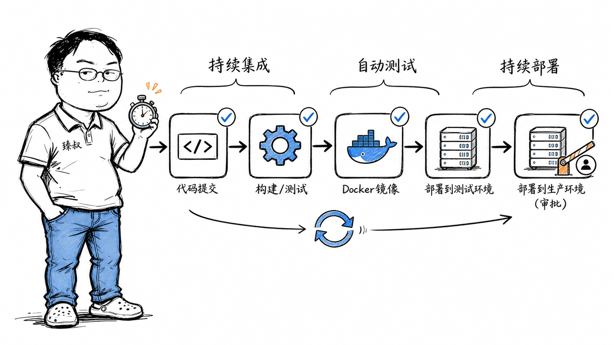

# CI/CD流水线——"在我机器上能跑"这句话害了多少团队




2019年，我带一个项目组做上线。周五晚上10点，运维在群里发了一句："部署失败，回滚了。"

开发组长急了："不可能，我本地跑得好好的！"结果排查到凌晨2点——有人忘了提交一个新的配置文件，有人在代码里硬编码了自己的本地路径 `/Users/xiaowang/tmp/data`。线上环境没有这个路径，直接炸了。

那天之后，我们立了一条强制规则：从今往后，任何代码必须经过CI流水线才能合并。三个月后，"在我机器上能跑"这句话再也没有出现在我们的工作群里。

**CI/CD不是逼你多干活，是为你的那台机器"辩护"——它不能成为唯一的真理来源。**

## 核心结论

1. **CI（持续集成）的核心价值是"早发现"**——提交代码几分钟内就知道编译过不过、测试绿不绿
2. **CD（持续交付/部署）的核心价值是"快交付"**——从代码提交到生产环境，全过程自动化，人工只做关键决策
3. **环境一致性是CI/CD的命门**——Docker镜像保证开发/测试/生产环境完全一致，消灭"我机器上能跑"
4. **Pipeline as Code**——流水线配置随代码一起版本管理，改流水线等于改代码，可追溯可回滚

## 深度拆解

### CI阶段：你提交的代码，5分钟内接受全面体检

CI阶段做什么？一个标准的CI Pipeline长这样：

```
代码提交 → 静态分析 → 编译构建 → 单元测试 → 构建制品
```

每一步的价值：

**静态分析（Lint + SAST）**：代码还没跑，先查有没有低级错误。ESLint查JavaScript语法，SonarQube查代码异味和安全漏洞，Checkstyle查Java编码规范。这步通常几十秒完成，是成本最低的Bug发现窗口。

**编译构建**：把源码变成可运行的制品。Java打Jar包，Node.js做Webpack/Vite打包，Go交叉编译。这步验证的是"代码能不能变成一个可执行的东西"——有人改了方法签名但忘记改调用方，编译阶段直接暴露。

**单元测试**：跑所有 `*Test` 文件。这是对函数级别的契约验证——"add(1,2) 必须等于3"。单元测试覆盖率低于80%的团队，线上事故率是覆盖80%+团队的3倍（Google的统计数据）。

整个CI阶段控制在10分钟内。超了？说明你的单元测试写了太多集成的东西，或者构建过程有冗余依赖。

### CD阶段：从"大事件发布"变成"日常操作"

CI通过后，自动触发CD Pipeline：

```
构建镜像 → 部署测试环境 → E2E测试 → 部署预发布 → 人工审批 → 生产发布
```

**镜像构建**：把Jar包打进Docker镜像。这里的关键不是"构建镜像"本身，而是**镜像即环境契约**——同一个镜像，在测试环境跑起来的就是测试环境，在生产环境跑起来的就是生产环境。差异只来自环境变量和配置中心，不来自镜像。

**多环境逐级晋升**：测试环境自动部署→E2E自动化测试通过→预发布环境部署→产品经理验收→人工卡点审批→生产环境发布。每一级都是"准入"——当前级不过，绝不进入下一级。

关键的工程决策：**生产环境发布要不要人工审批？** 大部分公司选择"要"，因为生产环境的回滚虽然可以做，但用户看到的故障已经发生了。但Netflix的做法是"全自动金丝雀发布"——自动放量1%，自动比对指标（错误率/延迟），异常自动停止并回滚，全程无人参与。这需要极强的监控和自动化回滚能力。

### Pipeline as Code：流水线也是代码

Jenkinsfile、GitHub Actions的 `.github/workflows/ci.yml`、GitLab CI的 `.gitlab-ci.yml`——这些文件随源码一起版本管理。

为什么这很重要？

- **可审查**：改流水线步骤要提PR、要Code Review
- **可复现**：任何开发者拉下代码，流水线配置也随之拉下
- **可追溯**："上次部署失败是因为流水线里少配了一个环境变量"——Git Blame找得到是谁改的

## 实战要点

### 臻叔踩坑笔记

1. **CI跑太久**：超过10分钟，开发者开始跳过、开始攒大PR。解法：拆分慢测试（集成/E2E）到单独阶段并行跑，单元测试必须快。
2. **制品仓库混乱**：镜像tag用 `latest` 或随意命名，回滚时不知道上一次生产跑的是哪个版本。解法：tag用Git Commit SHA或语义化版本号。
3. **环境漂移**："测试环境和生产环境用的同一个镜像，所以一致？"不一定——如果数据库版本、中间件版本、操作系统内核不同，镜像一致也没用。解法：基础设施即代码（Terraform/Ansible）管理环境配置。
4. **审批变成橡皮图章**：发布审批人每次都点"同意"，因为在非工作时间不敢拦。解法：定义明确的审批条件（测试通过+预发布验证通过+灰度指标正常），符合条件的自动放行。

### 一句话总结

> CI/CD把"在我机器上能跑"这句话从托辞变成了笑话——不是逼你承认自己的机器有问题，而是让你的机器不再需要成为真理来源。

---

