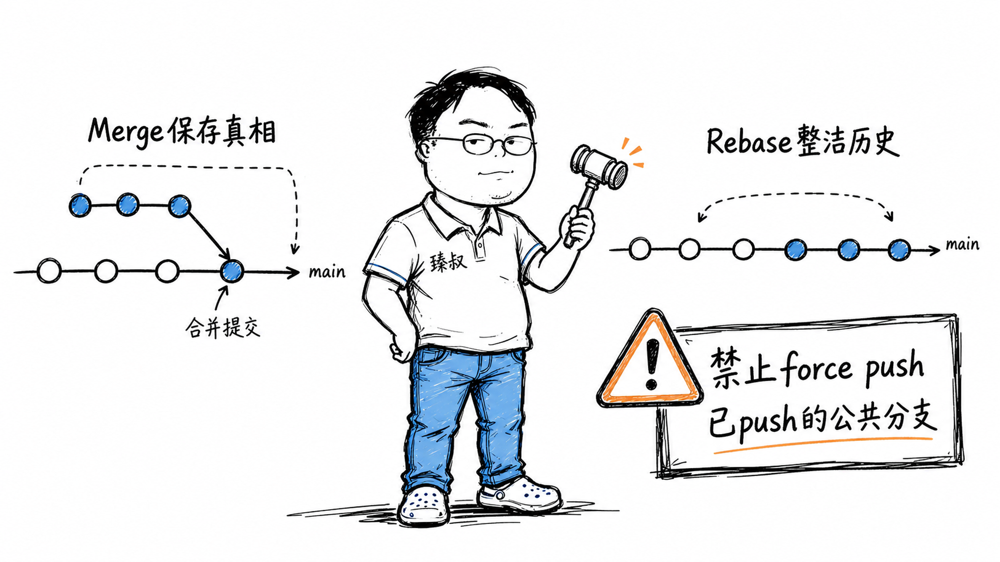

# Git合并策略：Merge与Rebase的区别与团队规范



---

> 📌 **关注「程序员臻叔」，获取更多硬核技术干货**


---

一个新人在2018年加入了一个技术团队，提了第一个PR。代码review没啥问题，但一个老同事在PR下写了句话："请rebase到main再push，不要merge。"

他心想：不是一样吗？代码合进去了不就行了？后来才明白：这不仅是"历史长什么样"的问题，而是"当线上出事故时，你花10分钟定位还是花2小时定位"的差别。

而另一家公司的技术负责人则坚决站在另一边："我们禁止rebase。历史的真相比整洁更重要。你要美化历史就是在撒谎。"这话也有道理。

**Merge和Rebase之争本质上不是对错之争，而是"你要用提交历史做什么"之争。**

## 核心结论

1. **Merge保留真相**：并行开发的真实时间线被完整记录，代价是历史图分支交错、可读性差
2. **Rebase重写为直线**——提交历史像一条干净的线，代价是改写历史（SHA变了）
3. **铁律：永远不要rebase已经push到共享分支的commit**，改写了别人正在基于你的commit开发的公共历史
4. **最佳实践：个人feature分支用rebase保持整洁，合并到公共分支用merge保留真相**

## 深度拆解

### Merge：保留"谁在什么时候做了什么"

假设你和同事从main的同一个commit A出发，各自开发了功能：

```
你：A → B → C（feature-1）
同事：A → D → E（feature-2）
```

你用 `git merge feature-2` 合并时：

```
A → B → C ─────┐
   → D → E →  M (merge commit)
```

结果：一个Merge Commit M同时指向C和E。这张"有向无环图"完整记录了：C和E是并行开发的，M是合并点。两周后线上出问题，你查 `git log` 看到的不只是一条线——是真实的开发轨迹。

**Merge的优势**：真相完整，合并冲突只解决一次。

**Merge的代价**：历史图随着多人多分支开发越来越像"意大利面条"。`git log --graph` 的输出像纺织图案。而且，如果你频繁从main merge到feature分支（保持feature同步），提交历史里会有一堆"Merge branch 'main' into feature"的无信息量commit。

### Rebase：让提交历史像一个人写的

同样的场景，你用 `git rebase main`：

```bash
git checkout feature-2
git rebase main
```

结果：D和E被"搬到"了main的最顶端——原来的D和E被丢弃，生成新的D'和E'（SHA变了，因为parent从A变成了C之后的某个commit）：

```
A → B → C → D' → E'
```

历史变成一条直线。`git log` 看起来就像是一个人顺序写的，干净、易读、方便review和cherry-pick。

**Rebase的优势**：历史干净，`git bisect`（二分法定位引入Bug的commit）在这条直线上极高效。

**Rebase的代价**：历史是假的。D和E实际是在A上写的，但D'和E'被重写成在C之后写的。如果这是一年前的事你还记得真相，但如果是你同事的代码而你不在现场，你会被"假历史"误导。

### 为什么"不rebase已push的公共分支"是铁律？

你和同事都从main的A开始。你把A→B→C push到了远程的feature分支，同事fetch了你的分支并基于C开发了D。然后你rebase了你的feature分支，A→B→C变成了A→B'→C'（SHA全变了），你force push覆盖了远程分支。

此时同事的本地仓库里，他想push自己的D，但D的parent是旧的C（已不存在于远程）。他merge远程分支时，会看到两个完全不同的历史线（旧C和新C'），冲突地狱。

这就是**rebase的辐射伤害**：你改写的不只是自己的历史，而是所有依赖你commit的人的历史。

## 实战要点

### 正确的工作流

**个人feature分支（未push/未共享）**：
```bash
git checkout feature-xxx
git rebase -i main   # 交互式rebase，squash掉"WIP""fix"等杂乱commit
```
把"WIP: 初步实现""fix typo""again""这次总行了吧"压缩成一个干净的commit，然后提PR。Review者看到的是一个意图清晰的commit而非你的探索过程。

**合并到main**：
```bash
git checkout main
git merge --no-ff feature-xxx  # 保留merge commit，记录"feature-xxx是在此时合并的"
```
这样main上的历史既有干净的feature主线（因为feature分支内部已经rebase整理过），又保留了合并点。

### 臻叔踩坑笔记

1. **rebase后force push到main**：直接引起团队公愤。main是公共分支，永远只增不改。
2. **rebase冲突解决后继续rebase**：rebase过程中解决冲突→`git rebase --continue`，如果中间出错→`git rebase --abort`回到rebase前。不要中途切分支或reset。
3. **Merge Commit的message无信息量**：`Merge branch 'feature' into main` 没有说明合了什么。好的做法：Merge Commit的message写清楚"合并用户积分系统重构，改动点：... "
4. **Squash Merge滥用**：GitHub的"Squash and Merge"按钮把整个feature分支的N个commit压成一个，历史干净但丢失了commit粒度。一个feature的多个独立变更（重构+新功能+修Bug）被压成一个2000行变动的commit→未来定位Bug时无法区分"这是重构引入的还是新功能引入的"。

### 一句话总结

> Merge保存了"发生过什么"，Rebase编造了"应该发生什么"。两者都有用——取决于你是要查线上故障（需要真相），还是要code review一个有30个"fix typo"的feature分支（需要整理）。

---

---

### 🎯 觉得有帮助？关注「程序员臻叔」


---
