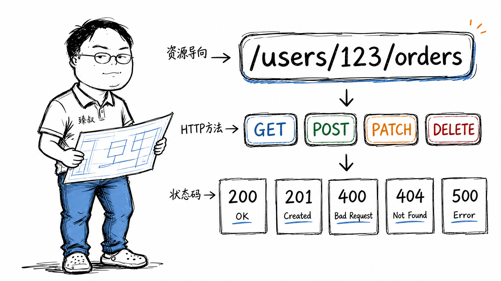

# RESTful API设计——为什么你的接口一看就是"凑合能用"？




2018年，产品经理要我们接一个第三方支付。对方发来了API文档，我打开第一页就看到：

```
POST /api/getUserInfo
POST /api/deleteOrder
POST /api/createPayment
```

全部是POST。查用户、删订单、创建支付——全用POST。我再往下翻翻状态码——所有情况统一返回 `200 OK`，然后body里塞一个 `"code": 0` 表示成功、`"code": -1` 表示失败。

我截图发到技术群里，有人回了四个字："这是犯罪。"

**API不是你一个人调的——是几十个、上百个开发者在不同时间、不同语言、不同心态下调的。你写得随意，他们用着痛苦。好的API让调用方不需要读文档就能猜出怎么用。**

## 核心结论

1. **URL是资源不是动作**——`/users/123/orders` 不是 `/getOrders?userId=123`
2. **HTTP方法表达动作**——GET读、POST创建、PUT全量更新、PATCH部分更新、DELETE删除
3. **HTTP状态码别自己发明**——200成功、201创建成功、400参数错误、404不存在、500服务端错误
4. **一致性比灵活性重要**——宁可"不那么优雅但全体统一"，也不要每个模块各搞一套

## 深度拆解

### 资源建模：名词 > 动词

```
❌ POST /api/getUserById      (动词)
❌ POST /api/createOrder      (动词)
❌ POST /api/deleteProduct    (动词)

✅ GET    /users/123           (名词 + 标准HTTP方法)
✅ POST   /orders              (名词 + 标准HTTP方法)
✅ DELETE /products/456        (名词 + 标准HTTP方法)
```

RESTful的核心洞察：**世界上所有操作都可以归类为对资源的CRUD。** 获取用户列表 → 对user资源的GET。创建订单 → 对order资源的POST。取消订单 → 对order资源的DELETE（或者PATCH status=cancelled）。

规则：URL里只放名词。复数形式。嵌套关系表示资源归属：`/users/123/orders` 读作"用户123的订单"。层级不要太深——超过3层说明你的资源模型该重构了。

### 状态码：HTTP已经替你定义好了，别自己发明

```
200 OK —— 请求成功（GET/PUT/PATCH）
201 Created —— 创建成功（POST），响应头里带上Location: /users/789
204 No Content —— 删除成功（DELETE），没有响应体
400 Bad Request —— 参数校验失败（缺少必填字段、类型不对）
401 Unauthorized —— 没登录/Token过期
403 Forbidden —— 登录了但没有权限
404 Not Found —— 资源不存在
409 Conflict —— 资源冲突（如并发修改版本号不匹配）
422 Unprocessable Entity —— 参数格式正确但语义错误（如金额为负数）
429 Too Many Requests —— 被限流了
500 Internal Server Error —— 服务端出了未预期的错
```

很多团队的习惯是——所有情况返回200，body里用自定义code。这么做的原因是"前端好处理"。实际上这是把HTTP的设计抛在脑后——浏览器、CDN、负载均衡器都能理解标准状态码并做优化（如对429自动重试、对301/302自动跟踪重定向）。你用自定义code，这些基础设施全废了。

### 分页：Offset vs Cursor

```
Offset分页：GET /users?page=3&size=20
Cursor分页：GET /users?cursor=abc123&size=20
```

**Offset的致命问题**：用户浏览第2页时，有3条新数据被插入到第1页→原来的第21条被挤到第24条→用户翻到第2页时看到了第21-40条，但第21条他在第1页已经看过了（重复），被挤下去的第18-20条永远看不到（遗漏）。

**Cursor分页**：基于最后一条记录的标识符取下一页。无论前面怎么插入，cursor保证连续性——"我看到了第20条，下次从第20条之后开始"。适合数据频繁更新的场景（社交Feed、订单列表）。

## 实战要点

### 版本管理

```
/v1/users    →  v2/users
```

不要一个接口同时支持多个版本（`/users?version=1`）——复杂度会随版本数膨胀。旧版本维护6-12个月，给调用方充足的迁移时间后下线。

### 臻叔踩坑笔记

1. **GET请求改数据**：`GET /orders/123/cancel` —— GET不应该有副作用。浏览器可能预加载、搜索引擎可能爬取、用户可能刷新——每次刷都取消一次？用POST/PATCH。
2. **响应体结构不一致**：成功时 `{"data": {...}}`，失败时 `{"error": "..."}` ，列表时直接返回数组 `[...]`。统一包装：`{"code": 0, "data": {...}, "message": "ok"}`。
3. **字段命名风格混用**：Java后端返回 `userName`（驼峰），Python后端返回 `user_name`（下划线）。选定一种风格全系统统一，别让前端做双份映射。
4. **不做幂等**：POST扣款接口用户点了两次→扣两次钱。请求头加 `Idempotency-Key`，相同Key的POST只执行一次。

### 一句话总结

> 好的API让调用方关上文档就知道下一步该调什么。差的API让调用方打开文档也不知道为什么要这么设计。

---

