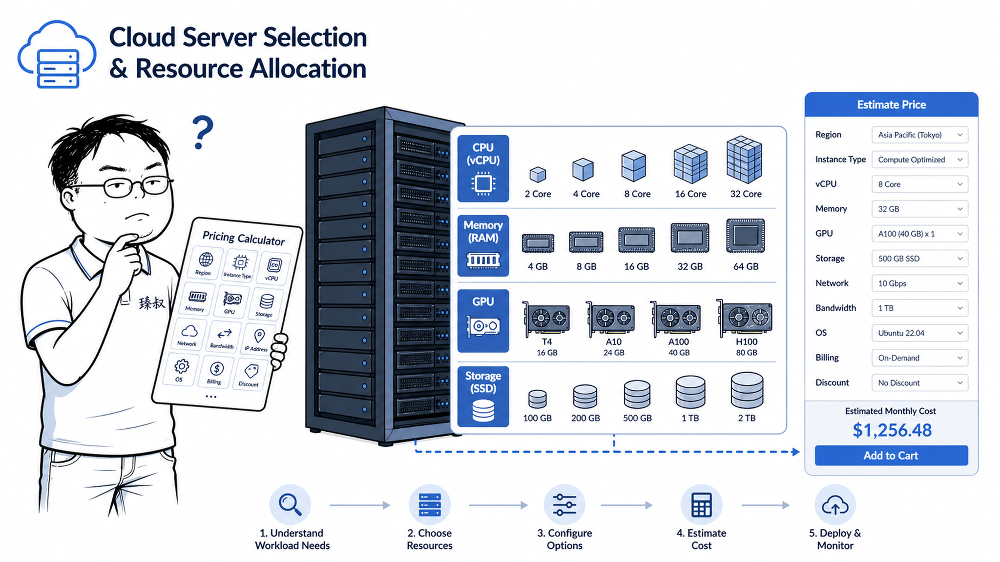

# 云服务器怎么采购——选错配置的代价不是多花钱，是上线当天宕机



2022年6月，一家刚拿了A轮融资的创业公司上线了新功能。产品经理预计日活5万，CTO在阿里云买了一台4核8G的标准ECS。上线当天，实际日活2.3万。按说不至于崩——但崩了。

复盘发现：不是日活高，是"瞬时并发"高。晚上8点30分，2000人在同一秒刷新首页。4核CPU瞬间到100%，TCP连接队列堵死，后面的请求全部超时。而8G内存——只用了3G，GPU版的服务器配了张RTX 3090——这个业务根本不需要GPU。

**云服务器选型的核心不是"买贵的就对了"——是"每一分钱都花在瓶颈上"。**

## 核心结论

1. **CPU密集还是IO密集？** 这个问题的答案决定了你80%的选型决策
2. **用户量评估不是"日活 × 人均请求数"**——要算峰值的瞬时并发
3. **通用型实例是最大的坑**——CPU、内存、网络、磁盘全都"够用但不够好"，导致每个瓶颈都差一点

## 深度拆解

### 第一步：搞清楚你的业务是吃什么的

不同类型的业务，瓶颈完全不同：

**CPU密集型（吃算力）：**

- 视频转码、图像处理、机器学习推理、游戏服务器逻辑
- 选型建议：CPU主频 > 核心数。选高性能计算型实例（如阿里云c7/华为云C7/腾讯云C6），vCPU与物理CPU核心绑定。
- 关键参数：主频（GHz）、单核跑分（Geekbench）、AVX-512指令集支持

**内存密集型（吃内存）：**

- Redis、Memcached、Elasticsearch、大型JVM应用
- 选型建议：内存越大越好，但注意——不是所有内存都一样快。关注内存带宽（GB/s）和NUMA架构（多CPU下的内存访问延迟差异）。
- 关键参数：内存容量、内存带宽、是否支持内存热插拔

**IO密集型（吃磁盘）：**

- 数据库（MySQL/PostgreSQL）、Kafka、日志系统
- 选型建议：磁盘比CPU重要得多。优先选本地NVMe SSD，而不是网络存储。网络存储（云盘）的IOPS和延迟波动大，高峰期可能掉速。
- 关键参数：IOPS（随机读写）、吞吐量（MB/s顺序读写）、延迟（P99读写延迟<2ms）

**网络密集型（吃带宽）：**

- CDN边缘节点、直播推流、API网关、反向代理
- 选型建议：关注网络带宽上限和PPS（每秒包转发数）。小规格实例通常网络带宽被严格限制（比如1Gbps），大流量业务必须选中高规格的实例。
- 关键参数：带宽上限（Gbps）、PPS、是否支持SR-IOV直通网卡

### 第二步：用户量到底怎么算

很多人这样算：日活5万 × 每人10个请求=50万请求/天 ÷ 86400秒=5.8 QPS——一台2核4G够了。

**这是错的。** 错在两个地方：

**错误一：用户不是均匀分布的。**

5万DAU的业务，晚高峰（8pm-10pm）通常占全天流量的60%。所以晚高峰的2小时内要扛30万请求。平均QPS变成：30万 ÷ 7200秒 = 41 QPS。但这还不够。

**错误二：请求不是均匀到达的。**

晚高峰期间，每小时的第一个5分钟（比如抢购、开奖、推送）可能有密集流量。41的平均QPS可能突变成200-300 QPS。而且，一个用户的一次页面访问通常触发5-15个API请求（页面渲染 + 数据加载 + 埋点上报）。

**正确的估算方式：**

```
峰值QPS = DAU × 人均请求数 × 晚高峰集中度 ÷ 3600 × 峰值系数

举例：
DAU 5万，人均3次访问 × 每次10个API请求 = 每人30个请求
晚高峰集中度 = 60%（即60%的请求在2小时内）
峰值系数 = 5（峰值QPS是平均的5倍）

峰值QPS = 50000 × 30 × 0.6 ÷ 3600 × 5
        = 1250 QPS
```

这就是为什么4核机器扛不住——不是2万用户的问题，是1250个并发请求的问题。

### 第三步：怎么选配置

**通用Web服务（Nginx + 业务代码）：**

- 推荐：计算型实例 4核8G起步
- 原因：业务代码通常CPU-bound（JSON序列化、模板渲染、业务逻辑）
- 单机扛500-1000 QPS为健康水位（留50%余量应对突发）

**数据库（MySQL/PostgreSQL）：**

- 推荐：内存型实例 8核32G起步，配本地NVMe SSD
- 原因：数据库吃内存（缓存）和磁盘IO，CPU其次
- `innodb_buffer_pool_size`设到物理内存的70%-80%
- 单机扛2000-5000 QPS（简单查询）或500-1000 QPS（复杂查询）

**Redis/缓存：**

- 推荐：内存型实例 4核32G起步
- 原因：纯内存操作，CPU主要消耗在网络IO和序列化
- 注意：2核的Redis在QPS超过5万时CPU会成为瓶颈——不是内存不够，是处理不过来

**消息队列（Kafka）：**

- 推荐：存储型实例 8核32G + 多块数据盘
- 原因：Kafka重度依赖磁盘顺序写，CPU主要用于压缩/解压
- 单机吞吐量可达100MB/s（取决于磁盘和网络）

### 第四步：云厂商怎么选

国内主流：阿里云（国内市场份额最大，生态最全）、腾讯云（游戏和社交场景优势）、华为云（政务和制造业优势）、AWS中国（外企和国际场景）。

选择标准按优先级递减：
1. **你的团队熟悉哪个**（学习新平台的时间成本 > 价格差异）
2. **目标用户在哪**（华南选腾讯云，华东选阿里云，延迟更低）
3. **需要的特定服务**（比如阿里云的MaxCompute、腾讯云的实时音视频TRTC）
4. **价格**

**买之前必做的三件事：**
- 压测：用实际业务场景压到极限，看瓶颈在哪。不要相信云厂商的标称规格。
- 测网络延迟：从你的用户所在区域ping云服务器，选延迟最优的Region。
- 算总成本：不只是ECS/RDS的费用——还有带宽费（贵！）、快照费、跨Region流量费。很多人以为一个月3000块够了，实际收到7000的账单。

## 实战要点

### 臻叔踩坑笔记

1. **按日均流量买机器**：日均100 QPS买了台2核4G——大部分时候够用，但晚上高峰期直接挂了。坑点：扩容是按分钟级的（云厂商的弹性伸缩有5-10分钟的启动延迟），不是瞬时的。永远按"峰值QPS的1.5倍"来配置基线。
2. **所有服务都买同一种配置**：Web、数据库、Redis全买4核8G——Web服务CPU够但内存用不到，Redis内存不够但CPU闲。每种服务有专门的实例类型（计算型/内存型/存储型），混用=浪费。
3. **包年包月一口气买3年**：省了30%的钱，但业务半年后转型了——服务器配置跟不上新需求，又没法退款。除非业务非常稳定，否则先按月买，跑了3个月数据后再判断要不要包年。
4. **被"突发性能实例"坑了**：某些云厂商的低价实例（如阿里云的t5/t6、AWS的t3/t4g）是"基准性能+积分制"——CPU积分用完了性能暴跌到20%。适合开发测试、不适合生产环境。买之前看清楚是"基准性能"还是"突发性能"。
5. **忘记算带宽费**：一台服务器一个月300块，开了10Mbps固定带宽——带宽费比服务器贵3倍。如果流量波动大，用"按流量计费+带宽上限"的方式可能更省钱（但需要设置上限避免账单爆炸）。

### 一句话总结

> 云服务器选型的核心：先搞清楚你的瓶颈在哪（CPU/内存/IO/网络），再根据峰值QPS（不是日均）确定配置级别，最后用压测验证——而不是看云厂商的推荐配置。

