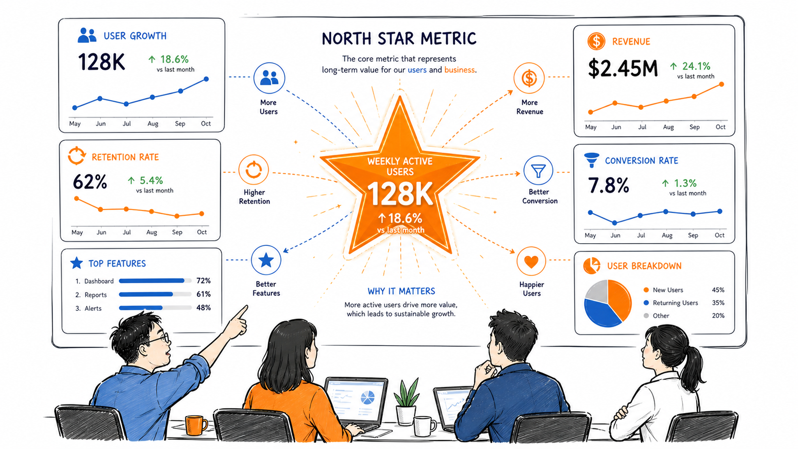

# 北极星指标体系：指标定义、数据采集与看板设计



---

> 📌 **关注「程序员臻叔」，获取更多硬核技术干货**


---

2019年Q3，一家SaaS公司的CEO和CTO吵了一架。

CEO说："这个季度的数据不对，新用户注册量下降了30%。"

CTO翻出后台："我这里看涨了15%啊？"

两人把数据源的SQL导出来一对——CEO的报表统计的是"完成手机验证的注册用户"，CTO的统计的是"完成了邮箱验证的注册用户"。公司刚把注册流程从"邮箱验证"改成了"手机验证"，两张报表的数字差了30%。没人意识到统计口径不一致。

**北极星看板的本质不是"好看的数据大屏"，而是"全公司所有人查同一组数字时，答案必须一致"。**

## 核心结论

1. **北极星看板的核心价值是"统一口径"**：不是可视化，不是实时刷新，而是"数字只有一种解释方式"
2. **指标不超过5个**，越精简越有约束力，多了等于没有
3. **每个指标必须可拆解**："收入"这个数字本身不能指导行动，但"收入 = 新用户支付 + 续费用户支付 + 升级用户支付"就是可操作的了

## 深度拆解

### 为什么叫"北极星"？

航海中，北极星的位置几乎固定在天球北极，是所有导航的基准点。无论你在北半球的哪个位置，抬头找到北极星，就能确定方向。

北极星看板同理：无论你是产品经理、工程师、运维、市场，看到这个看板，你就知道公司当前最重要的目标是什么，以及我们离这个目标还有多远。

### 选指标的三个铁律

**铁律一：反映用户价值，而非内部效率**

❌ 错误指标：部署次数、代码行数、CI速度、技术栈升级进度  
✅ 正确指标：用户激活率、付费转化率、用户留存率、NPS净推荐值

内部效率指标应该在团队的看板上，而不是北极星看板上。北极星看板只看"用户获得了什么价值"。

**铁律二：可被团队直接影响**

一个电商平台的北极星指标如果是"GMV"（总交易额），运营能做活动、产品能优化转化率、技术能保证不宕机——人人都有直接影响它的路径。

但如果你选"DAU"（日活跃用户数），运营觉得是推广部的事，推广部觉得是产品吸引力的事，产品觉得是市场的事，没人觉得自己能直接影响它，这个指标就废了。

**铁律三：有清晰的统计口径文档**

不是嘴上说说"我统计的是注册用户"，而是有一份文档写着：

```
指标名：月活跃用户（MAU）
口径：最近30天内，至少触发过一次"登录"事件且user_type ≠ 'bot' 的去重用户数
数据源：user_events表，event_type = 'login'
排除条件：user_agent包含'bot'/'spider'/'crawler'、内部测试账号（uid以'test_'开头）
更新频率：每日凌晨2点T+1刷新
历史数据保留：365天
负责人：张三（数据工程组）
```

这份文档放在一个全公司都能看到的Wiki里。任何人对数字有疑问，看这个文档就行。

### 看板的结构：从顶层到可操作

一个北极星看板通常分三层：

**第一层（大盘）：3-5个核心北极星指标**
- 今日/本周核心指标值
- 与上周/上月同期对比（环比）
- 趋势折线图（最近30天/90天）

**第二层（拆解）：每个核心指标的驱动因子**
- 比如"付费转化率"拆成：注册→完成新手引导→首次使用核心功能→触发付费引导→完成支付
- 每步的转化率、每步的绝对人数
- 哪一步掉了就看哪一步

**第三层（诊断）：异常检测和归因**
- 自动标记"异常"：当前值偏离历史同期基线超过2个标准差
- 自动归因，是哪个渠道/哪个版本/哪个地区的用户出了问题

三层的设计逻辑：CEO看第一层，团队负责人看第二层，干活的人看第三层。

### 技术实现要点

北极星看板不是一张大屏就能解决的。背后的数据管道才是核心：

```
业务数据库 → ETL清洗 → 数据仓库 → 指标计算引擎 → API → 看板前端
```

关键设计决策：

- **T+1还是实时？** 大多数北极星指标用T+1就够了。实时看板成本高、数据不稳、反而容易引起误判。除非是秒杀/大促场景，否则别追求实时。
- **指标要能下钻**：P50/P90/P99分位数、按地区/渠道/版本拆分、按用户群拆分（新用户vs老用户），这些都是"看到数字不对之后，下一步该看什么"的路径。
- **数据质量监控**：每天自动执行"同比波动检测"，同一指标今日值 vs 上周同日值，差异超过30%自动报警（可能是数据管道挂了，不是业务出问题）。

## 实战要点

### 臻叔踩坑笔记

1. **把几十个指标全放上去**："反正数据都有了，都展示出来呗"。结果就是没人看。屏越大，垃圾越多。一个SaaS团队最核心的指标无非就是：MRR（月经常性收入）、用户留存率、NPS、关键功能使用率。超了这个数就砍。
2. **口径改了一次没通知任何人**：某个月的数据突然"变好"了，管理层很高兴。后来发现是开发在统计口径里排除了"注册后从未登录的用户"，所以指标自然好看。但这不是变好，是作弊。口径每次修改必须有变更记录，且需要业务负责人审批。
3. **看板做成了PPT替代品**：数据可视化花里胡哨——3D柱状图、粒子动画仪表盘——占满一个显示器，但查一个具体数字要翻三页。好的看板应该"一眼知道答案"，而不是"很好看但找不到数据"。
4. **单点故障**：所有指标跑在一台机器上。这机器挂了，全公司不知道今天的业务数据。至少要有数据缓存层和降级展示方案。

### 一句话总结

> 北极星看板的价值不在大屏够不够炫，而在于CEO和实习生打开同一张看板时，看到的是同一组数字、同一种解释、同一个优先级。


---

### 🎯 觉得有帮助？关注「程序员臻叔」


---
