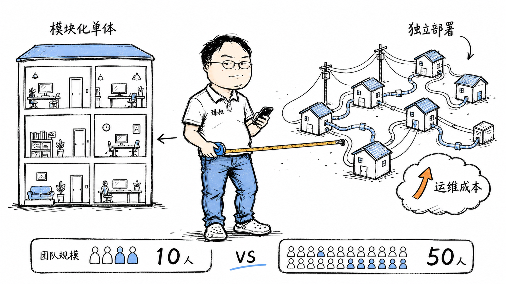

# 架构选型决策：单体与微服务的适用场景与转型时机



---

> 📌 **关注「程序员臻叔」，获取更多硬核技术干货**


---

2019年我参加了一个技术分享，演讲者激情澎湃地讲了40分钟"我们如何从单体迁移到微服务"。讲到一半他展示了一张图：迁移前，一个10人团队维护一个单体应用；迁移后，一个40人团队维护47个微服务。

台下有人举手："所以你们的运维成本是之前的四倍，但功能交付速度提升了吗？"演讲者沉默了几秒说："实话——没有明显提升。但我们的系统现在'更容易扩展了'。"

这话我记到现在。**微服务没有消除复杂度，它只是把"代码复杂度"变成了"运维复杂度"。你省了在代码里理清模块依赖的麻烦，换来的是排查分布式Bug的噩梦。**

## 核心结论

1. **单体和微服务的本质区别**：单体=进程内通信（函数调用），微服务=网络通信（RPC/消息）
2. **选择的标准不是"趋势"，而是"收益是否大于代价"**，10人团队做微服务是自残
3. **模块化单体是第三条路**：源码级模块隔离 + 进程内通信 = 单体的简单 + 微服务的边界
4. **康威定律决定了你的架构**：系统结构最终会反映组织沟通结构

## 深度拆解

### 单体真正的优势

一个单体应用 = 一个进程、一个代码仓库、一次部署。这三个"一"对应着巨大的优势：

**函数调用就是函数调用**：A模块调B模块的方法是本地方法调用：纳秒级延迟、不需要序列化、不需要处理网络超时、不需要考虑"对方挂了怎么办"。你在IDE里Debug，一个断点直接追到底。出了异常，堆栈信息一条线。

**事务是本地事务**：扣库存、扣余额、生成订单，在一个数据库事务里，ACID保证。失败了就回滚，没有中间态。

**部署是"扔一个Jar包"**：不管你写了多少模块，最终产出一个制品。没有服务发现、没有负载均衡、没有分布式配置。

这些优势在团队规模小于10人时是压倒性的。一个10人的微服务团队，2个人写服务A、2个人写服务B...最后每个人都要懂服务发现、熔断、链路追踪、分布式事务。每个人的认知负担翻倍，但产出不一定翻倍。

### 微服务什么时候"值"？

微服务的收益体现在**组织层面**，不是技术层面：

**团队并行开发**：50人团队，单体的代码库是所有人改同一个仓库：merge冲突、发布排队、一个人的Bug阻塞所有人的发布。微服务中，服务A的3人团队和服务B的4人团队完全独立，各自的仓库、各自的CI、各自的发布节奏。

**独立扩容**：秒杀场景只有订单服务爆发，其他服务不变。单体中所有功能共享进程，要扩容就是整个应用复制一份。微服务中只扩容订单服务，成本精确。

**故障隔离**：单体中某个模块内存泄漏→整个进程OOM→所有功能不可用。微服务中服务A崩了→服务B/C/D照常。这个差异是质的差别。

但记住：**微服务的"独立部署"对10人团队不是优势，因为一个人可能同时维护3个服务，部署A时要确保B和C不受影响，他还是要验证所有服务。**

### 模块化单体：第三条路

模块化单体的核心思想：**用包/模块的边界做隔离，用编译器的访问控制做约束，而不是用网络隔离。**

```
com.company.user       // 用户模块——不依赖订单模块
com.company.order      // 订单模块——依赖用户模块的公开接口
com.company.payment    // 支付模块——不依赖订单模块，只依赖用户模块的公开接口
```

每个模块有自己明确的公开API（接口），模块之间通过接口通信。编译器强制：如果你引用了user模块的 `internal` 包，编译直接报错。

**模块化单体 vs 微服务**：
- 函数调用 vs 网络调用（纳秒 vs 毫秒）
- 编译器强制边界 vs 运维强制边界（API网关/服务网格）
- 本地事务 vs 分布式事务（ACID vs 最终一致）
- 一个进程 vs 多个进程（简单 vs 运维复杂）

模块化单体的核心优势：**未来要拆微服务时，模块边界已经清晰。你做的只是把函数调用换成RPC调用，而不是先理解一个混乱的代码库再拆。**

## 实战要点

### 判断标准

不是"单体好还是微服务好"，而是"拆这个模块的收益和代价分别是什么"：

- **拆的收益**：独立扩容需求、独立发布需求、团队独立维护需求
- **拆的代价**：网络通信延迟、分布式事务复杂度、运维成本增加

只有收益 > 代价时才拆。

### 臻叔踩坑笔记

1. **为微服务而微服务**："大厂都用微服务"→大厂有1000个开发，你有10个。大厂的做法对大厂是对的，对你大概率是错的。
2. **拆太细**：一个服务只做一件事（一个函数）→ 一个业务请求经过20个微服务 → 端到端延迟爆炸 + 排查地狱。
3. **数据不拆分**：微服务拆了，但所有服务连同一个数据库 → 表面是微服务，实际是"分布式单体"，最差的情况（运维复杂度+数据耦合）。
4. **忽视康威定律**：组织架构是三个大部门，却拆了30个微服务——没有团队负责的服务就是孤儿服务。

### 一句话总结

> 微服务把代码的复杂度变成了运维的复杂度。10人团队的微服务不是前沿架构，而是被未来的自己恨死的技术债。

---

---

### 🎯 觉得有帮助？关注「程序员臻叔」


---
