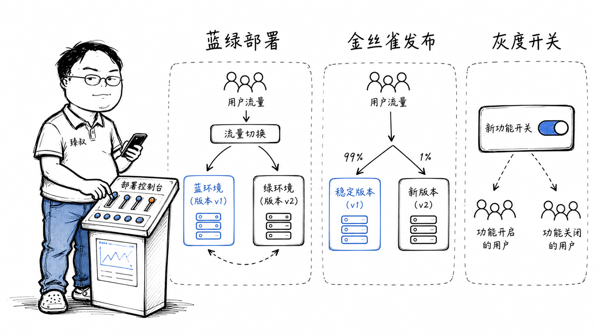

# 发布策略对比：蓝绿、金丝雀与滚动发布的选型与实施



---

> 📌 **关注「程序员臻叔」，获取更多硬核技术干货**


---

2020年的一个周四下午，我们做了一次"常规发布"。下午3点新版本上线，3点05分客服电话被打爆——支付功能报错了。运维紧急回滚，3点12分系统恢复。7分钟的故障，影响了约2000笔支付，财务团队加了三天班对账。

复盘时有人问："为什么不能先让1%的用户用新版本，发现问题就自动切回去，99%的用户根本不受影响？"答案是：我们当时连版本灰度机制都没有。发布 = 全量切换，没有中间状态。

那次之后，我们引入了金丝雀发布。从那之后，新版本的Bug最多影响1%的用户，而不再是全部。

**发布策略不是"高大上的技术"，而是从事故中活下来的人发明的血泪教训。**

## 核心结论

1. **蓝绿部署 = 秒级回滚**，代价是双倍基础设施
2. **金丝雀发布 = 小范围暴露验证**，自动比对指标异常则回滚
3. **灰度发布（Feature Flag）= 功能级开关**，代码已部署但不可见，随时可关
4. **三者可以组合**：蓝绿切换环境 + 金丝雀逐步放量 + Feature Flag控制功能

## 深度拆解

### 蓝绿部署：两套完全一样的环境

```
            ┌─────────────┐
用户 → 路由 →  Blue(当前)  │  新版本部署到Green
            ├─────────────┤
用户 ← 路由 ← Green(新)   │  路由切换，用户无感知
            └─────────────┘
```

蓝绿核心：维护两套完全相同的生产环境。当前流量全在Blue上。新版本先部署到Green，在Green上做冒烟测试。确认Green正常→路由切换到Green→所有流量到新版本。出问题了→路由切回Blue，秒级。

**优势**：回滚速度极快（切换路由不到1秒）、切换过程用户无感知。适合核心支付系统，每一秒的故障都在烧钱。

**代价**：双倍基础设施成本。且切换瞬间所有用户同时看到新版本，没有小范围验证的机会。

### 金丝雀发布：先让1%的用户当"试验品"

```
100%流量 → 99%→旧版本  1%→新版本
            ↓ 持续监控
            错误率/延迟/CPU
            ↓ 正常 ↓ 异常
       扩大到5%→25%→100%  自动切回旧版本
```

名字来源于矿井。矿工带着金丝雀下矿，金丝雀对有毒气体比人敏感。金丝雀死了→人赶紧撤。

金丝雀的流程：新版本部署到部分实例→导流1%用户→监控这1%的指标（错误率、P99延迟、CPU/内存）→正常则扩大到5%→正常则25%→正常则100%。任何阶段指标异常→自动停止放量并回滚。

**优势**：爆炸半径极小（1%用户受影响）、真实流量验证（不是测试用例能覆盖的）、自动止损。

**关键设计**：放量策略和回滚阈值。放量太快→还没来得及监控就已经打到100%了。阈值太敏感→正常波动触发回滚→发布永远通不过。这些参数需要根据你的系统的正常波动范围来调。

### 灰度发布（Feature Flag）：功能级别的开关

```
if (featureFlag.isEnabled("new_checkout", userId)) {
    return newCheckout();  // 新结算页
} else {
    return oldCheckout();  // 旧结算页
}
```

不同于蓝绿和金丝雀是**部署层面**的控制，灰度是**代码层面**的开关。新代码已经部署到了所有机器上，但通过开关控制它对谁可见。

灰度的典型用法：先对内部员工开放→对5%白名单用户开放→对特定地区开放→全量开放。任何阶段出现问题，关开关（可能就是一个配置中心的boolean值修改），无需重新部署。

**优势**：最细粒度的控制（可以按用户ID/地区/设备型号/会员等级精确控制）。回滚=改配置，秒级。

**代价**：代码里到处是 `if (featureFlag)` → 开关越积越多 → 测试组合爆炸（N个开关有2^N种组合状态→不可能全测）。好的实践：功能稳定后，在下个版本删除Feature Flag代码（包括它的if判断）。

## 实战要点

### 策略选择矩阵

| 场景 | 推荐策略 | 原因 |
|------|---------|------|
| 支付核心系统 | 蓝绿+金丝雀 | 秒级回滚+小范围验证 |
| C端电商 | 金丝雀+灰度 | 用户量够大，1%就有统计意义 |
| B端SaaS | 灰度 | 可以精确到企业级开关 |
| 大版本重构 | 蓝绿 | 架构变化大，不适合混合跑 |
| UI/UX改版 | 灰度 | A/B测试需要精确的人群划分 |

### 臻叔踩坑笔记

1. **金丝雀1%不代表无风险**：如果你的日活100万，1%就是1万人。如果这1万人全是付费用户（因为付费用户更活跃），你的金丝雀不是随机样本。
2. **蓝绿切换时的数据一致性问题**：Blue用了旧表结构，Green改了新字段，切换瞬间数据还没迁移完。蓝绿必须确保两个环境的数据库Schema兼容（新版本能读旧数据）。
3. **Feature Flag的膨胀**：一个Flag管了3个版本还没删→测试组合爆炸→每次改动要测N种开关组合。Flag应该临时存在，功能稳定后必须清理。
4. **回滚 != 撤销副作用**：新版本可能发了消息、调了外部API、改了用户数据。只切换环境/关开关不能撤销这些。回滚策略必须包含数据补偿方案。

### 一句话总结

> 发布的核心指标不是"上线的速度"，是"回滚的速度"。能快速安全地回滚的发布才是好发布。

---

---

### 🎯 觉得有帮助？关注「程序员臻叔」


---
