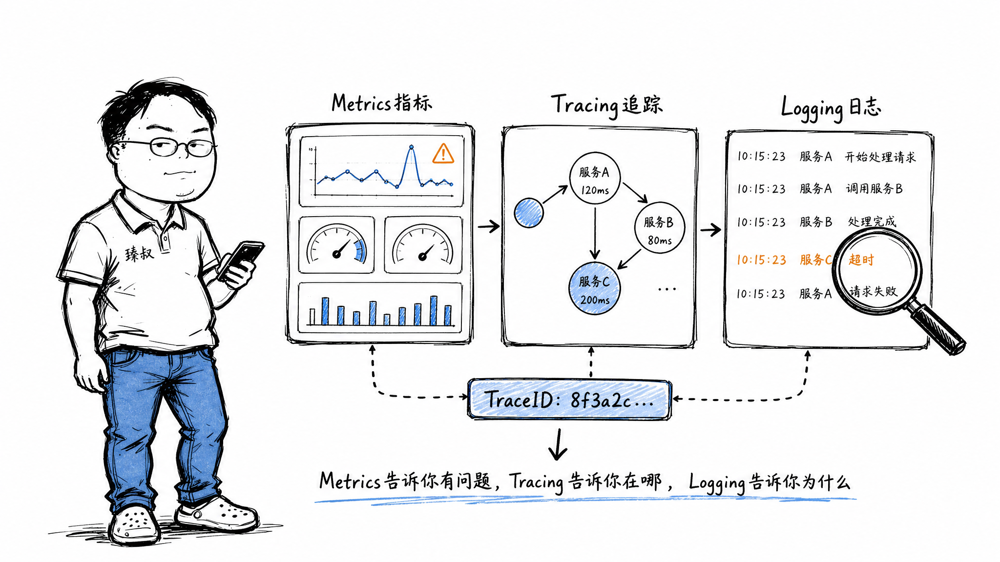

# 可观测性——为什么"系统还活着"不等于"系统没问题"




凌晨2点，手机响了——告警："支付服务CPU使用率95%"。我爬起来看监控大盘，确实CPU打满了。但所有接口都正常返回，用户没投诉，业务没受影响。

我跟运维说："先别管，明早再看。"运维急了："CPU都95%了！"我说："你看错误率——0。P99延迟——比昨天还低。这说明CPU在干正事，不是在瞎忙。"

果然第二天一早，我们发现昨晚有一个定时任务在跑数据统计——就是它吃满了CPU，但任务优先级低、不抢接口资源。CPU高是因为资源配置合理——买的机器就该跑满，不然浪费。

**告警的核心不是"告诉我有什么不正常"——是"告诉我什么需要我行动"。CPU 95%且业务正常 = 不需要行动 = 不应该告警。**

## 核心结论

1. **监控 = 回答"已知的已知"**（CPU超过80%了吗？）；**可观测性 = 回答"未知的未知"**（为什么延迟突然变高了？）
2. **Metrics告诉你"有没有问题"，Tracing告诉你"问题在哪"，Logging告诉你"具体什么问题"**
3. **告警风暴是比故障本身更严重的问题**——20000条告警淹没真正有价值的那条
4. **好的告警系统**：每个告警都是actionable——接到告警时你知道该干什么

## 深度拆解

### 三支柱：Metrics、Tracing、Logging

**Metrics（指标）**：聚合数值。QPS、P99延迟、CPU使用率、内存、GC频率、线程池大小。适合趋势分析和阈值告警。

特点：极度轻量（每秒产生的数据是固定的几个数字，不随流量增长而膨胀）、实时性好（秒级）、适合dashboard和长期趋势。

局限：告诉你"有什么问题"，但不告诉你"为什么"。

**Tracing（链路追踪）**：一次请求在整个分布式系统中的完整路径。TraceID贯穿所有服务→每个服务的Span记录自己的处理耗时→拼起来就是一条调用链。

```
请求入口(API网关) → 用户服务(34ms) → 订单服务(150ms) → 支付服务(2300ms) ❌
                                        ↓
                                    DB查询(1800ms) ← 这里慢！
```

链路追踪让你一眼看出：延迟增加是因为支付服务调用了一个慢SQL查询。没有Tracing——你只能挨个服务查日志。

**Logging（日志）**：离散的事件记录。`"用户123于10:32:15登录失败，原因：密码错误，IP：1.2.3.4"`。适合事后排查和审计。

关键约束：日志必须结构化（JSON）、必须带TraceID（否则无法串联到链路里）、必须有上下文（只有 `NullPointerException` 没有参数信息，等于没记）。

### 三者如何串联

一个线上故障的排查路径：

1. **Metrics告警**：P99延迟从200ms飙升到5秒 → 知道"有问题"
2. **Tracing定位**：打开链路追踪，看到支付服务的`/pay`接口慢了，慢在调用风控引擎 → 知道"在哪"
3. **Logging查根因**：查风控引擎的日志，看到 `Redis connection timeout`，Redis那台机器网络断了 → 知道"为什么"

三者缺一不可。没有Metrics你不知道有问题，没有Tracing你不知道在哪，没有Logging你不知道根因。

### 告警风暴：为什么20000条告警比0条更可怕

交换机故障 → 1000台服务器全部不可达 → 监控系统对每台服务器产生"不可达"告警 + 每个依赖服务产生"下游不可用"告警 + 健康检查失败告警 → 20000条告警在30秒内涌入。

结果：运维人员根本看不过来。真正有价值的告警（那一条"交换机端口down"）被淹没在20000条噪音里。而如果交换机的问题修好了，所有派生告警自动恢复——你根本不需要看到那19999条。

**防告警风暴策略**：
1. **告警聚合**：1000台服务器不可达 → 合并为1条"集群不可达，受影响：1000台"
2. **告警抑制**：交换机告警触发 → 自动抑制所有下游的"服务器不可达"告警
3. **延迟告警**：CPU瞬时飙到100%可能只是GC在回收→等2分钟如果仍然100%才告警
4. **分级**：P0电话（系统不可用）→ P1短信（关键功能受损）→ P2即时消息 → P3邮件

## 实战要点

### 臻叔踩坑笔记

1. **告警阈值拍脑袋**："CPU > 80%"——你80%可能是正常区间，有些系统常态85%。阈值应该基于历史数据的统计分布设定。
2. **只看"活着"**：健康检查pass≠系统正常。系统可能活着但响应时间从200ms变成30秒——这个比死了还痛苦（超时不如直接报错）。
3. **可观测性不是事后补的**：出故障时才想"如果有TraceID就好了"——已经晚了。TraceID、结构化日志、Metrics收集必须在写代码时就集成。
4. **日志太多**：一个请求打500行日志 → 存储成本爆炸 + 查起来大海捞针。INFO只记关键节点（请求进入/外部调用/请求结束），DEBUG记详情。

### 一句话总结

> 好的监控让你在用户投诉之前就知道有问题；好的可观测性让你在接到告警时不需要打开代码就能定位。

---

