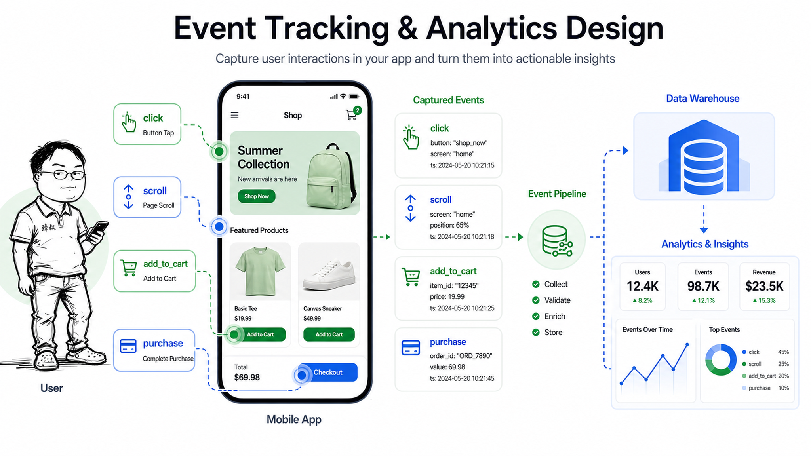

# 埋点怎么做——90%的埋点数据最后都是垃圾



2020年，一家内容平台的数据团队把三年的埋点数据做了个全量盘点。结果让CEO沉默了很久：

- 总埋点数：1876个
- 过去一年被查过的：127个（6.8%）
- 有明确业务决策依赖的：43个（2.3%）
- 数据异常但没人发现的：89个

更尴尬的是——产品经理提了一个需求："能不能看一下用户在播放页的停留时长分布？"数据团队查了两天，发现两年半前的埋点里有一个`video_play_duration`事件，但参数定义是"用户点击播放按钮到用户点击暂停按钮的时间差"——而不是"视频实际播放的时间"。用户暂停去上厕所，停留时长被算成了37分钟。

**埋点的核心问题从来不是"技术怎么埋"——是"埋之前有没有想清楚这个数字会用来做什么决策"。**

## 核心结论

1. **先定义"要回答的问题"，再设计埋点**——而不是"先全埋上，以后总会用到的"
2. **埋点三要素缺一不可**：事件（What）+ 属性（Context）+ 时机（When）
3. **数据质量靠校验不靠信任**——埋点上线后必须有自动化的数据质量监控

## 深度拆解

### 埋点的三种类型

**全埋点（无埋点/可视化埋点）：**

自动采集用户在页面上的所有行为——点击、滑动、输入、停留。使用SDK自动注入，不需要开发者手动在代码里加埋点代码。

优点：零开发成本，历史数据可回溯。缺点：数据量大（每天几千万条打底）、噪音多、无法采集业务上下文（只知道"点了一个按钮"，不知道"这个订单的金额多少"）。

适合场景：初期的用户行为分析（用户在哪个页面流失了、热力图）。

**代码埋点：**

开发者在代码的特定位置手动插入埋点代码：

```javascript
// 用户完成支付
tracker.track('order_paid', {
    order_id: order.id,
    amount: order.total,
    payment_method: 'wechat_pay',
    coupon_used: order.coupon_id ? true : false,
    user_type: user.is_new ? 'new' : 'returning'
});
```

优点：精确、带上业务上下文、可以控制触发时机。缺点：需要开发排期，改一个埋点 = 一次发版。

适合场景：核心业务流程（注册、下单、支付）、转化率分析、A/B测试。

**服务端埋点：**

在服务端的日志/事件中采集，而不是客户端：

```python
# 订单状态变更
logger.info("order_status_change", extra={
    "order_id": order.id,
    "from_status": old_status,
    "to_status": new_status,
    "operator": "payment_callback"
})
```

优点：不受客户端网络影响（不会有"用户完成了支付但埋点丢失"的情况）、不受广告拦截插件影响。缺点：拿不到客户端行为（用户在哪个页面停留多久、点了哪个按钮）。

适合场景：后端业务流程（订单状态流转、库存变更、退款处理）、数据一致性要求高的场景。

**正确的策略：三种混合，分层使用。**

- 全埋点 → 探索阶段，找"用户在哪流失了"
- 代码埋点 → 核心转化漏斗，必须精确
- 服务端埋点 → 业务数据的唯一真实来源

### 埋点设计的魔鬼细节

**事件命名的统一规范：**

不用规范，三个月后谁也看不懂。推荐规范：`模块_动作_对象`。

```
❌ bad:
  buy_click
  purchase_event
  newOrder

✅ good:
  cart_click_checkout       # 购物车-点击-结算按钮
  order_view_success         # 订单-查看-成功
  payment_click_wechatpay    # 支付-点击-微信支付
```

**属性不要"什么都带上"：**

每个事件带30个属性，存储成本爆炸且查询变慢。一个事件带5-8个核心属性就够了。其余的可以通过"事件+用户ID+时间"关联到业务数据库查。

但有一个属性必须带：**`page_url` 或 `page_name`**。没有这个，你永远不知道用户在哪个页面触发的——"支付按钮点击"在商品详情页和购物车页的含义完全不同。

**时机要精确，不要"差不多"：**

```javascript
// ❌ 埋点时机错误——页面加载就触发
$(document).ready(function() {
    tracker.track('page_view', {page: 'home'});
});

// ✅ 正确——页面首屏渲染完成才触发
window.addEventListener('DOMContentLoaded', function() {
    tracker.track('page_view', {page: 'home', load_time: performance.now()});
});
```

"页面加载"这个事件如果在DOM ready之前触发——那每次采集到的都是"用户还没看到页面"。你的"首页浏览量"实际上是"首页请求量"，差了一倍不止。

### 埋点数据质量保障

埋点上线只是开始。上线后第一周必须做数据校验：

**校验一：事件量级是否合理**

对比业务数据库的量级：订单表的今天新增记录 = 1000条，埋点`order_created`事件今天 = 300条？差70%说明埋点掉了。

**校验二：属性非空率**

`order_paid`事件的`amount`属性有20%是null——要么是代码bug，要么是某类订单没有金额（比如0元试用）。不管是哪种，数据分析时都会出问题。

**校验三：异常值检测**

某一天`page_view`事件量突然比前一天暴涨10倍——不可能是突发的自然流量。大概率是埋点代码里写了死循环，或者爬虫触发了埋点。在埋点SDK里加`debounce`（去重防抖）逻辑——同一用户同一事件1秒内只发一次。

### 埋点文档：没人写但最重要的东西

一个完整的埋点文档应该包含：

```
事件名：order_paid
触发时机：支付回调成功后（服务端确认支付状态为SUCCESS）
属性：
  - order_id (string)：订单号，关联订单表
  - amount (decimal)：实付金额，单位元，保留两位小数
  - payment_channel (string)：微信/支付宝/银联
  - is_first_order (bool)：是否用户首单
  - coupon_discount (decimal)：优惠券抵扣金额，无则为"0.00"
不包含的常见误区：
  - 不包含user_id（可通过order_id关联获取，避免隐私合规问题）
业务用途：
  - 计算每日支付转化率（= order_paid唯一用户数 / 当日活跃用户数）
  - 监控支付成功率（= order_paid事件数 / 支付发起事件数）
  - 分析首单用户占比
负责人：王五（产品），李四（开发）
最后更新：2023-03-15
```

没有这份文档的埋点，三个月后就是个定时炸弹：数据分析师不知道`amount`是"原价"还是"实付价"；开发重构时不知道这个埋点还有没有人用，不敢删也不敢改。

## 实战要点

### 臻叔踩坑笔记

1. **一上来就全埋点**：全埋点产生海量数据但价值密度极低。先想清楚你要回答的5个核心业务问题，每个问题反推需要的埋点——这5个问题的埋点集就是你的最小可行埋点集（MVP Tracking Plan）。一切新增埋点必须回答"这个数据会用来做什么决策"。
2. **客户端埋点当唯一数据源**：用户在App上完成了支付——客户端埋点`payment_success`发出去了。但此时网络断了，这个埋点丢了。数据分析认为"支付转化率下降了30%"，其实是埋点丢失。关键业务流程必须用服务端埋点做双校验。
3. **埋点属性类型不一致**：V1.0版本`amount`是string、V1.1版本改成了number——数据分析平台里同一个字段混了两种类型，SQL直接报错。属性类型一旦定义就不能改，要加新类型就加新属性名（比如`amount_v2`）。
4. **埋点code review被忽略**：埋点代码通常和业务逻辑混在一起，CR时业务逻辑通过了就过了，埋点是否正确没人检查——直到数据分析师发现数据不对劲。埋点代码应该有独立的CR检查项。
5. **埋点数据没有隐私合规check**：`page_url`里包含了用户的手机号（因为是URL参数传过来的）。这在GDPR和个保法下是严重违规。埋点数据在发送前必须做脱敏处理——正则过滤手机号、身份证号、邮箱等敏感信息。

### 一句话总结

> 埋点不是"越多越好"——是"每个埋点都能回答一个具体的业务问题，且数据质量可靠"。先想清楚问什么，再决定埋什么。反之就是制造数据垃圾。

