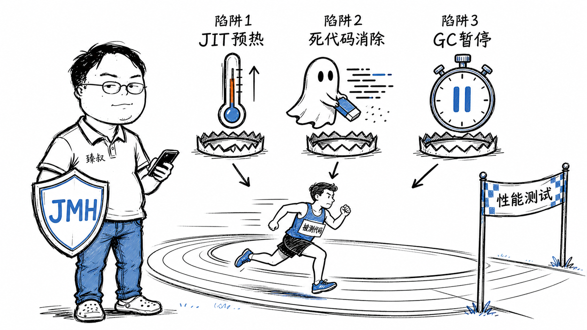

# 基准测试方法论：性能测试设计、执行与常见陷阱



---

> 📌 **关注「程序员臻叔」，获取更多硬核技术干货**


---

2020年我参加了一次技术评审，一个同事展示了"自研RPC框架的性能测试"：QPS 50万，比gRPC快3倍。

我问他："你用的是什么测试方法？"

"就一个for循环调100万次，System.currentTimeMillis()计个时。"

"你这for循环里，返回值用了吗？"

"没有，我就算一下时间，不需要返回值。"

"那你测的不是RPC性能，而是JIT帮你把整个RPC调用优化掉的速度。因为你没消费返回值，JIT判断这是'死代码'，直接删了。你测了个空气。"

他愣了三秒："那我该怎么测？"

**基准测试不是"写个循环跑一下"。所有能干扰结果的环境因素都在跟你作对，你必须一个个排除它们。**

## 核心结论

1. **JVM的JIT预热**：前几万次调用是"解释执行"，后面才是真实性能。不预热测的是启动速度
2. **死代码消除**——JIT发现计算结果没被使用，直接跳过整段计算。你以为测了，其实什么都没测
3. **GC暂停**：你测试的不是函数本身的耗时，是"函数耗时+GC暂停"。GC暂停可能在函数完成后触发
4. **用JMH**，Java Microbenchmark Harness是基准测试的标准工具，替你处理了所有这些陷阱

## 深度拆解

### 陷阱1：JIT预热

Java/C#等JVM语言有个特性：代码第一次执行是解释器逐行解释（慢）。执行次数足够多后，JIT编译器把热点代码编译成机器码（快）。

```java
// 你这样测：
long start = System.nanoTime();
for (int i = 0; i < 10000; i++) {
    myFunction();
}
long end = System.nanoTime();
```

问题：前1000次是解释执行（慢），后9000次是JIT编译后的机器码（快）。你测的是"混合性能"，不代表稳定后的真实性能。而且，如果总共只跑1000次，可能JIT还没触发，你测的完全是解释执行速度。

JMH的做法：先跑N轮"预热"（不记录），等JIT编译完成后，再跑M轮记录数据，取统计。

### 陷阱2：死代码消除

```java
// 你的测试代码
@Benchmark
public void test() {
    int result = heavyComputation();  // 计算了result
    // 但result没有被任何地方使用
}
```

JIT分析：这个函数返回void；result是一个局部变量，函数结束后就没了；没有任何外部能观察到这个计算的结果。结论：整段计算可以安全删除。

你测出来的0纳秒，不是你的代码快，而是你的代码根本不存在。

JMH的做法：用 `Blackhole.consume(result)` 强制消费计算结果。"这个结果被外部观察到了，JIT你不能删它。"

### 陷阱3：GC暂停

```java
// 你的测试：
runTest();       // 1ms
// GC在这里触发，暂停50ms
runTest();       // 结果：51ms（这不是函数慢！）
```

你的测试循环里触发了GC→某个测试样本的值异常大→平均值被拉高。如果你只看平均值，以为是函数变慢了，实际是GC在背锅。

JMH的做法：每个@Benchmark方法之间强制GC；分别记录GC暂停时间并从测试时间中排除。

### 陷阱4：CPU动态频率

你的测试刚开始时，CPU可能运行在低频（省电模式）。测试跑了几十秒后，CPU检测到高负载→升频→后面的测试跑得更快。你的"平均值"混合了低频和高频的性能。

JMH的做法：多轮预热让CPU进入稳定高频状态、取多次测量的统计分布而非单次。

## 实战要点

### 正确的基准测试流程

```java
@BenchmarkMode(Mode.Throughput)          // 测吞吐量
@OutputTimeUnit(TimeUnit.SECONDS)
@Warmup(iterations = 5, time = 1)       // 预热5轮
@Measurement(iterations = 5, time = 2)  // 正式测5轮
@Fork(3)                                 // 独立JVM跑3次
@State(Scope.Thread)
public class MyBenchmark {
    
    @Benchmark
    public void testMethod(Blackhole bh) {
        int result = heavyComputation();
        bh.consume(result);  // 防止死代码消除
    }
}
```

这些注解不是"建议"，而是基准测试的**最低标准**。

### 臻叔踩坑笔记

1. **只在本地测**：你MacBook Pro的M3跑出来的数据，不代表线上Xeon服务器的性能。
2. **不控制其他进程**：测试期间开着Chrome、IDE、音乐——它们在抢CPU和内存。测试要关掉一切非必要进程。
3. **比较不同硬件的测试结果**："框架A在32核服务器上QPS 50万，框架B在4核笔记本上QPS 5万，所以框架A比B快10倍"。放同样的环境里可能B更快。
4. **看Benchmark Games的数据做决策**：那些"语言性能排行"的测试代码是高度优化的，不是你日常写的代码。日常代码的性能差异通常远小于Benchmark Games展示的差异。

### 一句话总结

> 基准测试是用排除法排除所有能扭曲结果的因素，最后剩下的那个数字，勉强能代表"真实性能的可能范围"。任何不讨论"你控制了哪些变量"的基准测试都是娱乐节目。

---

---

### 🎯 觉得有帮助？关注「程序员臻叔」


---
