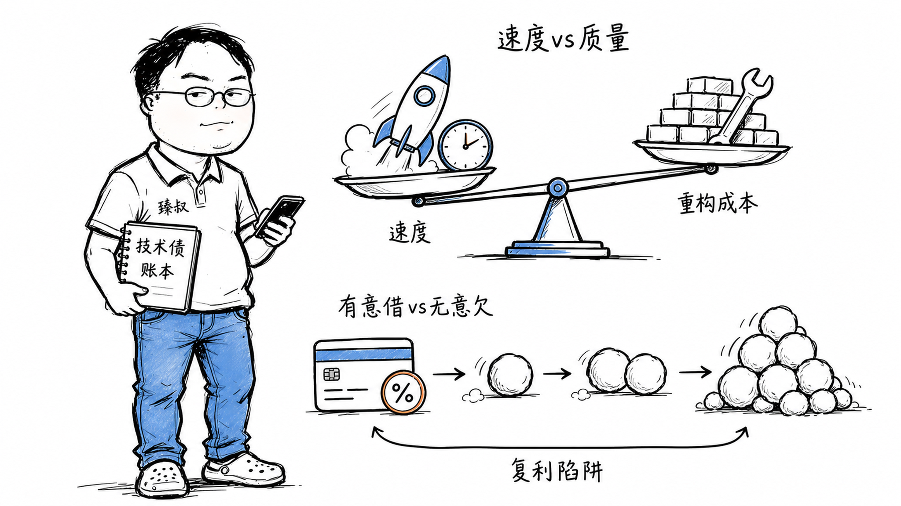

# 技术债管理：识别、量化与偿还策略

---

> 📌 **关注「程序员臻叔」，获取更多硬核技术干货**

---

2017年，一个新入职的工程师接手了一个创业公司的代码库。打开一看，一个3万行的 `Utils.java`，所有业务逻辑都写在Controller里，数据库查询直接拼SQL，变量名叫 `a`、`b`、`temp`、`temp2`。

他火速找CTO投诉："这就是一坨屎山，必须重写！"CTO很平静地回了一句："你知道我们现在的月活已经50万了吗？这座'屎山'养活了公司两年。你重写需要多久？三个月？期间新功能不上？竞争对手三个月能抢走我们30%的用户。"

这是一个经典的教训：**技术债不是错误，而是决策。坏的是不知道自己欠了债、或者知道但没计划还。**

## 核心结论

1. **技术债本质上是用明天的重构成本换取今天的上线速度**
2. **技术债分四种**：有意借的（理性决策）、无意识的（经验不足）、不可避免的（业务演进）、技术演进的（框架升级）
3. **管理技术债 != 消灭技术债**，像房贷一样，适度负债加速发展，但必须有还债计划
4. **"烂代码"和"技术债"的区别**：前者是不知道有问题，后者是知道有问题且有计划

## 深度拆解

### 什么时候"借"是合理的？

理性借债的三个条件：
1. **验证假设**：MVP阶段，你不知道用户要不要这个功能。花三个月做完美架构，结果没人用。最贵的不是技术债，是做了没人要的东西。
2. **时间窗口**：竞品已经在市场上，你晚一个月上线就永久失去这批用户。先上线再优化。
3. **非核心模块**：你公司做支付的，后台管理系统写烂一点可以接受。核心支付系统不能欠债。

Ward Cunningham（技术债概念的提出者）的原话："交付不成熟的代码就像借债。还债就是重构。债会产生利息，利息就是未来修改代码时额外的维护成本。"

### 四种技术债

**1. 有意为之**：你知道这里用的是简化方案，你知道未来要改。你有计划、有时间表、甚至已经建了Jira Task。这是"良性"债务，可控。

**2. 无意产生**：写的时候不知道更好的做法，后来看了别人的代码或学了新技术才知道"原来可以这样写"。这是成长带来的债，无法避免，但需要定期review老代码发现它。

**3. 不可避免**：三年前设计的数据模型，当时只支持国内用户。现在业务要出海，手机号字段从11位变成国际格式。不是当年写错了，是业务变了。这种债不应该被指责。

**4. 技术演进**：框架主版本升级：Spring Boot 2.x → 3.x，Java 8 → 17，React Class Component → Functional Component。技术上旧代码仍然能跑，但不升级就享受不到新版本的性能优化和安全补丁。

### 利息怎么量化？

技术债的"利息"不是比喻，而是可以估算的工程成本：

- **修改成本**：正常修改一个功能需要改2个文件；因为架构耦合，实际需要改15个文件。多出的13个文件的改动=利息。
- **理解成本**：新人入职，正常理解一个模块需要2天；因为代码没有注释、变量名混乱、缺少设计文档，实际需要2周。多出的时间=利息。
- **Bug率**：正常情况下，每次发布引入Bug的概率是5%；因为代码质量差，每次发布引入Bug的概率是20%。多出的15%线上事故=利息。

如果你的"利息"已经开始大于"本金"（花在改旧代码上的时间多于写新功能的时间），系统已经进入了"技术破产"状态。这时不是还债的问题了，是重写。

## 实战要点

### 还债策略

1. **每Sprint固定20%时间还债**：不是"这个Sprint有空就还"，永远不会"有空"。必须硬性分配。
2. **维护技术债登记簿**：记录每一笔"债"：欠了什么、为什么欠、预计影响范围、计划偿还时间。
3. **童子军原则**：每次修改一个文件，让它在离开时比进来时干净一点。不用一次性还清，每次还一点。
4. **技术债的"复利"陷阱**：欠A债→系统变复杂→新功能开发更慢→为了赶进度欠B债→系统更复杂→恶性循环。打断这个循环的唯一办法是：**暂停新功能一段时间，集中还债。**

### 臻叔踩坑笔记

1. **"我们下个季度重构"**：说完就忘。技术债跟信用卡一样，有最低还款额，不能只"计划"。
2. **大面积重写**：看到屎山就想推倒重来。风险极高：重写期间系统不可用、新系统有新的Bug、业务逻辑迁移遗漏。增量重构（一次改一个模块）比整体重写安全得多。
3. **不区分优先级**：不是所有技术债都值得还。那些"已经稳定运行三年、未来不会改"的模块，欠再多债也不需要还。
4. **把"我不喜欢这个设计"当成技术债**：技术债是"不改会导致实际问题"的东西，不是"不符合我的审美"的东西。

### 一句话总结

> 技术债不是罪恶，而是杠杆。聪明的工程师知道什么时候借钱、什么时候必须还。愚蠢的工程师要么从不借钱（过度设计到饿死），要么借了不还（撑死在利息里）。

---

---

### 🎯 觉得有帮助？关注「程序员臻叔」

---
