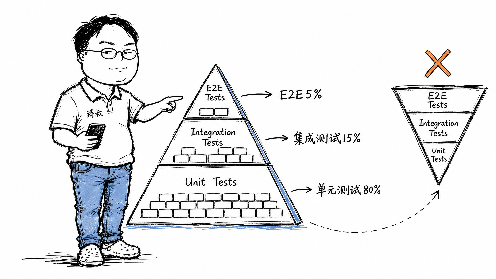

# 测试金字塔实践：单元测试、集成测试与E2E的比例分配



---

> 📌 **关注「程序员臻叔」，获取更多硬核技术干货**


---

2020年，某团队接手了一个遗留系统。第一天跑CI，CI日志跑了2小时18分钟。打开一看，300多个测试用例，其中270个是E2E测试（用Selenium操控浏览器做完整业务流程），单元测试不到20个。

更魔幻的是：这270个E2E测试的通过率只有60%。不是代码有Bug，而是浏览器版本更新导致某些选择器失效、测试环境网络不稳定导致超时、某次UI改版把按钮文案改了所以click不到。每次CI跑完，开发者要花30分钟区分"真Bug"和"测试自身的问题"。

两个月后这个团队把它翻了过来：单元测试从20个涨到400个，E2E从270个砍到30个。CI时间从2小时降到8分钟。更重要的是，开发者终于不再看到红色CI就麻木了。

**测试金字塔不是教条，而是你花了足够多冤枉时间之后被迫总结出来的生存法则。**

## 核心结论

1. **单元测试是最低成本的Bug发现工具**：毫秒级、精准定位、不受环境干扰
2. **集成测试验证契约**——模块之间的接口约定是否正确
3. **E2E测试是"信心税"**：给你最大的上线信心，但找Bug效果最差、维护成本最高
4. **反转金字塔 = 慢CI → 开发者跳过测试 → 线上事故 → 补更多E2E → 更慢 → 恶性循环**

## 深度拆解

### 单元测试：你改了一行代码，它在0.1秒内告诉你对不对

```java
@Test
public void testCalculateDiscount_VIP_20Percent() {
    OrderService service = new OrderService();
    BigDecimal result = service.calculateDiscount(
        new BigDecimal("100"), UserLevel.VIP);
    assertEquals(new BigDecimal("80"), result);
}
```

这段测试有三个关键特征：
- **隔离**：不依赖数据库、不依赖网络、不依赖任何外部系统。所有依赖都是Mock的。
- **快速**：毫秒级执行，400个单元测试 < 5秒跑完。
- **精准**：失败了就告诉你哪个函数的哪个分支不对，不需要排查。

单元测试应该占测试总数的70-80%。为什么是这个比例？因为大部分Bug出在函数级别的逻辑错误：边界条件没处理、null没判断、类型转换出错。这些在单元测试里发现是0成本（你还在写代码，顺手就改了），到了集成测试阶段发现需要花20分钟定位，到了线上被发现就是事故。

### 集成测试：两个模块各自完美，拼在一起就炸了

```java
@Test
public void testUserRegistration_PersistsToDatabase() {
    // 真实数据库，不是Mock
    userService.register("test@example.com", "Password123!");
    User saved = userRepository.findByEmail("test@example.com");
    assertNotNull(saved);
    assertEquals("test@example.com", saved.getEmail());
}
```

集成测试验证的是"模块A调用模块B时，数据格式、异常处理、超时重试等契约是否能正确履行"。经典场景：你的Service调了Repository的方法，参数类型改了但Repository那边的方法签名还用的老类型，编译通过（因为Repository接口没变），运行时空指针。单元测试各自Mock对方，测不出这个问题。集成测试用真实依赖，暴露它。

集成测试占15-20%。不更多，因为涉及真实依赖（数据库、消息队列），执行慢（秒级），且多个测试可能互相干扰（共享数据库状态）。

### E2E测试：花20分钟跑一个流程，告诉你"用户能下单了"

E2E测试模拟真实用户操作，通常用Selenium/Cypress/Playwright操控真实浏览器：

```
打开首页 → 搜索"手机" → 点第一个结果 → 加入购物车 → 去结算 → 填地址 → 提交订单 → 看到"下单成功"
```

E2E的价值是"信心"：你不需要推理"如果A+B+C+D都正确，那用户能下单吗"，你直接看到用户能下单。代价也巨大：

- **慢**：一个E2E用例通常30秒到数分钟
- **脆弱**：UI一改文案/布局/ID → 测试挂掉 → 维护成本爆炸
- **定位难**：E2E失败只能告诉你"下单流程断了"，不能告诉你"哪行代码的问题"

E2E占5-10%。你的E2E应该只覆盖核心业务路径（用户注册、下单、支付），而不是所有边缘场景。边缘场景放单元测试，成本低、定位准。

## 实战要点

### 臻叔踩坑笔记

1. **把集成测试当成单元测试写**：单元测试里连了真实数据库，跑一次50ms→500ms，400个测试从5秒变3分钟。解法：单元测试一律Mock外部依赖。
2. **测试覆盖率焦虑**：追求100%覆盖率，写了一堆 `assertTrue(true)` 的无意义测试。解法：覆盖核心业务逻辑的分支，不追数字。
3. **E2E测试用来找Bug**：Bug应该被单元测试找到，E2E只是确认"这些正确的东西合在一起仍然正确"。
4. **测试环境不稳定**：E2E测试因为网络超时/测试数据冲突/浏览器崩溃而随机失败。解法：Flaky Test自动重试机制+失败超过N次则标记为"不健康"并报警。

### 一句话总结

> 测试金字塔不是教条，而是你把金字塔倒过来之后被两小时CI折磨出来的经验。底层快而多、顶层慢而少，这是工程成本的最小化，不是某人的审美偏好。

---

---

### 🎯 觉得有帮助？关注「程序员臻叔」


---
