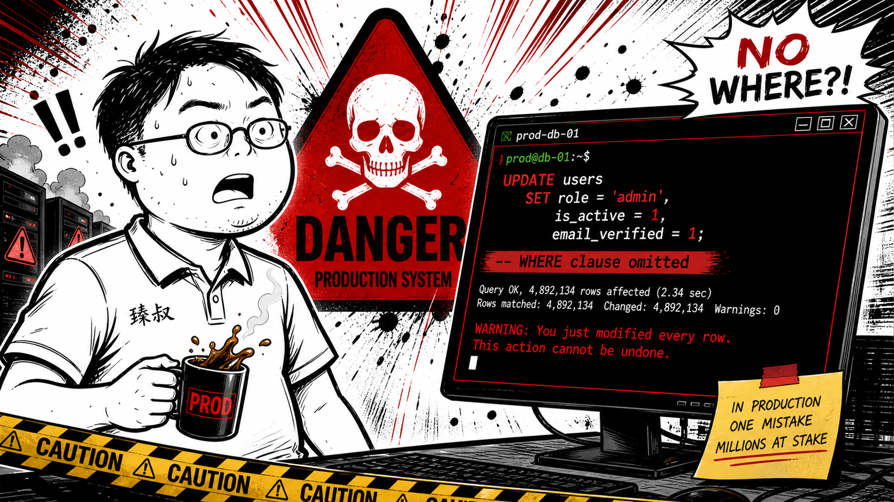

# 线上运维的高危操作——每一行命令都可能让你成为"那个导致事故的人"



2018年7月的下午3点14分。某支付平台的运维工程师在线上数据库执行了一条SQL：

```sql
UPDATE t_order SET status = 'PAID' WHERE order_id = '12345678';
```

他漏掉了`LIMIT 1`。而且WHERE条件写错了——应该是`order_id = 12345678`（数字类型），他写成了字符串。MySQL的类型转换让这条SQL命中了全表。

3秒后，客服电话开始响。200万条未支付订单的状态全部变成了PAID。用户在App上看到"支付成功"，但钱没扣。财务团队花了一周时间逐条对账。

**线上运维不是"会不会操作"的问题——是"操作失败之后你有没有退路"的问题。**

## 核心结论

1. **高危操作的定义**：任何可能导致数据丢失、服务中断、或用户体验降级的线上变更
2. **"防呆"比"小心"可靠一万倍**——别指望人的注意力，用流程和工具拦住错误
3. **每个高危操作必须有三件套**：审批流 + 灰度验证 + 回滚预案

## 深度拆解

### 高危操作清单

**等级P0 — 可能造成资金损失/数据丢失/服务完全不可用：**

1. **数据库直接操作（UPDATE/DELETE/DROP）**：生产库执行写操作前，必须在只读副本上验证。涉及超过1000行影响范围的，需要DBA审批。
2. **表结构修改（ALTER TABLE/加索引）**：大表加索引会锁表。高峰期执行会让全站不可用。必须在凌晨窗口期，且提前用`pt-online-schema-change`做在线DDL。
3. **Kubernetes操作（kubectl delete）**：尤其注意——`kubectl delete namespace` 会删掉这个namespace下所有的Deployment、Service、ConfigMap。没有确认，没有撤销。做过这件事的人这辈子都会在按下回车前验三次`kubectl config current-context`。
4. **删除云资源**：删了RDS实例、Elasticsearch集群、Redis节点——这些资源删了就没了。云厂商的快照恢复不一定靠得住。
5. **秘钥轮转/证书更换**：旧证书过期前必须提前2周换新的，而不是"到期当天换"。换证书的过程中如果新旧不兼容，全站HTTPS不可用。

**等级P1 — 可能造成部分用户不可用：**

6. **负载均衡摘除节点**：摘错了节点——业务流量全打到少量节点上，连锁过载。摘之前确认IP、确认节点上的QPS、确认有备用节点承接。
7. **配置中心变更**：一条配置推送到所有实例。如果有实例不兼容新配置，可能会导致这批实例全部panic重启。
8. **灰度发布回滚**：回滚不是简单的"部署上一个版本"。上一个版本的数据库Schema是否兼容当前的？上一个版本的API是否被其他服务调用了？这些都是"回滚预案"必须回答的问题。
9. **防火墙/安全组规则变更**：加了一条错误的规则——把自己关在门外（还有SSH/RDP都进不去的情况）；或者错误地放开了不该开放的端口。

**等级P2 — 短期影响，可恢复：**

10. **批量重启/重载服务**：批量重启时如果并发太高，所有实例同时启动（冷启动慢），期间服务不可用。
11. **日志级别临时调整**：开启DEBUG日志后忘记关闭——日志量暴增导致磁盘写满，服务崩溃。
12. **域名切换**：DNS TTL要提前降到60秒，不然切换后老IP还有大量流量。

### 高危操作的防护体系

**第一道防线：审批流**

所有P0级操作必须有至少两个人审批。审批人不是"同意就行"，而是要确认三件事：
- 你准备执行的确切命令是什么？（贴出来，别只说"我要改数据库"）
- 影响范围多大？（多少用户/订单/数据行会受影响）
- 回滚方案是什么？（如果失败，多久能恢复？）

**第二道防线：变更窗口**

不是随时都能操作。高峰期（比如电商的晚上8-10点、支付平台的午间）禁止一切变更。变更窗口要提前48小时通知相关方。

**第三道防线：灰度验证**

先操作一个实例 → 观察10分钟 → 再操作10% → 观察5分钟 → 再操作全部。每一步都有观察窗口和数据验证。

**第四道防线：回滚预案**

每个变更必须有书面的回滚预案，且回滚预案本身也要验证过——"理论上可以回滚"不等于"上次测试回滚是一个月前"。

### 最常见的"我以为"灾难场景

- **"我以为这只是个查询"**：你用`mysql -u root -p`连上了生产库，想跑一个`SELECT COUNT(*)`。但你忘记自己连的是生产，而且你用的是一个有写权限的账号。一键F5执行了某个DML语句。
- **"我以为我在操作测试环境"**：你有两台机器SSH连着——一台生产，一台测试。你在操作测试机，但终端窗口是生产机。`rm -rf /tmp/*` 在测试环境执行了，但生产机的tmp下存着关键日志。
- **"我以为这个改动很小"**：改了一个配置文件的参数值。但你没意识到这个参数变了之后，下游服务的反序列化会失败。100个实例全部重启。

## 实战要点

### 臻叔踩坑笔记

1. **root账号进生产库**：任何时候都不应该。每个运维应该有个人专属账号（权限最小化），且生产库默认只开只读。需要写操作时必须额外申请临时权限。
2. **没有"一键回滚"的按钮**：回滚方案是一堆手动步骤——"先登录跳板机，再切DNS，再重启应用……"。真正出事故的时候人都是紧张的，手动步骤越多越容易出错。回滚应该是一条命令/一个按钮。
3. **删除操作的二次确认只是"y/N"**：人会条件反射地按y。高风险删除操作应该要求用户输入一个随机字符串（比如输入"delete-permanent-9527"确认）。这强迫大脑从"肌肉记忆"模式切到"有意识决策"模式。
4. **没有变更历史记录**：出问题之后需要知道"是谁、什么时候、执行了什么命令"。每台机器上应该有操作审计（bash history不够——`history -c`就没了。需要auditd或堡垒机审计日志）。

### 一句话总结

> 线上运维的安全感不来自"我技术好不会出错"——来自"即使出错了，我也能在5分钟内恢复，而且没有人会因此骂我蠢，因为流程保护了我"。

