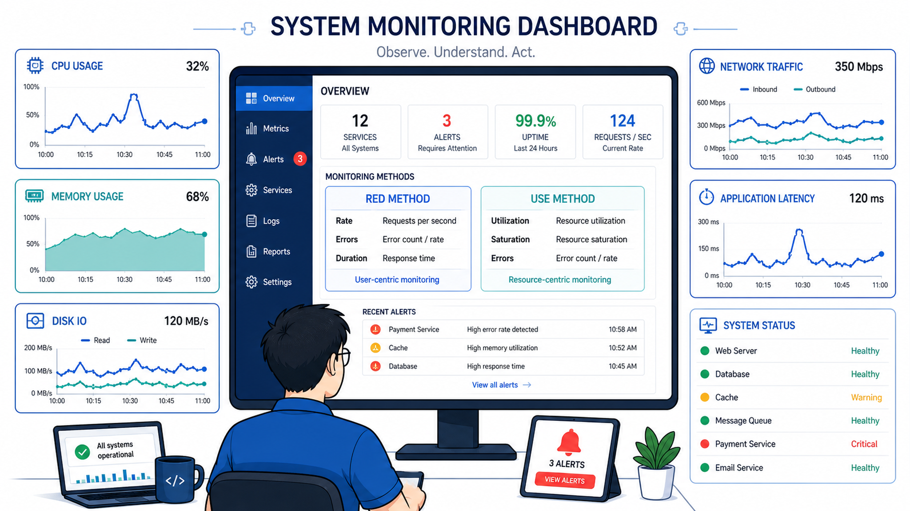

# 运维监控到底该看什么？——90%的告警都是噪音



2021年双十一，某电商平台的运维群里，告警在疯狂刷屏——CPU使用率超过80%、磁盘IO飙升、网络延迟增加……值班工程师盯着屏幕，麻木地一条条划过。突然，他接到客服电话："用户说下单一直转圈。"

他回头一看：告警刷了3000多条，没有一条告诉他"用户现在不能下单了"。

更讽刺的是——CPU、磁盘、网络这些告警根本就不是原因。真正的问题是一个下线的Redis节点被负载均衡误判为"活着"，70%的流量打到了空气上。然而这个系统的监控指标里，根本没有"Redis节点可用连接数"。

**监控不是为了满足好奇心——是为了在用户发现故障之前，告诉你哪里出事了。**

## 核心结论

1. **别监控"现象"，监控"影响"**——CPU高了用户不一定受影响，但下单成功率跌了就是真故障
2. **四层金字塔**：基础设施层→应用层→业务层→用户体验层，逐层递进
3. **告警不是越多越好**——一条有效告警胜过一千条噪音。告警必须有"行动指南"

## 深度拆解

### 第一层：基础设施监控——你最不想看但必须在的底层

基础设施层包括：CPU使用率、内存使用量、磁盘IO、网络吞吐、TCP连接数、文件句柄数。

这些指标的价值在于**"排除法"**。当出问题时，你先看基础设施——如果CPU正常、内存没满、磁盘IO没有异常，那问题大概率在应用层或数据层。

关键指标（每个指标都必须带"阈值+趋势"）：

- **CPU使用率**：单核超过80%持续5分钟报警。但更关键的是——**CPU Steal Time**（在虚拟化/云环境里，Steal意味着宿主机在跟你抢算力）。Steal Time > 5%意味着你的云服务器邻居在搞你。
- **内存使用量**：超过85%报警。但要区分"真正在用"和"page cache"。Linux倾向于把空闲内存当缓存用，所以`free -m`要看"available"而不是"free"。
- **磁盘IO util**：超过80%持续10分钟报警。IO util满了意味着所有读写都在排队，你的数据库可能开始超时。
- **TCP连接数**：逼近`/proc/sys/net/core/somaxconn`的80%报警。连接数满了=新请求直接拒绝。

### 第二层：应用监控——你的代码在干什么

应用层监控要回答三个问题：
1. 这个服务还活着吗？（健康检查）
2. 它正在处理多少请求？（QPS/并发数）
3. 它处理请求花了多长时间？（延迟分布）

**健康检查不是ping一下端口就完了。** 一个典型的健康检查应该验证：

```
GET /health
→ 数据库连接正常
→ Redis连接正常
→ 消息队列连接正常
→ 内部线程池使用率 < 80%
→ 最近一次GC暂停时间 < 500ms
→ 与配置中心的连接正常
```

五项里任何一项挂了，这个节点就应该被负载均衡踢掉。只ping端口的话，节点可能在"假活"——端口开着但数据库连不上了，请求打进去全部500。

**延迟要看分布，不看平均值。** P99延迟是180ms但平均值只有20ms——说明大部分请求很快，但有1%的倒霉用户要等180ms。如果你只看平均值，永远发现不了这1%的痛苦。

### 第三层：业务监控——钱在哪

业务监控是决策层最关心的东西：

- 每分钟订单量 vs 预期值（不是绝对值，是"比上周同一时间少了多少"）
- 支付成功率（正常99.5%，低于99%报警）
- 用户注册量、活跃用户数
- 关键的转化率漏斗：浏览→加购→下单→支付

**业务监控的核心是"环比"而不是"绝对值"。** 凌晨3点没有订单是正常的，不需要报警。但同一时间段比上周跌了80%，那就是事故。

### 第四层：用户体验监控——用户真难受了吗

这一层是"最终的真相"：

- 页面加载时间（首屏、可交互）
- 接口平均响应时间（从用户视角，带网络延迟）
- 客户端错误率
- 用户投诉量

**UEM（用户体验监控）是兜底的。** 前三层都可能报警，但用户没事——那就真没事。前三层都不报警，但用户端大量500——那一定是监控漏了什么。

## 实战要点

### 臻叔踩坑笔记

1. **把所有东西都设了告警**：一个运维新手配了200多条告警规则。上线第一周发现自己平均每天收到800条告警，两周后就对告警"免疫"了——所有告警自动归档不看。真正有用的规则不超过20条。
2. **告警没有"下一步行动"**："CPU 90%"——然后呢？是扩容、重启、限流、还是忽略？好的告警信息必须包含：影响范围（多少用户/订单受影响）、可能原因（Top 3）、建议操作。
3. **监控数据没有保留历史趋势**：上周CPU平均12%，今天突然40%。虽然还没到报警阈值，但趋势异常。没有历史基线，你永远不知道"正常"是多少。至少保留30天的分钟级数据。
4. **只监控生产环境**：预发布环境也需要监控——很多问题在上线前就能暴露。特别是压测场景下的性能退化。

### 一句话总结

> 好的监控体系不是告警越多越安全——是告警越精准、越可行动、越接近用户真实体验，你的运维效率越高。

