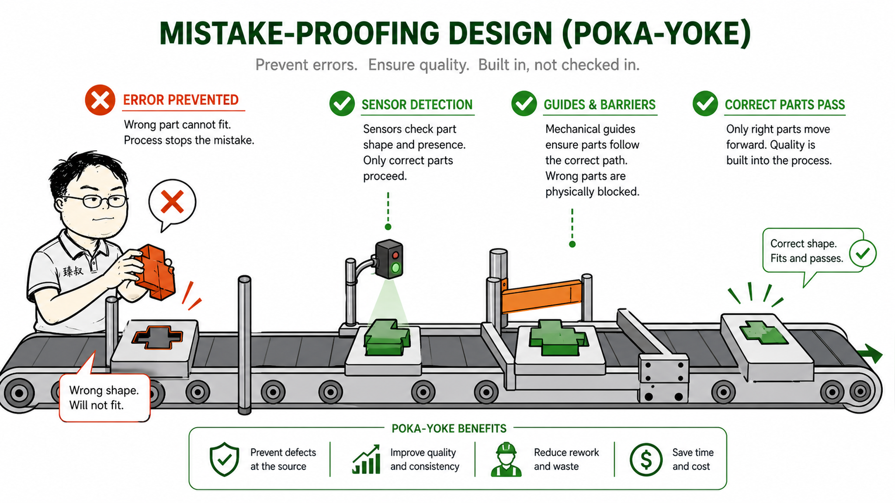

# 防呆处理怎么做——让错误操作根本做不出来



日本新干线的驾驶员在每次发车前，都要做一套奇怪的动作：用手指着仪表盘上的速度表，大声念出"速度，零"，然后指着信号灯，念出"信号，绿"。

这不是形式主义。这套动作叫"指差确认"（指差喚呼）——用手指、用眼睛看、用嘴巴说，三个感官同时参与，把注意力错误率从2.8%降到了0.38%。

新干线运行60年，零致命事故。而我们的后台管理系统呢？一个误点"删除"按钮，200万条数据就没了。

**防呆（Poka-Yoke）不是让你更小心——是让"做错"这件事情在物理上不可行。**

## 核心结论

1. **防呆的第一原则**：宁愿让操作变慢，也不留"一键毁灭"的入口
2. **三层防呆体系**：阻止错误发生 → 操作时强制确认 → 错误发生后快速恢复
3. **不是所有操作都需要防呆**——只对"不可逆的、影响面大的、人容易犯错的"操作做防呆

## 深度拆解

### 防呆的源起：丰田生产线的教训

1960年代，丰田工厂的工人经常在装配时漏装一个弹簧。质检很难发现，因为弹簧在里面，不拆开看不到。到了客户手里才出故障——代价巨大。

丰田的工程师新乡重夫（Shigeo Shingo）没有训斥工人"你仔细点"，而是重新设计了一个托盘：弹簧必须被取出来才能继续装配，托盘上少了一个弹簧，下一道工序的夹具就对不上。

**防呆的本质是把"人容易犯的错"转变成"机器/流程不容忍的非法状态"。**

软件系统里也一样——别指望"开发者/运维/客服记得检查"，让系统替他们检查。

### 第一层：阻止——让错误操作根本做不出来

**物理阻断：**
- 生产环境数据库只开只读权限。写操作必须通过一个审批工具发起，审批通过后工具自动执行，而不是给你一个临时写权限让你手动操作。
- 物理服务器上禁用`rm -rf /`。用`alias rm='rm -i'`不够——人会跳过。真正的防护是`chattr +i`锁定关键目录。
- 云资源的删除按钮默认灰掉。要删除必须先"解锁"（输入资源名称二次确认）。

**逻辑阻断：**
- 推送代码到master分支前，CI必须全部通过。不是"建议通过"，而是"不通过就无法推送"。
- 配置变更时，如果新配置格式不对（JSON解析失败），拒绝推送。不要让100个实例读到坏配置后一个个重启。
- 扣款操作：扣款金额 > 账户余额 或 扣款金额 > 前30天平均消费的5倍，拒绝扣款并报警。

**一个经典例子：** 某银行的转账系统，如果转账金额超过10万，必须输入两个人的授权码。这不是信不过你——是"一个人同时被诈骗和头脑发热"的概率远大于"两个人同时犯蠢"。

### 第二层：确认——操作时强制"有价值"的二次确认

**什么是"无价值"的确认？**

```
是否确认删除此订单？[是/否]
```

这就是无价值的确认——你在删除100个订单，删到第30个的时候大脑已经进入肌肉记忆模式，看到"确认删除"就按Enter。

**什么是"有价值"的确认？**

```
你即将删除 3582 条订单记录
影响范围：2023年1月至2023年6月的历史订单
如果删除，以下报表将立即失效：
  - 月销售额统计
  - 用户购买行为分析
  - 库存预估模型

请输入订单数量以确认：____
（提示：输入"3582"继续）

请输入原因（必填）：____
```

有价值确认的三个要素：
1. **明确量化影响面**——不是"将删除订单"，而是"3582条"
2. **明确级联后果**——"报表失效"比"数据没了"更能让人停下来想
3. **认知参与**——输入数字、打字输入原因——这些动作迫使大脑从"自动模式"切换到"手动模式"

### 第三层：恢复——如果前两层都失败了

**软删除代替硬删除：**
所有"删除"操作默认是软删除（标记`is_deleted=1`）。真正的物理删除需要额外步骤且有时间窗口（比如30天后自动清理）。

**快照/备份自动触发：**
在进行高危操作（表结构变更、批量更新）之前，系统自动创建快照。如果出了问题，回滚时间 < 5分钟。这个快照的创建应该是全自动的——不依赖操作者记得去做。

**操作回滚窗口：**
某些操作不是立刻生效的——系统给你5-10分钟的"后悔期"。比如发送全量推送通知、域名切换、关停某个服务——操作提交后进入"pending"状态，计时结束前可以撤销。

### 防呆设计的决策框架

不是所有操作都需要防呆。判断标准：

| 维度 | 高风险 | 中风险 | 低风险 |
|------|--------|--------|--------|
| 可逆性 | 不可逆 | 可逆但成本高 | 立即可逆 |
| 影响面 | >1万用户 | 100-1万用户 | <100用户 |
| 出错频率 | 已知常见错误 | 偶尔出现 | 几乎不会错 |

- 三个"高风险" = 必须三重防呆
- 两个"高风险" + 一个"中风险" = 至少两重防呆
- 其余 = 基础确认即可

## 实战要点

### 臻叔踩坑笔记

1. **把防呆做成了"操作手册"**：手写了200页的操作SOP，指望新人一字一句照着做。操作手册是"事前学习"用的，不是"事中执行"用的——紧急操作时没人会一页页翻手册。防呆必须嵌入到工具和流程里。
2. **防呆太复杂导致用户绕过去**：一个审批流程需要5级审批+3个工单+2个系统操作。没人愿意走——最后大家偷偷用别的办法（比如开发写了个脚本绕过审批直接操作数据库）。防呆的复杂度不能超过被保护的资源价值。
3. **只防操作错误，不防配置错误**：运维小心翼翼地输入命令，但配置文件里把`timeout`写成了`time_out`（typo），100个实例读到无法解析的字段，优雅降级失败，全部crash。配置变更也需要防呆——配置文件有schema校验。
4. **防呆机制只在"危险操作"上**：但实际上"看起来安全的操作"常常是灾难的真正原因——比如把`redis.flushAll()`写进了定时任务，每5分钟清空一次缓存。任何`flushAll`/`dropTable`/`truncate`类操作，不管在什么环境执行，都应该有二次确认。

### 一句话总结

> 防呆设计的原则：对好人来说多一个步骤，对错误来说多一堵墙。宁可让操作变慢3秒，也别让事故修3天。

