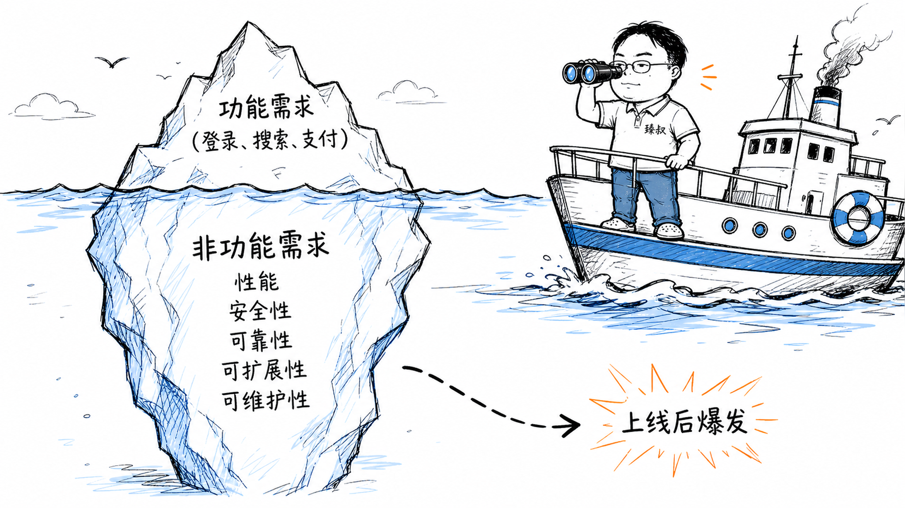

# 非功能需求：性能、可用性、安全性等维度的验收标准



---

> 📌 **关注「程序员臻叔」，获取更多硬核技术干货**


---

2020年双十一前一周，我们系统的压测结果出来了，2000QPS就跑不动了。产品经理崩溃了："你们不是说功能都开发完了吗？去年也是这套代码跑到了8000QPS啊！"

开发团队开始排查：一个新的"商品推荐"模块，每次请求都做全表扫描然后拼SQL，功能是对的，但一个请求消耗1.5秒。另一个新的"用户画像"功能，在登录时同步调用了5个外部服务，功能也是对的，但登录从0.5秒变成6秒。

功能需求全部满足，所有TestCase都绿。但系统跑不起来了。

**非功能需求远不止功能需求之外"多加点东西"。你做的每一个功能需求，背后都站着几十个你没意识到的非功能需求，等着在上线后给你惊喜。**

## 核心结论

1. **功能需求 = "能做什么"**（登录、下单、搜索），**非功能需求 = "做得好不好"**（多快、多可靠、多安全）
2. **非功能需求在开发阶段不可见**，用户100个时一切都好，用户100万时一切都炸
3. **非功能需求的成本是指数级的**：在上线后发现性能问题，修复成本是设计阶段就考虑的100倍
4. **每个非功能需求都必须量化**——"要快"是废话，"P99延迟<200ms"才是需求

## 深度拆解

### 非功能需求的分类

**性能**：响应时间、吞吐量、并发用户数。不只"平均值"，P50/P95/P99延迟比平均值重要得多。平均值掩盖了那些极端慢的请求，但这些极端慢的请求就是用户骂你的原因。

**可靠性**：可用性（99.9% = 年宕机8.76小时，99.99% = 年宕机52分钟）。你需要多高？取决于业务：支付系统需要99.99%，内部管理后台99%就行。

**安全性**：渗透测试、依赖库漏洞扫描、密钥管理。不是"上线前做一次"，而是持续的过程。你昨天扫描没漏洞的依赖库，今天可能爆出CVE。

**可扩展性**：用户量涨10倍，系统能不能通过加机器扛住？还是说你的架构限制只能垂直扩容（换更大机器）？

**可维护性**：新人从clone代码到完成第一个feature要多久？出线上故障到定位根因要多久？这些时间成本会在项目后期吃掉开发效率。

**可观测性**：系统出问题时，你能不能在5分钟内知道"哪里出了问题"？不是"设几个报警"，而是从Metrics→Tracing→Logging的完整链路。

### 为什么非功能需求总被忽略？

**延迟反馈**：你写了一段有Bug的代码，编译报错、测试挂掉，立刻知道。但你写了一段"能跑但O(n²)复杂度"的代码，测试也绿了，功能也OK了。只有等到数据量涨到1000万行，这个O(n²)才会跳出来告诉你"嘿，记得我吗？"

**前期投入无感知**：你花了三个月做性能优化，把P99从3秒降到200ms，上线后用户的感觉是"跟之前一样快啊"。因为一个月前就已经加了缓存凑合着能用了。你的优化是"活该你存在"，做了看不见，不做到时候炸了全是你的锅。

**需求方通常不提**：产品经理的PRD里写的是"用户能搜索商品"，不会写"搜索结果在200ms内返回"。非功能需求是技术团队自己欠自己的债，要么在开发阶段主动做，要么在上线后被动修。

### 非功能需求的量化公式

```
❌ "搜索要快" 
✅ "搜索接口P99延迟 < 200ms，P50延迟 < 50ms"

❌ "系统要稳定" 
✅ "全年可用性 >= 99.95%，单次故障恢复时间 < 10分钟"

❌ "要能抗住高并发" 
✅ "支持10000 QPS，在12000 QPS时自动限流降级而非崩溃"
```

无法量化的非功能需求 = 不存在。因为你没法验证"做到了还是没做到"。

## 实战要点

### 持续验证

非功能需求不是"做完就完了"，每次发布后要持续监控它们还在不在被满足：

- **性能回归测试**：每次提PR时跑基准性能测试，对比master的性能基线
- **负载测试**：每次大版本上线前，模拟流量打到预期峰值的1.5倍
- **混沌工程**：定期在生产环境注入故障（Kill一个Pod、断一个数据库连接），验证系统的容错能力

### 臻叔踩坑笔记

1. **只关注均值**："平均响应时间200ms"，但P99可能是5秒。那1%的用户每次打开页面等5秒，已经卸载App了。
2. **本地性能测试代表线上**：本地单机跑出来的QPS没有意义，线上是多实例+数据库连接池+网络延迟的叠加。
3. **非功能需求的"军备竞赛"**：99.9% → 99.99% 的成本不是10倍是100倍。不要盲目追求极致，根据业务需求设定合理的阈值。
4. **只在项目末期做性能测试**：上线前一天跑压测发现扛不住→推迟上线→加班。性能应该持续监控，不是一次性活动。

### 一句话总结

> 功能需求是你女朋友说"要有房"——可以商量。非功能需求是"房子不能塌"——没有商量余地。

---

---

### 🎯 觉得有帮助？关注「程序员臻叔」


---
