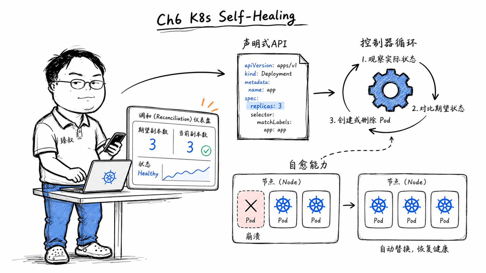

# Kubernetes自愈机制：健康检查与Pod自动恢复原理



---

> 📌 **关注「程序员臻叔」，获取更多硬核技术干货**


---

### "你部署了多少个Pod？"——"三……可能是两个？"

接手一个新团队时我问了一句"服务跑了多少个实例"，得到的答案令人窒息："配置了三个……但昨天有个节点重启了，应该有俩吧。"

然后我去查K8s——Deployment的replicas字段写着3，actually running也是3。那个因为节点重启挂掉的Pod，K8s在15秒内就在另一个健康节点上重新创建了一个。团队里的人自己都不知道。

这就是声明式API + 控制器循环的威力——人不需要操心"当前有几个"，只需要声明"我想要几个"。

### 核心结论

1. **工程层**：K8s的自动修复不是AI或魔法，是每个控制器在无限循环执行同一个逻辑：观察实际状态 → 对比期望状态 → 执行操作消除差异。
2. **原理层**：K8s的核心抽象是"声明式API"——你告诉K8s"我要什么"（期望状态），而不是"怎么做"（步骤）。控制器负责把"实际"变成"期望"。
3. **本质层**：K8s的自动修复能力来自一个简单但强大的设计原则——控制循环永不停止。任何时候系统偏离期望状态，最终都会被纠正。

### 拆解

**从"命令式"到"声明式"的思维转变**

命令式（Imperative）：`kubectl run nginx --image=nginx --replicas=3`——告诉K8s"现在执行跑3个nginx的操作"。

声明式（Declarative）：写一个YAML——`replicas: 3`，然后`kubectl apply`。K8s自己决定"现在有2个，需要新建1个"或者"现在有4个，需要删1个"。

区别在哪？命令式只执行一次，执行完后如果Pod挂了，没人管。声明式的描述持久存在，控制循环不断检查，只要有偏差就修正。

**控制循环——K8s的心脏**

每个K8s控制器本质上都是一个`for {}`无限循环：

```
for {
    实际状态 := 从API Server查询Pod列表
    期望状态 := 从Deployment Spec读取replicas字段
    if 实际状态 != 期望状态 {
        if 实际Pod数 < 期望:  创建新Pod
        if 实际Pod数 > 期望:  删除多余Pod
    }
    sleep
}
```

注意：这个循环里没有"通知/回调/事件驱动"。控制器就是不断地问，不是"等Pod挂了通知我"，而是"我现在去查，Pod还在不在"。

这个设计极其鲁棒：即使控制器自己挂了10分钟，重启后继续循环——第一轮就发现差异→修复。没有"中间状态丢失"的问题。

**哪些控制器在默默守护你的集群？**

- **Deployment控制器**：保证Pod数量正确。Pod挂了？新建。Pod跑在坏节点上？重建到健康节点。
- **Node控制器**：监控节点心跳。节点超过5分钟无心跳→标记为Unknown→把上面的Pod驱逐到其他节点。
- **Service控制器**：维护Endpoints列表——哪些Pod是健康的，把不健康的踢出负载均衡。
- **ReplicaSet控制器**：更低层的Pod数量保证（Deployment创建ReplicaSet，ReplicaSet创建Pod）。

每个控制器职责单一、互相独立——Deployment控制器不关心节点健康（那是Node控制器的事），它只知道"我该管3个Pod但现在只有2个→再建1个"。

**etcd的角色——为什么"集群状态"那么重要**

所有期望状态都存在etcd里。etcd是一个强一致的KV存储（基于Raft协议）。K8s的所有组件（API Server、Controller、Scheduler）通过etcd共享信息。

这个设计的关键后果：**控制循环不需要"内存状态"**——它在任何时刻都可以从etcd读到"当前期望是什么"+"当前实际是什么"。即使API Server重启，控制器重启——一切状态都在etcd里完好无损。

这就是为什么K8s集群可以"电都没断过"地运行——它的核心状态都是有持久化保障的。

### 怎么讲给产品经理听

> 你写一张纸条"客厅温度=24度，恒定"，贴在墙上。管家每隔一秒读一次纸条→拿温度计测室温→如果26度→开空调；23度→关空调。你从不告诉管家"怎么做"，你去开空调、你去关，你只写了"我要什么温度"。管家自己循环处理。如果管家休息了10分钟，回来第一件事还是读纸条+测室温→发现偏差→纠正，所以它不怕自己出错。

✓ 精准说明了声明式（desired state）和命令型（do this）的核心区别。

✗ 不能说明"多个控制器之间的协同"——比如Deployment+ReplicaSet+Scheduler之间的互动链路，这需要另一个类比。

### 一个核心洞察

> K8s的自动修复机制揭示了一个反直觉的工程哲学：**"不断重试"比"精准通知"更可靠**。事件驱动看似高效但丢失一个事件就永久偏离；循环轮询看似低效但永不丢失——"时间到了我再查一遍"是最朴素的鲁棒策略。

---

**臻叔踩坑笔记**
- `replicas`设了3但只有一个健康节点上有Pod——K8s不会"为了HA而强制分布"——需要Pod Anti-Affinity规则来保证不同Pod不在同一节点。
- 控制器循环太激进会打爆API Server——注意rate limit和Throttling。
- 不是所有资源都适合声明式——Job类的"跑完就完"需要Job控制器；StatefulSet需要有序启停和持久化标识。

**一句话**：K8s的自动修复不是聪明，是执着，不断问、不断比对、不断修正。

---

### 🎯 觉得有帮助？关注「程序员臻叔」


---
