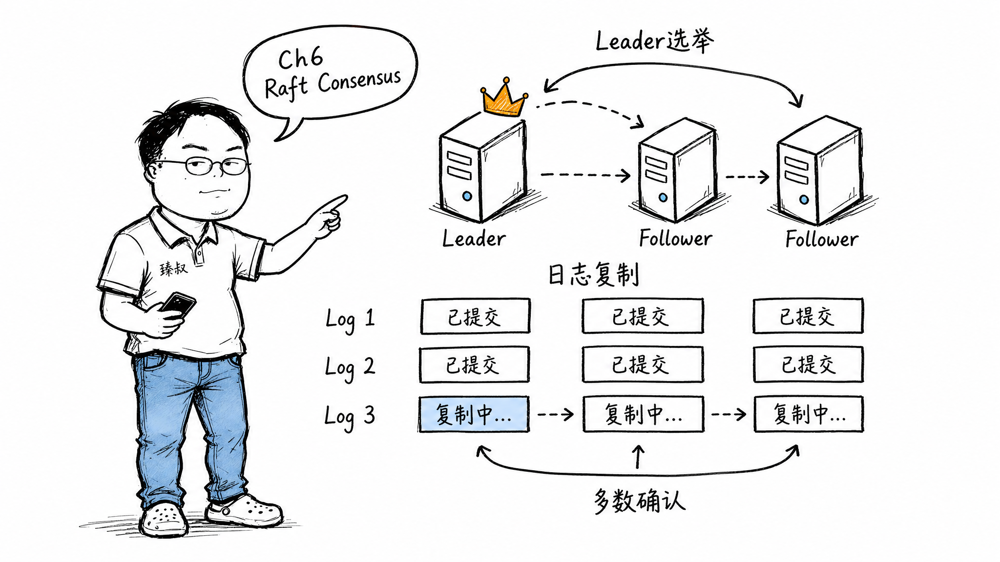

## Raft共识算法到底在"共识"什么？



### etcd深夜的Leader选举风暴

半夜两点，K8s集群的etcd触发了Leader选举风暴。三个节点的集群，Leader宕机后，另外两个节点几乎同时发起选举——Term编号撞车，得票数都没过半。重试。又撞车。再重试。来回了六七轮才选出新Leader。

这恰好是Raft论文里描述的核心场景——随机选举超时如何防止分裂投票。理论很优雅，现实里看到Term数狂飙时手还是会抖。

### 核心结论

1. **工程层**：Raft解决的是"日志复制一致性"——确保分布式集群中所有节点的状态机日志顺序完全相同。这不是"数据同步"问题，是"谁说了算 + 说到哪了"的问题。
2. **原理层**：Raft将共识拆成两个子问题——Leader选举（选出一个权威）+ 日志复制（这个权威决定日志顺序，其他人跟随），简化了Paxos的复杂性。
3. **本质层**：Raft的日志不是运维"日志"，是"在状态机之前记录所有操作"的共识载体——它是分布式系统的Single Source of Truth。

### 拆解

**共识不是什么**

"共识"这个词被滥用得太厉害了。Raft的共识不是"大家商量着来"——不是公司开会讨论方案、然后投票。Raft的共识含义非常精确：确保所有有效节点上，已提交（committed）的日志条目顺序完全一致。

比如客户端发了一条`SET x=5`，Raft保证：要么所有节点最终执行这条（已提交），要么这条永远不出现（未提交就丢了）——绝不会出现"节点1执行了SET x=5，节点2也执行了但执行的是SET x=6"。

**Leader选举——最容易被误解的部分**

很多人以为Raft选举是"少数服从多数民主"。不是。Leader选举是"谁来拍板"的独裁确立过程。

选举的核心机制：
- 每个节点有个随机的选举超时（150-300ms），不会同时触发选举——谁最先超时谁发起选举。
- 发起者把Term（任期）+1，自己变成Candidate，给其他节点发"请投我一票"。
- 投票规则：每个节点在一个Term内只能投一票，而且只投给"日志至少和自己一样新"的候选人。
- 获得多数票→变成Leader。

Raft最巧妙的设计是随机超时——如果不用随机，所有节点同一时刻超时→同时发起选举→票数分散→无人过半→全部重试→又同时重试→无限循环（分裂投票）。150-300ms的随机区间打破了这个对称性。

**日志复制——一切的基础**

Leader选举的最终目的不是为了有人当领导——是为了日志复制。有了Leader，日志复制就简化成：

```
① Leader收到客户端请求
② Leader追加请求到自己的日志（条目尚未提交）
③ Leader并行发AppendEntries给所有Follower
④ 收到多数确认（quorum）→ 提交（apply到状态机）
⑤ 在下一个AppendEntries中通知Followers"上次的提交了"
⑥ 返回客户端成功
```

关键细节：第④步的"多数确认"是Raft正确性的核心。不是说全部节点——只要多数（超过半数）——为什么？因为两个多数一定有交集。如果新Leader的选举也需要多数票，而日志复制的多数和选举的多数至少有一个重叠节点——这个节点的日志一定比新Leader的更新（或至少一样新）——这就是Raft选新任Leader时"日志不能比我旧"规则的原因。

**日志的真相：不是为了debug，是为了共识**

Raft里的"日志"和你平时理解的"应用日志"完全不是一回事。Raft的日志是"在状态机执行操作之前、预先记录的不可变指令序列"。

为什么必须是"先记录、再执行"？因为如果先执行操作（改了状态），然后操作记录丢失——状态已经变了——其他节点永远不知道这个变化发生了什么。先记录→Leader挂了其他节点可以继续从未提交的位置恢复。

这就是WAL（Write-Ahead Log）的思想在分布式系统中的延伸。

### 怎么讲给产品经理听

> 想象一个议会有三个议员——需要一个议长。谁先举手谁开始拉票，得两票以上就是议长。议长负责记所有提案（日志），每个提案先征求两票同意（多数）再正式写入议会的纪要。如果议长开一半会睡着了，剩下两人重新举手选新议长——新议长上任第一件事不是提新提案，而是检查"上届议长记到哪了，有没有没写进纪要的"。

✓ 说明了选举、多数派、日志提交之间的闭环。

✗ 不能说明为什么是"多数"而非"全体"——想象只差一票就通过但那一票的议员在睡觉——等他醒了已经形成决议了，这就是"多数"的效率优势。

### 一个核心洞察

> Raft教会我们分布式系统最重要一课：**权威不是永恒的，是选举产生的、附期限的、可被撤销的**。Leader不是神，Leader宕机后任何Follower都可能成为新Leader——系统设计的核心不是保护Leader，而是保证"Leader更替过程中状态不乱"。

---

**臻叔踩坑笔记**
- etcd集群3节点够用、5节点冗余——但不要放在同一个物理机/可用区，分区时失去的如果是多数就废了。
- 心跳间隔不要设太短（如<50ms）——网络一抖动，Leader被误判宕机→频繁选举→性能雪崩。
- Raft保证了日志顺序一致后，上层状态机必须是确定性的（同样的日志产生同样的状态），否则集群各节点的实际数据仍可能不同。

**一句话**：Raft解决的不是"数据同步"，是"对'什么是数据'这件事的同步"。
