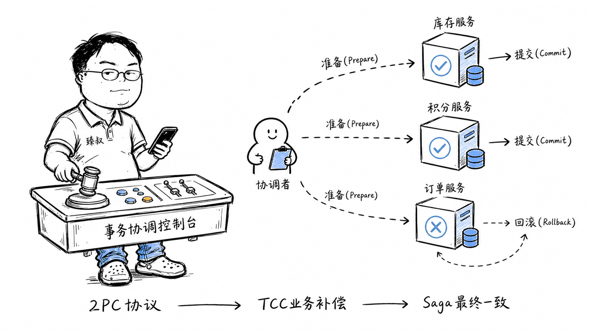

# 分布式事务方案：跨数据库事务的五种解决方案对比



---

> 📌 **关注「程序员臻叔」，获取更多硬核技术干货**


---

### 一笔订单拆了三个服务才发现不对劲

2018年我在支付团队，订单服务升级拆微服务。原来的单体应用里一个`@Transactional`就能搞定的事——扣库存、扣积分、建订单——三点一线一气呵成。拆成三个微服务后，噩梦来了：扣库存成功了，扣积分超时了，建订单因为扣积分失败需要回滚——但库存已经扣完了，"回滚"成了一个业务动作而非数据库动作。

这就是分布式事务的本质难题：不再有一个中央权威（数据库）替你做原子性保障——你必须自己设计"部分失败后怎么补偿"。

### 核心结论

1. **工程层**：分布式事务不再有ACID中的A（原子性）和I（隔离性）的免费保障。2PC、TCC、Saga是在不同场景下用不同代价买回部分原子性的方案。
2. **原理层**：分布式事务的根问题是一个时序问题——当部分参与者已经提交、部分还悬而未决时，系统如何最终收敛到一个全局的"确定状态"。
3. **本质层**：没有银弹。选方案的核心不是看"哪个技术更牛逼"，而是看你业务能接受什么程度的中间态暴露。

### 拆解

**为什么本地事务这么简单？**

单机数据库的本地事务靠的是"日志"——WAL（Write-Ahead Log）。修改数据前先写日志，commit时在日志里标记一下。如果crash了，重启后看日志——已commit的重做（Redo），未commit的回滚（Undo）。这一切都在同一个进程的控制下，速度快、同步性强、没有网络延迟。

分布式事务要面对的是：多个独立进程，网络延迟不可预测，参与方随时可能宕机——数据库那套WAL在跨进程场景下力不从心。

**2PC（两阶段提交）——最古老的方案**

想象你是一个婚礼策划师，要订花店、蛋糕店、场地：

- 第一阶段（Prepare）：你同时给三家打电话"5月1号有空吗能接吗？"——三家都回"确定有空，给你锁住这段时间"。
- 第二阶段（Commit）：你宣布"好，三家都确认，正式下单"→三家执行。

问题在哪？第一阶段的"锁住"是一个承诺——花店把5月1号上午档期锁给你了，不能接别人。如果婚礼策划师在第一阶段之后、第二阶段之前自己猝死了（协调者crash）——三家都锁着资源，不知道到底该不该执行。这叫"事务悬挂"。

工程上2PC还有另一个致命问题：同步阻塞。Prepare阶段所有参与者必须持有锁等待协调者下一步指令。如果网络抖动、协调者慢了——全部参与者都在阻塞等待。

**TCC（Try-Confirm-Cancel）——把协议推到业务层**

2PC是数据库层面的，TCC是业务层面的。还是婚礼的例子：

- Try：花店预留鲜花（锁定库存，还没扣）、蛋糕店预留蛋糕模具、场地预留当天档期。
- Confirm：全Try成功→婚礼策划师说"正式下单"→花店真正扣库存、蛋糕店开始制作。
- Cancel：任何一个Try失败→婚礼策划师说"全部取消"→各店释放预留。

TCC的核心受益：Confirm/Cancel逻辑可以由业务自己定义（"释放预留"可能只需要改个状态，不需要复杂的数据库回滚），比2PC的死锁问题轻得多。

核心代价：业务代码需要显式实现Try/Confirm/Cancel三个接口——侵入性强，老系统改造工作量大。

**Saga——最务实的方案**

Saga的思想直接：把一个长事务拆成N个本地事务序列，每个本地事务有对应的"补偿事务"。任何一步失败→逆序执行已成功步骤的补偿事务。

```
步骤1: 扣库存(成功) → 补偿: 加回库存
步骤2: 扣积分(成功) → 补偿: 加回积分  
步骤3: 建订单(失败!) → 逆序执行补偿2→补偿1
```

Saga的代价也很明显：中间态可见。步骤1、2执行后、步骤3执行前，库存和积分已经扣了但订单还没建。如果此时来个查询接口，用户看到的可能是"钱扣了但订单没生成"，这是业务能不能接受的。

所以Saga通常配合"最终一致性"的思维：允许短暂不一致，但不一致窗口必须有明确的、可解释的定义。

### 怎么讲给产品经理听

> 你帮三个朋友同时抢三张连座票——必须三张都有。一个人排队买三张，窗口说"成了"就是成了，不成一个都没扣钱。但现在你在三个窗口同时排队——A窗口说"这张有了我先锁住"，B窗口也锁了，C窗口说"不好意思卖完了"——A和B锁了但又得退——这个"退"不是系统自动的，是你得跑回去跟窗口说"不好意思那两张我不要了"。

✓ 说明了分布式vs单机事务的本质差异——一个是系统保障原子性，一个是业务自己管"退回"。

✗ 不能说明Saga的另一种优势——当业务很长（如差旅审批流程五天），2PC锁五天是不可能的，Saga的"先做了，不行再退"反而更合适。

### 一个核心洞察

> 分布式事务本质上是在为CAP中的"C"付费——你要一致性，就得接受部分不可用（2PC锁资源）或中间态（Saga的补偿期）。**选什么方案不是看谁更"高级"，而是看你的业务在哪段时间能忍什么程度的"不确定"。**

---

**臻叔踩坑笔记**
- 2PC不适合高并发场景——锁持有时间长、吞吐量指数级下降。
- TCC改造老系统的成本被严重低估——特别是那些"update set status=xxx"一步就搞定的操作，要拆成三接口。
- Saga的补偿不一定能100%补偿——扣积分可以加回去了，但如果积分规则变了呢（比如活动积分过期）？补偿逻辑本身也需要幂等和重试。

**一句话**：分布式事务不是技术难题，是业务语义难题，你得先定义清楚"失败后什么叫回滚"。

---

### 🎯 觉得有帮助？关注「程序员臻叔」


---
