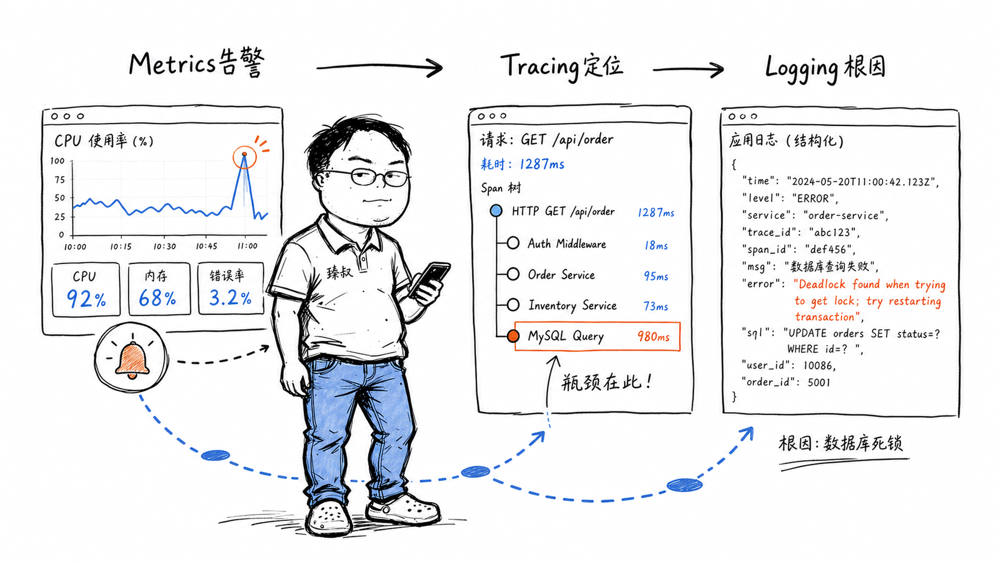

## 可观测性三支柱——日志、指标、链路追踪各自解决什么？



### "CPU飙了，但我不知道是谁干的"

凌晨两点，页面加载从800ms变成8秒。监控大盘上的CPU使用率曲线像心电图一样飙到95%。告警短信准时到达。

然后才是真正折磨的开始：CPU飙了——但谁飙的？哪个服务？哪个接口？我打开ELK搜日志——几百个服务海量日志里找人。没有链路追踪——我不知道这次慢请求经过了哪些服务、在哪一段耗了时间。

这就是典型的"Metrics告诉你起火了，但Tracing和Logging才告诉你火源在哪"。缺一个就是瞎子。

### 核心结论

1. **工程层**：三支柱的分工——Metrics回答"有没有问题"，Tracing回答"问题在哪"，Logging回答"问题为什么发生"。——三者是递进关系，不是替代关系。
2. **原理层**：Metrics是聚合（丢掉细节留统计）、Logging是事件（保留一切）、Tracing是因果链（把离散事件串成故事）。数据结构的不同决定了它们各自擅长的问题类型不同。
3. **本质层**：可观测性 ≠ 监控。监控回答"已知的已知"（CPU超过80%了吗），可观测性回答"未知的未知"（为什么这个从不超时的接口今天突然慢了）。

### 拆解

**Metrics——聚合的上帝视角**

Metrics不是单个事件，是聚合数据。CPU使用率不是你看了某一时刻某个进程占多少——是每15秒收集一次、然后按1分钟窗口取平均值。

数据模型：Key = metric name + tags。比如`http_request_duration_seconds{method="GET", handler="/api/users", status="200"}` → 一个时间序列。

为什么Metrics适合告警？
- 数据量小，查询快（固定字节数，不随事件数膨胀）
- 天然的阈值模型（"如果P99延迟>500ms持续5分钟"）
- 长期趋势分析（"过去30天QPS增长趋势"）

为什么Metrics不适合排查？
- 你看不到具体是哪个用户、哪个请求ID导致的P99增高
- 聚合丢掉了事件维度的细节——你只知道"有50个慢请求"，不知道它们共同的特征（也许都来自某个特定地区、某类手机型号）

**Logging——一切都记下来**

日志是开发主动写入的不可变事件："用户id=123456在10:32:15登录失败，原因：密码错误"。这是最细粒度的事件记录。

结构化日志（JSON格式）比文本日志强在哪里？

```
// 差
"用户123456登录失败"

// 好
{"timestamp":"2024-01-15T10:32:15Z","level":"WARN","event":"login_failed","user_id":123456,"reason":"wrong_password","ip":"1.2.3.4","user_agent":"Chrome/120"}
```

结构化的日志可以按字段过滤、聚合、关联——"最近5分钟内有多少login_failed事件？"文本日志你只能grep，结构化日志相当于一个小型数据库查询。

日志的问题：量大、存储贵、查询慢。ELK/ClickHouse/Loki等方案在成本和处理速度之间做了不同取舍。

**Tracing——把离散事件串成故事**

一个HTTP请求进入系统后，经过API Gateway → Auth Service → User Service → MySQL → 返回。沿途经过5个微服务，每个微服务记录这个请求的处理时间。

链路追踪的工作原理：
- 入口服务生成一个Trace ID（如`abc123`），这个ID贯穿整个请求的生命周期
- 每进入一个新服务，生成一个Span ID（如`span-1`），标记"在这个服务里我干了什么"
- Span之间有父子关系——`span-2`的parent是`span-1`（说明span-2是span-1调用的子操作）

最终得到一棵Span树：

```
Trace abc123（总耗时 2500ms）
├─ Span A: API Gateway (10ms)
│  └─ Span B: AuthService.ValidateToken (30ms)
│     └─ Span C: Redis GET session (2ms)
├─ Span D: UserService.GetProfile (2400ms) ← 瓶颈！
│  └─ Span E: MySQL Query (2350ms) ← 这个SQL慢了！
```

这棵树让你一眼看出：整个请求慢了是因为MySQL的一个查询花了2.3秒。没有Tracing，你只能看到UserService慢了——不知道是它自己逻辑慢还是数据库慢。

**三者怎么配合？**

经典的排查路径：
1. 告警响了——"P99延迟飙了"→Metrics告诉你出事了。
2. 点开Trace视图→看到最近慢请求的Trace→"UserService.GetProfile耗时最长"。
3. 在Trace中复制出这个慢请求的Trace ID→去日志系统搜这个Trace ID→看到完整的请求链路日志→定位到具体SQL。

这就是"三支柱联动"。缺任何一个支柱，排查链条就断了。

### 怎么讲给产品经理听

> 你查一个命案的三个证据来源——①Metrics=警局统计看板，"今月入室案+15%"→你知道有事，但不知道是哪家。②Tracing=嫌疑人行动轨迹图，"他从后门进→穿厨房→在主卧3分钟→前门出"。③Logging=案发现场的监控录像，"8点13分有人在门口站了3秒然后离开"。Metrics告诉你出事了、Tracing告诉你路径、Logging告诉你具体发生了什么。少一个就是瞎子摸象。

✓ 准确说明了递进互补关系。

✗ 不能说明三种数据结构的存储差异——Metrics为什么查询快但丢失细节？需要数据结构层面的解释。

### 一个核心洞察

> 可观测性最被低估的一点：**它不是让你看到更多，是让你在没预想过的问题发生时，不需要重新部署就能找到线索**。传统的监控=你提前想好"要监控CPU>80%"→设好阈值。可观测性=你在任何问题出现后，向前回溯数据、钻取细节——不需要因为你没预见过"这个场景"就束手无策。

---

**臻叔踩坑笔记**
- 不要单独搞Metrics/Tracing/Logging——三个系统独立部署=没有关联的ID，Trace ID没法跳日志，等于白做。
- 日志等级别在生产开DEBUG——IO会打爆磁盘。INFO就够，异常场景ERROR加请求体就够了。
- Trace的采样率不是100%——高频服务如果全量Trace，存储成本是天价。先100%→发现成本问题→改成1%或自适应采样。

**一句话**：监控是你知道该盯哪里；可观测性是你在不知道盯哪里的时候，能查出来。
