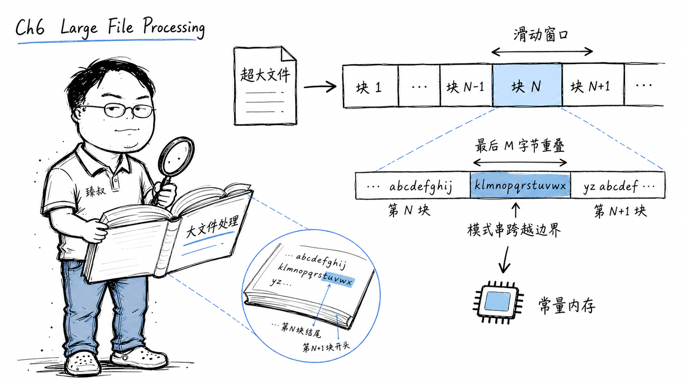

# 大文件处理：GB级日志的流式搜索与替换技巧



---

> 📌 **关注「程序员臻叔」，获取更多硬核技术干货**


---

### 日志轮的"撑爆"事故

日志系统报了一个高危：一台核心服务器的错误日志里出现了大量明文密码。原因是某个内部服务的日志脱敏规则被误关闭了。运维跑过来问我："这日志文件大概120GB，我需要把里面所有身份证号和手机号替换成`****`，但服务器内存才16GB——一个grep开到一半就OOM了。"

我第一反应是Python逐行读，第二反应是"逐行不行，身份证号会跨行"。这就是大文件处理中经典的"边界跨越"问题。

### 核心结论

1. **工程层**：超大文件处理的约束是"内存放不下，但不能用换内存的方式解决"——必须用流式处理。根本方案：缓冲区滑动窗口 + 稀疏索引。
2. **原理层**：核心矛盾是"搜索模式可能跨越缓冲区边界"——所以缓冲区切换时需要有重叠窗口。
3. **本质层**：大文件处理不是"把规则放大"，而是"用一个和文件大小无关的常量内存完成相同任务"。

### 拆解

**为什么不能直接读整个文件？**

简单：内存放不下。120GB的文件，你还要构建正则匹配状态机、构建替换后的输出——内存占用可能远超文件本身。

**方案一：逐块读取 + 滑动窗口**

核心思路：读一个块（如64KB）→在这个块内搜索匹配→替换→写入输出→读下一个块。

但有个致命问题：你要找的"身份证号"可能正好跨在两个块的边界上。比如第65532字节到第65540字节是一个身份证号——前4个字节在第一个块的末尾，后4个字节在下一个块的开头——逐块处理就漏掉了。

解决：滑动窗口。每次读N字节，但只处理前N - M字节，保留最后M字节和下一个块的开始M字节拼在一起。M = 最大模式长度 - 1。比如你的正则最长匹配是身份证号的18位，那M=18就够了。

```
读第1块(64KB): [0..........65520][65521.....65536] ← 处理后65520
                                                    ↓ 保留最后18字节
读第2块(64KB):       [保留18字节 + 新读65518字节]
                    ↑ 这里如果有身份证号跨边界，现在不跨了
```

**方案二：Boyer-Moore算法——为什么搜索可以比O(n)更快**

朴素搜索：每个位置都检查一遍，O(n*m)（n=文件大小，m=模式长度）。

Boyer-Moore的精髓：从右向左匹配。当在某个位置发现不匹配字符时，利用两条规则直接跳过一大段：

- **坏字符规则**：如果模式串中有个字符和当前文本位置不匹配，找这个文本字符在模式串中最后一次出现的位置，可以安全跳过的距离 = 当前位置 - 那个位置。
- **好后缀规则**：如果已经匹配了一部分后缀——用这部分后缀找模式串里的另一个出现位置。

结果：大部分场景下实际比较的字符数远小于n，平均O(n/m)。对于100GB的文件搜索18位的身份证号，Boyer-Moore比朴素搜索快十几倍。

**方案三：多机并行（MapReduce思想）**

如果一台机器处理100GB太慢，就把文件切片分给多台机器。

```
文件切分成4块（每块25GB）
机器1处理 [0, 25GB)         → 输出结果1
机器2处理 [25GB, 50GB)      → 输出结果2
机器3处理 [50GB, 75GB)      → 输出结果3
机器4处理 [75GB, 100GB)     → 输出结果4
                            合并→最终结果
```

但每个切片也有边界跨越问题——每条切片的末尾M字节需要发给下一台机器做重叠处理。

**方案四：稀疏索引——"如果我只搜关键字"**

另一个思路：不搜整个文件，先建索引。类似数据库的B+树索引——给文件建一个"关键字→字节偏移量"的映射。

但问题是：如果这个索引就只需要跑一次——建索引的成本可能比直接搜还高。索引适合"同一个文件反复搜不同关键词"的场景——一次建索引用很多次——才划算。

**实际选择**

工程上大多数场景选方案一（流式+滑动窗口），因为：
- 不需要预处理（流式处理=边读边处理）
- 内存可控（常量缓冲区大小）
- 单线程足够吞吐量（磁盘IO是瓶颈，算法不是）

如果单机磁盘IO不够（比如要处理TB级）→上MapReduce。如果同一个文件会被反复搜不同东西→建索引。

### 怎么讲给产品经理听

> 你只有一张小桌子（16GB内存），但要整理120本巨厚的书（120GB文件），把所有"春天"换成"summer"。你不能把所有书摊开在桌子上——放不下。你只能一次拿一本书，翻一页改一页。问题是"春天"可能在上一页的末尾和下一页的开头跨页了——所以你翻页的时候要留一行的"余光"。

✓ 说明了为什么流式处理可以解决大文件+小内存的矛盾。

✗ 不能说明Boyer-Moore为什么快——这个类比更适合解释滑动窗口，非字符串搜索算法。

### 一个核心洞察

> 大文件处理的本质教训：**硬件上限不可突破时，必须改变算法范式**。不是"把所有数据放到更大的内存里"（这是逃避问题），而是"让内存占用变成和数据量无关的常量"。这个思维在系统设计里反复出现：MapReduce、流处理、布隆过滤器，都是"用恒定的计算资源处理无界的数据量"。

---

**臻叔踩坑笔记**
- 正则的某些模式（特别是嵌套量词）会导致灾难性回溯（catastrophic backtracking）——搜索时间从毫秒变成几百年。测试你的正则在小样本和大样本上的时间差。
- 流式处理别忘了flush输出——缓冲满了才写盘，如果中途crash可能丢一大段。
- 超大文件的编码问题——UTF-8的字符可能跨字节边界，你的M需要按字符而非按字节计算。

**一句话**：算法空间复杂度的终极追求——让内存占用和数据量解耦。

---

### 🎯 觉得有帮助？关注「程序员臻叔」


---
