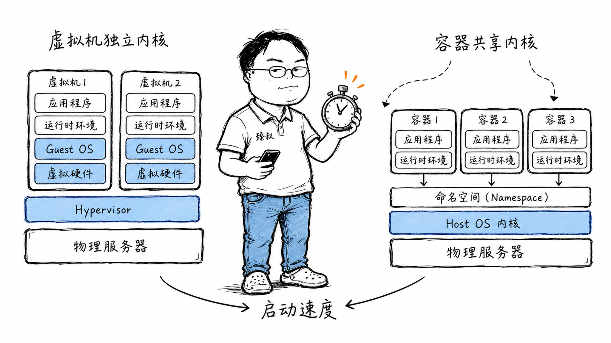

# 容器与虚拟机：Docker与VM的架构差异与隔离机制

---

> 📌 **关注「程序员臻叔」，获取更多硬核技术干货**

---

### 那个"它能在我机器上跑"的年代

2015年之前，我们的部署流程是这样的：开发写完代码→提交给运维→运维说"你的机器上不是这个版本的glibc"→重新编译→再部署→"你这个依赖冲突了，需要把服务器上的Python2升到3"→开发说"那不行，还有别的服务在跑"——无限拉扯。

Docker刚出来那阵，我第一反应是"又来一个花里胡哨的"。直到有天看到docker run拉一个镜像、三秒起来、环境完全一致——才意识到这东西不是"轻量虚拟机"，是另一套隔离哲学。

### 核心结论

1. **工程层**：容器的核心不是"更轻"，而是"可复现的不可变基础设施"。镜像打包了应用的所有依赖和运行时，从开发到生产环境完全一致。
2. **原理层**：虚拟机和容器的隔离层级不同——VM虚拟硬件，每个VM跑完整OS；容器虚拟操作系统，所有容器共享同一个Host内核。
3. **本质层**：容器和VM是互补而非替代——VM做强多租户隔离，容器做高效应用部署编排，K8s集群通常VM+容器混用。

### 拆解

**虚拟机——"建一栋独立房子"**

Hypervisor（如VMware ESXi、KVM）在物理硬件之上虚拟出一整套虚拟硬件（虚拟CPU、虚拟内存、虚拟磁盘、虚拟网卡）。每台虚拟机里装一个完整的Guest OS——自己的内核、自己的init系统、自己的驱动。

带来的好处：隔离性极强。你在VM1里跑CentOS 7，VM2里跑Windows Server，两个OS类型都不同，互不干扰。VM1内核崩溃不会影响VM2。

代价：资源开销大。每台VM需要数GB内存、完整的OS磁盘空间、独立的CPU调度开销。启动要分钟级——因为要走完完整的OS引导流程。

**容器——"隔出一间房"**

容器基于Linux内核的两项能力：
- **Namespace**：让进程看到的"世界"不同。PID Namespace让容器内进程以为自己是PID 1，实际在Host上是PID 5342。Network Namespace让每个容器有独立的虚拟网卡、路由表。Mount Namespace让每个容器有独立的文件系统树。
- **Cgroups**：限制Namespace内进程的资源使用（CPU、内存、IO）。

关键：所有这些容器共享同一个Host OS内核。容器内的`/bin/bash`是Host上的一个二进制文件，只是通过Namespace的"滤镜"看到了不同的文件系统视图。

好处：极轻量。启动是秒级（本质就是起进程），内存开销是MB级而非GB级，镜像分层共享相同的base层。

代价：隔离性弱。因为共享内核，Host内核的一个漏洞可能影响所有容器。容器里要跑特殊内核模块？不行——它没有自己的内核。

**关键数据对比**

| | 虚拟机 | 容器 |
|---|---|---|
| 启动时间 | 分钟级 | 秒级 |
| 内存开销 | GB级 | MB级 |
| 隔离性 | 极强（独立内核） | 中等（共享内核） |
| 可运行异构OS | ✓（Linux VM跑Windows） | ✗（必须和Host同内核） |
| 镜像大小 | GB级 | MB~百MB级 |

**为什么说容器是"不可变基础设施"**

传统运维：服务器A装了nginx 1.12，过了三个月有人上去手动改了配置→"这人后来离职了，现在没人知道为什么改"——这叫配置漂移。

容器理念：不要再"修"服务器，直接把整个应用+配置打成镜像，旧的关掉、新的启动。镜像不可变，你这次起什么镜像，跟上次起什么镜像，一模一样。配置变了？重新构建镜像、重新部署，不原地改。

### 怎么讲给产品经理听

> 虚拟机=同一块地上建了三栋独立的房子——各用各的水电系统（各自的内核），彻底隔开但建起来慢、占地方大。容器=同一栋房子里隔了三个房间——共享水电（共享内核），只拉几面墙就隔好了——快、省料，但隔音没那么好（如果水管爆了，三个房间都受影响）。

✓ 准确说明了"隔离层级"的差异。

✗ 不能说明另一个关键——容器带来的"镜像打包"解决了"测试环境能跑、生产不能跑"的问题，这跟隔离无关。

### 一个核心洞察

> 容器的真正革命不是"比VM轻"，而是它**把基础设施和运行环境打包成了一个可版本控制、可复现的制品**。从此以后，"在我机器上能跑"就不是推脱的理由了，因为你的机器和我的机器跑的是同一个容器镜像。

---

**臻叔踩坑笔记**
- 别在容器里跑systemd——容器只是进程，不需要init系统，多进程用supervisord或者干脆一个容器一个进程。
- 镜像分层虽好，但要控制层数——`RUN apt-get update && apt-get install -y x && rm -rf /var/lib/apt/lists/*` 一条命令合并，减少层数。
- 敏感信息（密码、密钥）不要写进镜像——用K8s Secret、环境变量或外部Vault注入。

**一句话**：容器的创新不在"轻"，在"任何环境都跑同一个东西"。

---

### 🎯 觉得有帮助？关注「程序员臻叔」

---
