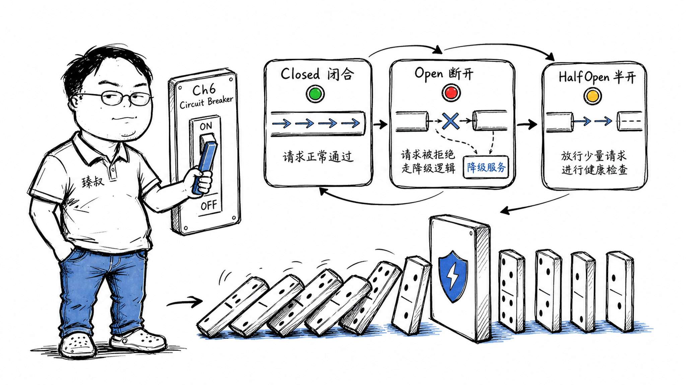

## 为什么分布式系统要有"熔断"机制？



### 一个第三方短信接口干掉了整个支付系统

那天双11预热，用户量还在攀升。监控显示支付接口的超时率在缓慢上升。排查了一圈发现：不是我们自己的问题——是我们调用的一家第三方短信验证码服务响应开始变慢，从正常30ms变成3秒超时。

这还不算完。因为短信服务的调用线程池被占满，调支付的其他接口也开始排队。支付线程池也满了。用户下单的API线程池被支付占着。层层传染——最后整个网关的tomcat线程池全部耗尽。

一个无关紧要的短信验证码服务，因为调用方没有熔断，拖垮了整个系统。

### 核心结论

1. **工程层**：熔断是"快速失败比慢速失败更安全"——与其让一个坏掉的依赖拖慢整个调用链，不如主动切断、降级返回。
2. **原理层**：熔断器的三态模型（Closed → Open → Half-Open）模拟的是"遇到问题先拉闸→冷静一段时间→试探一下→好了就合闸，没好继续拉"这种经验行为。
3. **本质层**：熔断解决的不是"下游坏了怎么办"，而是"下游坏了怎么不让上游也坏"——防止级联故障（Cascading Failure）。

### 拆解

**什么是级联故障？**

级联故障就像多米诺骨牌。服务A调用服务B，B调用C：

```
C挂了 → B的线程在等C响应，线程池耗尽
B线程池耗尽 → A调用B开始超时
A在等B响应，线程池耗尽 → A挂了
```

每一层的崩溃都不是自己的错——是被下一层拖死的。熔断器的作用就是在这个链条的任何一环就打断它——B发现C连续n次失败后，B不再等C，直接返回"C不可用"——B的线程不被C拖累，A也就不会被B拖累。

**熔断器的三态模型（Circuit Breaker Pattern）**

这是Martin Fowler在2014年经典博客里提出的模式，至今仍是分布式系统中最核心的弹性设计模式。

```
┌─────────────────────────────────────────────────────┐
│  ① Closed（闭合——正常工作）                           │
│  请求正常通过C → 同时记录成功/失败次数                  │
│  失败率超阈值（如50%）→ 切换到Open                    │
├─────────────────────────────────────────────────────┤
│  ② Open（断开——拒绝请求）                             │
│  不调用C，直接返回fallback或异常                       │
│  持续一段冷却时间（如30秒）→ 切换到Half-Open           │
├─────────────────────────────────────────────────────┤
│  ③ Half-Open（半开——试探恢复）                        │
│  放行少量请求（如3个）去调C                            │
│  成功 → 切换回Closed（恢复）                          │
│  失败 → 切回Open（继续熔断）                          │
└─────────────────────────────────────────────────────┘
```

Half-Open是关键——不直接全量放行，先试探。如果下游真的恢复了，逐步放量。如果没恢复，继续熔断。这避免了"恢复-打挂-恢复-打挂"的震荡。

**工程中的细节陷阱**

第一个坑：熔断粒度。是"整个服务"一起熔断还是"每个接口"独立熔断？

如果短信服务有"发送验证码"和"查询余额"两个接口——"发送验证码"慢了不代表"查询余额"也会慢。全部熔断→余额查询也被误伤。应该接口级别熔断——不同URL/方法的熔断器各自独立。

第二个坑：熔断 + 重试 = 重试风暴。

如果上游调B配了3次重试，B熔断后给上游返回异常——上游重试了3次都没成，这3次重试全部打到B（虽然B立即返回异常不调C，但仍然消耗B的线程）。如果上游有100个实例同时重试——B的压力反而比熔断前更大了。

解决：熔断场景下，上游也应该感知"下游熔断了"并减少重试次数或直接降级。

第三个坑：熔断阈值怎么设？

太敏感（失败3次就熔断）→ 网络短暂抖动就会触发不必要的熔断。太迟钝（失败1000次才熔断）→ 等触发时系统已经被拖死了。

工程经验：
- 短时间窗口统计（如最近30秒）
- 最小请求量阈值（少于5个请求不计算失败率——太少没有统计意义）
- 慢调用也计入失败（响应时间超过阈值的也算"半失败"）

**熔断不是唯一的弹性手段**

熔断+限流+降级是分布式系统弹性的"三件套"：
- **限流**：防止上游发太多请求（在入口处挡）
- **熔断**：防止调用坏掉的下游（在出口处挡）
- **降级**：当下游不可用时，返回兜底逻辑（如"验证码发送中，请稍后重试"而非报错）

三者配合才完整——不要只搞熔断忽略了前端的限流和响应层的降级。

### 怎么讲给产品经理听

> 一个多米诺骨牌——A倒→撞倒B→撞倒C→整个倒了。熔断=在B和C之间放个支架——B倒了但不让它撞倒C。支架会等一段时间，然后小心翼翼地试着放几块骨牌过去——如果C稳了，支架收起，恢复正常。如果C还是会倒——支架继续撑着。

✓ 精准解释了级联故障和熔断隔离的关系。

✗ 不能说明熔断阈值的配置——类比支架的"等多久试探一次"和"几个骨牌通过就算安全"是工程参数。

### 一个核心洞察

> 熔断揭示了一个被忽视的分布式系统设计原则：**"不做事"有时比"努力做事"对系统更有益**。当一个下游不可用时，与其排队等待、消费上游资源，不如立刻说"不行"——快速失败保护的是更大的系统。

---

**臻叔踩坑笔记**
- Netflix的Hystrix（已停维）和后来的Resilience4j是目前Java生态最成熟的熔断库——不要自己从零实现。
- 熔断一定要配监控和告警——熔断了是一个重要信号，说明你的下游出问题了，不能默默地降级处理。
- 不同接口独立熔断，不同调用方也要独立——A服务调用C的短信接口和B服务调用同一个接口，熔断状态应该独立。

**一句话**：熔断不治病——它治的是"病会传染"。
