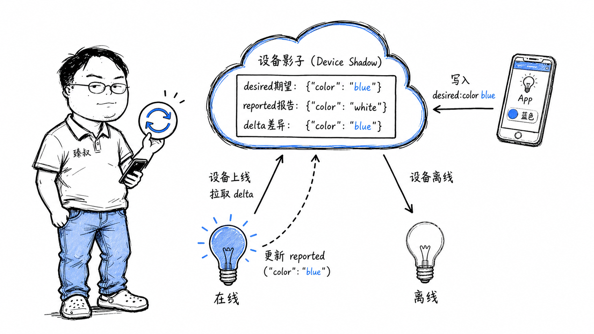

# 设备影子模型：IoT设备状态同步与离线管理方案



---

> 📌 **关注「程序员臻叔」，获取更多硬核技术干货**


---

### 智能灯泡的"我在想什么"问题

测一个智能灯泡——手机App设成"蓝色"，WiFi断了一下，灯没收到指令，留在"白色"。但App上显示的是蓝色——因为你设置后App乐观更新了UI。

五分钟后用户打开App，"咦，明明早就设成蓝色了怎么还是白灯？"然后猛地点了好几次，灯收到积压的指令后蓝-白-蓝闪了三次，用户以为灯坏了。

这个问题在IoT里有专有名词：设备物理状态和云端认知状态的"认知分裂"。设备影子的核心思想就是解决这个。

### 核心结论

1. **工程层**：设备影子是设备在云端的"持久化状态JSON副本"——应用永远读/写影子而非直接控制设备，影子负责在设备在线时同步差异。
2. **原理层**：设备影子的核心是desired/reported/delta三个字段的差异管理——desired是"我想要的"，reported是"设备实际做到的"，delta是两者的diff。
3. **本质层**：设备影子解决的根本问题不是"怎么控制设备"，而是"怎么在设备离线、网络不可靠、多App并发控制的条件下，让整个系统的状态认知保持一致"。

### 拆解

**设备影子的数据结构**

每个设备在云端有一个JSON文档——影子：

```json
{
  "state": {
    "desired": { "color": "blue", "brightness": 80 },
    "reported": { "color": "white", "brightness": 60 }
  },
  "metadata": {
    "desired": { "color": { "timestamp": 1620000000 } },
    "reported": { "color": { "timestamp": 1619999900 } }
  },
  "version": 42
}
```

**desired**（期望状态）：应用层的意愿。手机App说"我要蓝色"→写入desired。这是一个有版本号的更新。

**reported**（报告状态）：设备的真实状态。灯泡收到desired后，执行"变蓝"，然后把reported更新为`"color": "blue"`。

**delta**（差异）：desired和reported之间的diff。设备连接时收到delta→这就是"你需要执行的操作清单"。这是AWS IoT Device Shadow的核心抽象——不是推送整个desired，而是只推送delta（差异部分）。

**工作流程**

```
① App想设置灯为蓝色
② App调用云API更新desired: {color: "blue"}
③ 灯此时在线 → 云端计算delta并推给灯: {color: "blue"}
④ 灯执行 → 上报reported: {color: "blue"}
⑤ desired == reported → delta清空 → 状态一致 ✓

--- 如果灯离线了 ---

③' 灯离线 → delta保留在云端
④' 灯上线 → 云端推送delta: {color: "blue"}
⑤' 灯同步执行 → 更新reported → 一致 ✓
```

注意第③'步：指令没有丢失——它持久化在影子中，等设备上线再下发。

**为什么需要版本号？**

两个App同时控制一个灯泡：

```
App1（你的手机）: 设颜色为蓝色 (version=5)
App2（你老婆的手机）: 设颜色为红色 (version=5)
```

如果两个请求同时到达——都是基于同一个旧版本——谁赢？设备影子用版本号解决：每个更新请求必须带上它看到的当前版本号，云端检查版本是否匹配。如果App1先更新到version=6，App2带着version=5的更新请求就会因为版本冲突被拒绝——App2需要先获取最新状态，重新决定（"哦，已经有人设成蓝色了，那我再看看要不要改成红色"）。

**MQTT的角色**

设备影子的同步依赖MQTT协议。MQTT是一个为IoT设计的极轻量发布/订阅协议：
- 设备订阅影子更新Topic（如`$aws/things/myLight/shadow/update/delta`）
- 设备发布状态报告Topic（如`$aws/things/myLight/shadow/update`）
- MQTT自带"遗嘱消息"——设备断开连接时自动发布一条消息，可以标记设备离线

相比HTTP轮询，MQTT节省了设备侧的手机流量和电量——因为设备不需要定时去"云端有没有新指令？"，而是"有新指令时云端主动推送给我"。

### 怎么讲给产品经理听

> 影子=云端给每个设备开的一个"档案卡片"。你手机控制灯的时候，不是直接喊灯，你是在档案卡片上写"期望：蓝色"。灯联网的时候读一下卡片，"哦，有人想要我变蓝"，执行，然后也在卡片上写"报告：已变蓝"。如果灯不在线，卡片上的期望就一直在那等灯，不会丢。

✓ 说明了"期望vs实际"的分离和同步机制。

✗ 不能说明多App并发冲突的解决方案——版本号控制，需要另一个比喻。

### 一个核心洞察

> 设备影子的设计哲学：**在不可靠的通信链路上，唯一可靠的"真相"是持久化的、带版本的、云端存储的状态。**设备和App之间的通信不是"命令-响应"，而是"状态同步"，两者都围绕影子这个唯一真相源来同步自己。

---

**臻叔踩坑笔记**
- 不要把所有设备状态都放影子——影子是期望和报告的"合同"，不是设备全量快照。传感器高频上报的数据走单独的Topic，别污染影子。
- 影子的更新频率有吞吐量限制（AWS IoT限制每秒1次全量更新），高频变更→批量化再更新。
- 设备离线期间积压的delta——上线时一次性推送，量大可能把设备内存打爆。考虑"只推送最新的一条"或"合并去重"策略。

**一句话**：设备影子=在云端给设备找个"跑不掉的传话人"。

---

### 🎯 觉得有帮助？关注「程序员臻叔」


---
