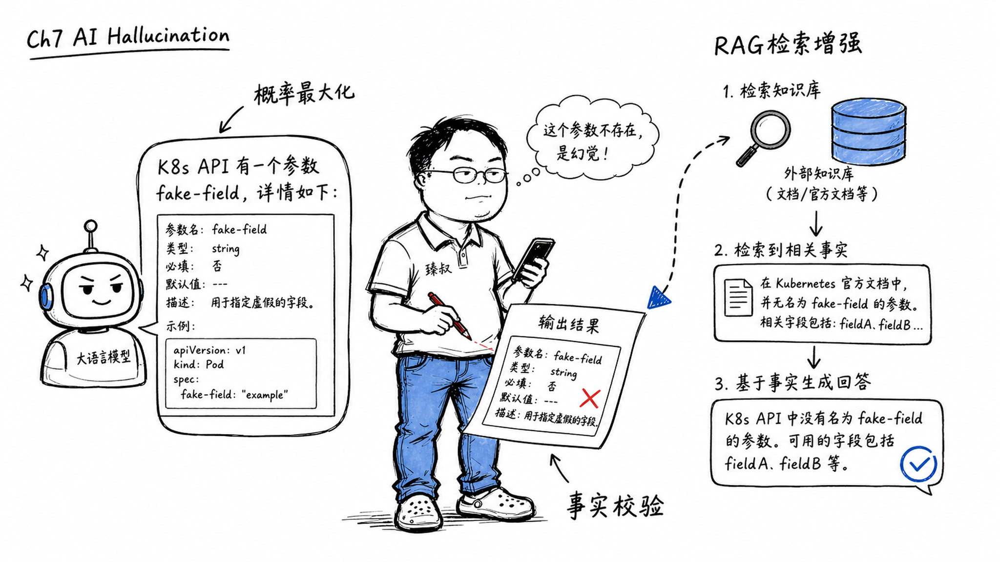

# AI幻觉问题：大模型生成错误信息的成因与缓解策略



---

> 📌 **关注「程序员臻叔」，获取更多硬核技术干货**


---

### "API文档第3段说错了，但说得跟真的一样"

用ChatGPT查一个K8s的API参数，它回复了一个格式规范的文档：字段名、类型、默认值、示例，每一样都有模有样。

然后我实际去调了一下，报错，字段不存在。回头查K8s官方文档，根本没有这个参数。模型用极高的自信编造了一个逻辑自洽但完全虚构的API参数，还包括了"为什么这个参数可能是合理的"——它在把概率最高的token序列当作事实输出。

这就是AI幻觉。模型没有"想骗你"，它只是没有"真相"的概念。

### 核心结论

1. **工程层**：AI幻觉的根因——自回归语言模型的本质是P(next_token | context)，概率最大化≠事实正确。模型没有内部"真相检查器"→当训练数据不足以支持正确回答时，它会输出概率上最合理的序列，而这个序列可能是虚构的。
2. **原理层**：幻觉无法被消除，因为概率模型没有"我不知道"的内在机制。缓解策略：RAG（外部知识检索增强生成）、RLHF对齐训练、事实校验层。
3. **本质层**：幻觉不是bug，而是"基于统计的语言生成"和"基于事实的信息检索"之间的范式鸿沟。语言模型是答案生成器，不是事实检查器。

### 拆解

**从Next Token Prediction到幻觉**

GPT的训练目标：给定前文"巴黎是法国的"，预测"首都"这个token的概率应该接近100%。

模型通过海量文本学到了这个统计模式。问题出在：如果训练数据中"巴黎是法国的首都"出现了10万次、"巴黎是意大利的首都"出现了0次→对"巴黎是__"→模型会高置信度输出"首都"。

但如果问题是"我的猫今年几岁了"，训练数据里没有任何关于"你的猫"的信息。模型不能输出"不知道"（因为所有训练样本都在"回答问题"，没有"拒绝回答"的模式），它只能输出统计上最通顺的token序列→"一般猫的寿命是12-15年"。这句话本身逻辑正确，但对你的猫是胡说八道。

**幻觉的类型**

- **事实幻觉**：编造真实世界不存在的事实（"OpenAI在2023年推出了GPT-5"——实际没有）
- **内在逻辑不一致**：前后文矛盾（"我今年25岁"→下一段"作为40岁的人……"）
- **虚假引用**：编造不存在的论文、书籍、法律条文，包括作者名、页码、摘要

**为什么RLHF不能根除幻觉？**

RLHF（来自人类反馈的强化学习）让训练师标注"哪个回答好"来微调模型，它教会模型"人类喜欢什么样的回答"，但没有教会模型"什么是事实"。

RLHF的作用是让模型的回答风格更像"有帮助的助手"。但一个有帮助的不准确的回答，比一个不礼貌的准确回答，在RLHF训练中得分更高。

**RAG——目前最有效的缓解方案**

检索增强生成（RAG）的核心思路：

```
用户问："K8s 1.28中Pod的.spec.terminationGracePeriodSeconds默认值是多少？"

传统LLM：基于训练数据直接生成答案→可能幻觉

RAG：
① 用问题去检索外部知识库（如K8s官方文档）→得到相关文档片段
② 把检索到的段片作为上下文拼在prompt前："基于以下文档回答问题：<文档> K8s 1.28文档：terminationGracePeriodSeconds默认值为30秒 </文档>"
③ LLM基于事实文档生成答案→"默认值是30秒"→不幻觉
```

RAG的本质：不是在训练时"记住更多知识"，而是在推理时"现场查资料，基于资料回答"。这与人类查资料的逻辑一致，不是凭空回忆，而是现场翻阅权威源。

RAG的局限性：如果知识库本身就有错的、过时的信息→RAG也会输出错误答案。RAG把幻觉从"模型记忆力不好"变成了"检索质量不好"，但"检索错→答错"比"凭空编造"更容易被用户发现和质疑。

### 怎么讲给产品经理听

> 一个只读过百科全书但从没出过家门的人，你问他"怎么做可乐鸡翅"。他流利地告诉你"准备可乐、鸡翅、料酒、生姜……炒3分钟加可乐收汁"。他说得全对，因为这些来自百科全书里的菜谱。但你再问"可乐放多了会怎样"，他可能答"会太甜"，这是基于概率推测的，他没有舌头。问他"你做给我吃"，他答不出来，因为他没做过。大模型就是这个人：知识来自文本、回答来自概率，没有一个真实的嘴去尝过可乐鸡翅。

✓ 说明了"基于文本的知识"和"基于体验的真相"的鸿沟。

✗ 不能解释RAG的设计——类比中的人在回答"怎么做可乐鸡翅"时现场翻开了一本菜谱（RAG），"我查了菜谱上面写着……"这与没翻菜谱的回答质量完全不同。

### 一个核心洞察

> 幻觉不是大模型的失败，它暴露了我们对"智能"的误解。我们以为"能正确回答所有问题"是智能的终极形态，但语言模型告诉我们：**在所有token序列中概率最高的那一个，不一定是真的那一个。在两个看似矛盾的"好答案"——概率最高 vs 事实正确——之间，模型选择了前者。** 消解幻觉需要让模型有另一个反馈通道：世界本身，不只是下一个token的概率，而是真实世界的约束。

---

**臻叔踩坑笔记**
- 别让LLM做精确的数值计算，它不是在算，是在"回忆"计算结果。让它算12345×6789，答案极高概率是错误的数字但看起来像对的。
- RAG的效果极度依赖于chunking策略（文档怎么切片）和embedding模型的质量，不要一上来就上RAG然后怪它不好使。
- 如果用户会基于模型回答做高风险决策（医疗、金融、法律），强校验层是最好的安全感。在LLM的输出和展示给用户的最终答案之间加一层程序化的规则校核。

**一句话**：AI不会骗你，它只是在可能的答案中选了最顺口的那一个，而最顺口和真相等价，只是你的错觉。

---

### 🎯 觉得有帮助？关注「程序员臻叔」


---
