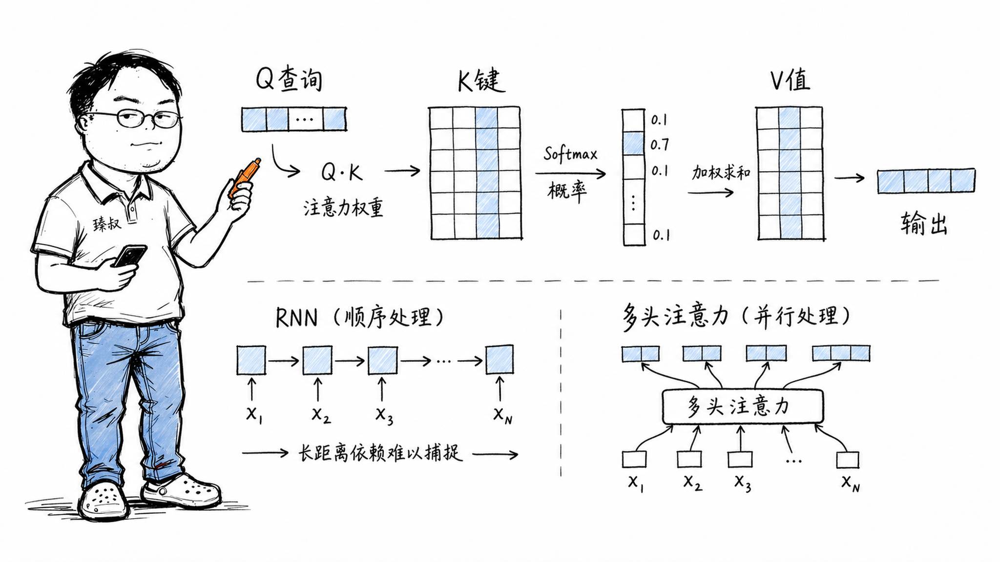

# Attention机制：Transformer自注意力的计算原理与作用



---

> 📌 **关注「程序员臻叔」，获取更多硬核技术干货**


---

### 从RNN的绝望到Transformer的曙光

2017年我在用LSTM做文本分类，序列长到100个token以上时效果就开始崩。当时我不理解：LSTM有"门"机制，理论上应该能记住长序列信息。

后来读了"Attention Is All You Need"才明白，RNN的瓶颈不是"记不住"，而是"信息传递路径太长"。如果第99个词需要参考第3个词的信息，RNN需要一步步传递96步，每一步都有信息衰减。而Attention可以让第99个词直接"看"第3个词，路径长度=1。

这就是Attention的革命性：它让序列中任意两个位置可以直接交互，不需要经过中间层层传递。

### 核心结论

1. **工程层**：Self-Attention的数学核心是：每个位置通过Q（Query）表达"我要找什么"，K（Key）表达"我有什么标签"，V（Value）表达"我的内容"，通过Q和K的相似度计算注意力权重，加权聚合V。
2. **原理层**：相比RNN的串行依赖（O(n)路径长度），Self-Attention实现了O(1)的任意位置直接交互——这是Transformer在长序列上碾压RNN的根本原因。
3. **本质层**：Attention的本质是"动态的、内容感知的加权聚合"，靠输入内容本身动态决定"该关注谁"，而非固定的网络权重。

### 拆解

**从信息检索的角度理解Q/K/V**

Attention的计算模式和你在Google搜索"猫"的过程几乎一模一样：

- **Query（查询）**："猫"——你想找什么
- **Key（索引）**：每个文档的标题/摘要——"这篇是关于什么的"
- **Value（内容）**：每个文档的完整内容

搜索引擎做的事：把你的Query和每个文档的Key计算相似度→得到相关度分数→用这个分数加权聚合所有文档的内容→得到最相关的信息。

Self-Attention做的事完全一样——只不过Q、K、V都是从同一个输入X通过不同的线性变换生成的：

```
Q = X · W_Q
K = X · W_K
V = X · W_V

Attention(Q,K,V) = softmax(Q · K^T / √d_k) · V
```

逐行解释：
- Q · K^T：计算Query和所有Key的点积（相似度）。结果是一个矩阵，第i行第j列 = 位置i对位置j的注意力"原始分数"。
- `/√d_k`：缩放因子。d_k是K的维度，如果不缩放，高维空间中点积的数值范围大→softmax的梯度会退化到极端（接近0或1）→梯度消失。
- softmax：把分数变成概率分布（加和为1）。
- `· V`：用注意力权重加权聚合所有位置的Value。

**为什么Self-Attention比RNN快？——计算和路径两个维度**

**计算维度**：RNN必须串行，算完t时刻才能算t+1时刻，不能并行。Self-Attention虽然O(n²)计算复杂度，但可以并行，GPU的千核优势可以充分发挥。

**路径维度**：RNN中两个位置之间的信息需要经过O(n)步传递（序列长度为n）。Self-Attention中任意两个位置直接连接，只需要O(1)步。翻译很长的句子时，主语在句首、谓语在句尾，Attention让它们直接关联。

**多头注意力——多个"视角"同时看**

单头注意力只给你一组Q/K/V，意味着只有一个"关注视角"。多头注意力并行运行多组：

```
MultiHead(X) = Concat(head_1, head_2, ..., head_h) · W_O

其中 head_i = Attention(X·W_Q_i, X·W_K_i, X·W_V_i)
```

类比：读一篇文章时，一个头关注语法关系、一个头关注指代消解（"他"指的是谁）、一个头关注语义连贯性，多头让你同时从不同角度理解文本。

每个头学到的模式完全不同。有研究发现，GPT-2的某些注意力头几乎完全匹配了依存句法分析的结构（主语→谓语→宾语）。

### 怎么讲给产品经理听

> 读一篇长文章，第10段提到了一个角色叫"老张"。你不需要把前面9段逐段回忆，大脑直接跳到"哦，第3段介绍过老张，他现在50岁，是工程师"。Attention就是这种"自由跳跃"的注意力机制。传统RNN就像你从第一段开始一页一页翻到第3段才能想起老张是谁，太慢了。

✓ 精准说明了"任意位置直接关联"vs"串行传递"的本质。

✗ 不能说明计算复杂度O(n²)的问题——类比里的"自由跳跃"在现实中也需要某种"索引"，这对Q·K^T的矩阵计算是个误导。

### 一个核心洞察

> Attention的哲学是：**不要事先规定"信息应该怎么流动"——让模型根据输入内容自己决定**。固定权重（如全连接层）假设所有输入一视同仁，缺乏对"这个输入在这个时刻和哪些其他输入有关"的动态感知。Attention则把"该关注谁"变成一个可学习的、内容驱动的函数，这是它强于RNN和CNN的根本原因。

---

**臻叔踩坑笔记**
- O(n²)的复杂度是Attention的阿基里斯脚跟，当序列长度>4096时计算和内存需求爆炸。FlashAttention等工程优化通过tiling和recomputation将内存降到O(n)。
- 不要理所当然把K=V（共享权重），有时K和V用不同表示效果更好（如多模态：query来自文本、key/value来自图像）。
- 因果注意力（Causal Attention，只看左边的token不看右边的）对于自回归模型是必须的，否则模型在训练时"偷看答案"。

**一句话**：Attention不是"学会了关注什么"，而是"学会了根据输入随时决定关注什么"。

---

### 🎯 觉得有帮助？关注「程序员臻叔」


---
