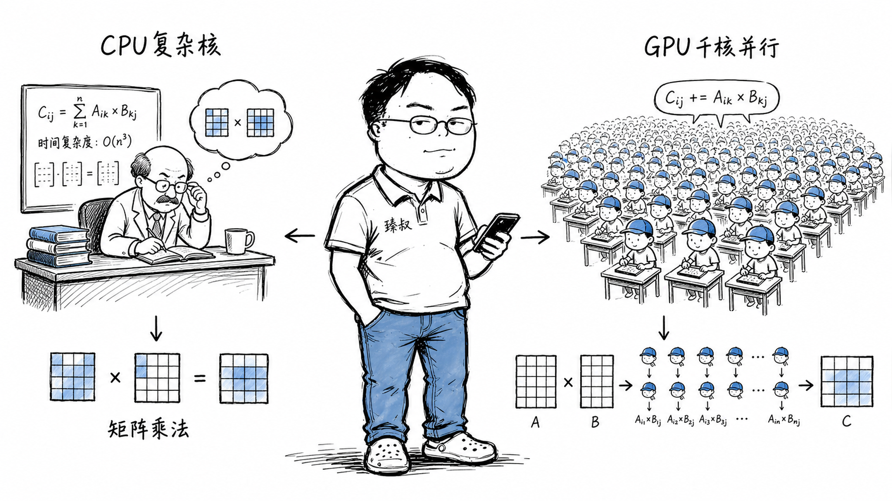

# GPU与CPU对比：并行计算架构差异与AI训练硬件选择

---

> 📌 **关注「程序员臻叔」，获取更多硬核技术干货**

---

### 第一次见识GPU训练时的震撼

2017年，一个开发者第一次训练图像分类模型。用MacBook的CPU跑了一个下午，mnist的准确率到了93%，每个epoch要12分钟。同事说"你试下那台插了1080Ti的机器"，同一个模型、同一份数据，每个epoch 22秒。

不是快了几倍，是快了三十多倍。后来查了一下，1080Ti有3584个CUDA核心，MacBook的i7只有4核（8线程）。GPU的核心数就是它的秘密，不过当时还不明白为什么"核心多=矩阵乘就快"。

### 核心结论

1. **工程层**：GPU的核心优势和AI训练的核心需求精确匹配——矩阵乘法运算量极大、可完美并行。几千个简单核心同时计算>几个复杂核心按序计算。
2. **原理层**：CPU架构为"降低延迟"优化（分支预测、乱序执行、大缓存），GPU架构为"提高吞吐量"优化（大量简单核心、高带宽内存、SIMT执行模型）。
3. **本质层**：CPU不是"做不了"AI训练，而是CPU的架构假设（任务差异大、分支多、不可预测）和AI计算的特性（全是矩阵乘、分支少、极其规则）错配了。

### 拆解

**CPU的架构哲学：一个全能选手**

现代CPU像一个大学教授，什么事情都能处理、非常聪明。他的办公桌上（L1缓存）放着最常用的资料，身后的书架（L2/L3缓存）放着次常用的。他还有一整套"优化工作流"的装备：
- **分支预测**：你给他10本书分类，他看一眼封面猜"这应该是文学类"，猜对了就继续，猜错了就退回来重新分。他的预测准确率高达95%+。
- **乱序执行**：打包10个包裹，快递单还没打印完先打包，反正不影响的先干。
- **超标量**：一个时钟周期可以做多条指令。

CPU的哲学是：**把每个任务做得尽可能快**——降低延迟。

但教授只有一个人，8核就是8个教授。做10万次简单的"1+1=2"，8个教授做还是远不如1000个小学生做得快。

**GPU的架构哲学：一支小学生军团**

NVIDIA H100有16896个CUDA Core（14592个FP32 Core + 2304个FP64 Core），每一个Core比CPU的Core简单得多，不会分支预测、不会乱序执行、只有小得可怜的缓存，但靠数量压倒一切。

GPU的SIMT执行模型（Single Instruction, Multiple Threads）：
- 一个Warp（32个线程）同时执行同一条指令——只是操作的数据不同
- 如果32个线程都走if分支→完美——全部执行
- 如果有的走if、有的走else→分裂，一半执行if（另一半空闲），然后切换，另一半执行else

这就是为什么GPU怕分支：分支会导致Warp分裂，执行效率减半。

但神经网络的前向传播和反向传播几乎全是矩阵乘法，而矩阵乘法的每一个输出元素的计算是完全独立的，不需要分支。千核并行计算矩阵乘，这是GPU的完美场景。

**为什么矩阵乘可以完美并行？**

矩阵乘法 C = A × B 的计算规则：C[i][j] = Σ(k) A[i][k] × B[k][j]

注意：C的每个元素的计算完全独立。C[0][0]的运算不依赖C[0][1]的结果，GPU可以把几千个CUDA Core同时分配给几千个不同的C元素，同时计算。

这是"数据并行"的教科书级案例。

**高带宽内存——另一个关键**

AI训练不光要算得快，还要数据喂得快。NVIDIA H100的HBM3内存带宽是3.35TB/s，而主流CPU的DDR5内存带宽大约是100GB/s，差了约33倍。

因为神经网络的权重参数有数十亿甚至数千亿，训练时每个batch都要在GPU显存中来回搬运数据，内存带宽决定了"数据到计算单元的管道有多粗"。

### 怎么讲给产品经理听

> CPU=一位教授，什么都能做、非常聪明，但一次只能专注几件事。GPU=一千个小学生，每人只会最简单的一位数加减法，但一千个人同时做，总量极大。AI训练=10万道两位数加法，教授做到猴年马月，一千个小学生几秒搞定。

✓ 说明了核心数量 vs 单核心能力的本质差异。

✗ 不能说明显存带宽的作用——类比里没有"数据喂得快不快"的维度。可以补充：不光小学生多，而且教室门口有33倍宽的走廊让他们同时进出拿文具。

### 一个核心洞察

> GPU vs CPU的对比揭示了一个深刻的系统设计原则：**为规模优化和为延迟优化是两种不同的设计哲学**。CPU假设你的任务是多样、复杂、不可预测的，所以做好"少量任务的快速执行"。GPU假设你的任务是简单、规则、大规模同构的，所以做好"海量任务的同步执行"。选错哲学，就不可能高效。

---

**臻叔踩坑笔记**
- PyTorch的`.to('cuda')`不是零成本的，把tensor从CPU搬到GPU需要经过PCIe通道，数据量大时会成为训练瓶颈。尽量让数据一开始就在GPU上处理。
- 显存不是无穷的，H100有80GB，但你如果batch size设太大或模型参数太多→OOM。用混合精度训练（FP16）可以省近一半显存。
- 不要把逻辑判断放到训练循环的热路径上，GPU最怕动态分支，保持代码路径尽量统一。

**一句话**：GPU赢不是因为比CPU智能，而是因为比CPU擅长"做一个不聪明的事一万次"。

---

### 🎯 觉得有帮助？关注「程序员臻叔」

---
