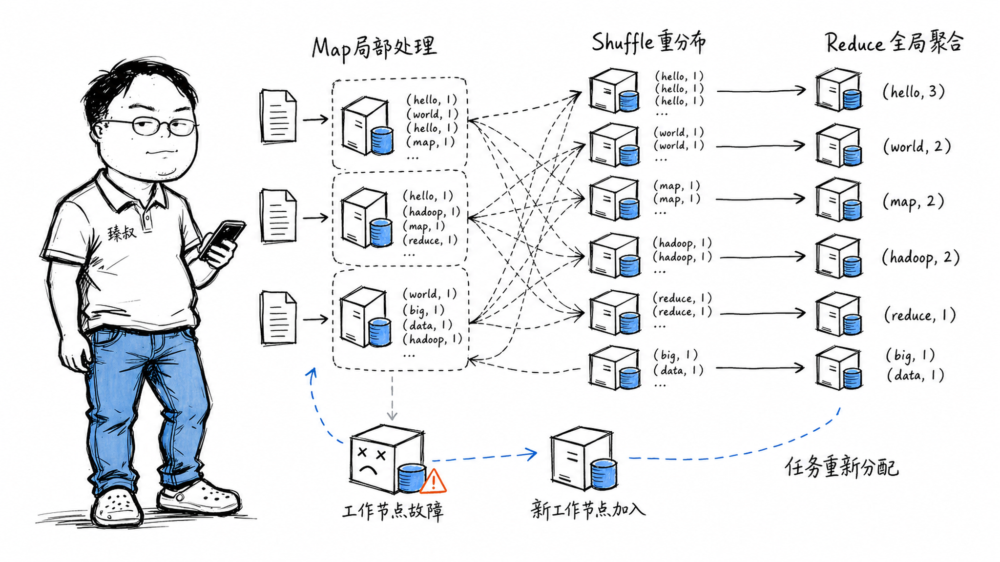

# MapReduce模型：分布式数据处理编程模型与实现原理



---

> 📌 **关注「程序员臻叔」，获取更多硬核技术干货**


---

### 一次"分而治之"的系统化震撼

2014年，一个新人工程师接手了一个数据统计任务，统计用户上报日志中每个错误类型的出现次数。数据量不大，大概50GB，用Python写了个单机脚本：逐行读文件→正则匹配→字典计数。跑完大概两个小时。

后来数据量涨到了2TB，单机脚本跑了一天半还没完。团队里有个老哥说"你用Hadoop跑一下，分到10台机器上，十几分钟出结果"，同样的逻辑，只是把它"分布式化"了。

这让人意识到，MapReduce的思想不只是一个算法，它是一套让"分而治之"能从黑板上的理论变成工业级系统的工程规范。

### 核心结论

1. **工程层**：MapReduce=把计算拆成 Map（数据源端局部处理）→ Shuffle（按Key重分布中间结果）→ Reduce（全局聚合）三个标准阶段。框架自动处理分布式调度、数据本地化、容错。
2. **原理层**：MapReduce的核心不是Map和Reduce两个函数，而是"数据本地化"（计算移动到数据所在位置而非反方向）和"函数式无副作用"（Map/Reduce函数无共享状态，Worker挂了直接重跑）。
3. **本质层**：MapReduce是大规模数据处理的"汇编语言"——它不够快、不够灵活，但它的核心思想（声明式+数据本地化+容错+水平扩展）启发了所有后续的大数据框架。

### 拆解

**最简单的例子：WordCount**

统计一千万份文档中每个单词的出现次数。

**Map阶段**：
```
输入: "the cat sat on the mat"
Map函数:
  → ("the", 1)
  → ("cat", 1)
  → ("sat", 1)
  → ("on", 1)
  → ("the", 1)
  → ("mat", 1)
```

每一篇文档独立地拆成(key=单词, value=1)的键值对，各文档之间完全独立，100个Worker并行处理。

**Shuffle阶段**（框架自动完成）：
把Map输出的数百万个键值对按Key分组，所有key="the"的归到一起、key="cat"的归到一起。这是MapReduce中最"贵"的一步，涉及大量网络IO，因为同一个Key可能由不同Worker上的Map输出。

**Reduce阶段**：
```
输入: ("the", [1,1,1,1,1,...])  ← 所有"the"的value列表
Reduce函数: sum([1,1,1,1,1,...]) → ("the", 15243)
```

每个Reducer处理一组key的聚合，这个Reducer被"喂"了所有包含"the"的键值对，和别的Reducer之间完全独立。

**三个隐式保证——MapReduce真正设计得好的地方**

1. **数据本地化**：Map任务被分派到数据所在的节点上执行，因为搬计算比搬数据便宜（2TB数据跨网络搬可能需要几十分钟，Map函数在本地读数据就只需要磁盘IO时间）。

2. **容错——纯函数式接口的无状态魔法**：Map和Reduce函数被设计为"纯函数"，输入键值对→输出键值对，没有共享状态。如果一个Worker在处理中途挂了，不需要恢复任何中间状态，直接把这个Worker的任务重新分配给其他人，因为函数无副作用，重新跑一遍结果完全一样。

3. **水平扩展无需改代码**：数据量从2TB涨到200TB，WordCount的Map和Reduce函数一行不改，只需要多加Worker。框架自动把数据切片、分配给更多Worker。

**MapReduce的局限——为什么Spark取代了它**

MapReduce最大的问题：每一轮MapReduce都要把中间结果写回磁盘（HDFS）。哪怕你只是做两个MapReduce步骤的串联，第一步的输出必须完整写回磁盘，第二步再读回来，大量的磁盘IO。

Spark的核心优化：把中间结果留在内存中（RDD：弹性分布式数据集），只有最后的最终结果才落盘。这就是为什么Spark比MapReduce快10-100倍，它不是"更快的MapReduce"，而是"不需要每步都写盘"。

尽管被取代了，MapReduce的"分而治之+容错+数据本地化"的三位一体仍然是一切大数据框架的根基。

### 怎么讲给产品经理听

> 你要统计全公司所有分部的销售数据。传统方式：把100个分部的报告全部寄到总部，总部一个人翻一个月。MapReduce方式：①Map（分）：每个分部自己先整理本地的数据（自己数本地有多少订单）。②Shuffle（汇）：把所有分部的统计按产品分类重新分堆，所有"产品A"的数据归一堆、"产品B"的归一堆。③Reduce（合）：每一堆分给一个人做最终汇总。一个分部的人请病假了？换个替补重新开始本地的统计就好，因为是独立的。

✓ 准确说明了三阶段分工和容错。

✗ 不能说明为什么MapReduce是"低效但可靠"的——类比中"每个分部的统计结果要寄回总部"也是一个IO代价。

### 一个核心洞察

> MapReduce最深刻的系统哲学贡献不是Map和Reduce这两个函数，而是 **"用纯函数和无共享状态换取免费容错"** 。在一个纯函数式编程范式下，系统不用记录checkpoint、不用做分布式快照，Worker在任何时刻宕机，唯一需要的处理就是"把它的任务重新分给另一个人"。这种"宁可重算，不备份状态"的设计哲学，比任何复杂的容错机制都更简单、更可靠。

---

**臻叔踩坑笔记**
- Shuffle是MapReduce中最容易成为瓶颈的阶段——数据倾斜（某一个Key的值比其他的多几百倍）→拖慢整个Reduce阶段→所有Job等这个最慢的Reducer。
- Hadoop的中间结果写盘三份副本，2TB的中间数据实际写了6TB。如果只是中间步骤、不需要持久化→用Spark。
- MapReduce的编程模型虽然简单，但复杂逻辑（如需要迭代的机器学习算法）需要把多个MapReduce Job串起来，每步都写盘→极慢。这种场景Spark/Mahout等框架才有可行性。

**一句话**：MapReduce = 把"分而治之"这件简单的事做成了足以处理EB级数据的工业系统。

---

### 🎯 觉得有帮助？关注「程序员臻叔」


---
