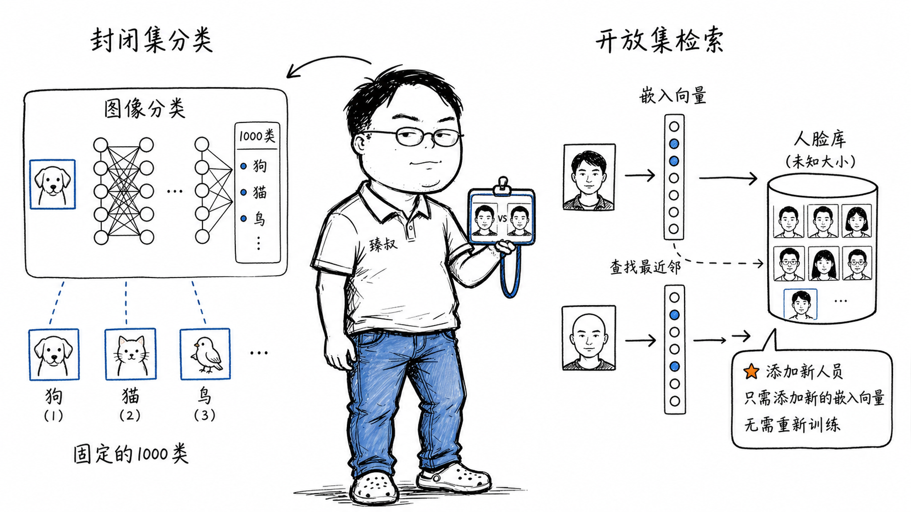

# 计算机视觉任务：人脸识别与图像分类的层次关系



---

> 📌 **关注「程序员臻叔」，获取更多硬核技术干货**


---

### "给我识别出这个人"——"他不在1000个已知类别里"

2019年接了个企业考勤的项目，摄像头拍人脸→识别是谁。我一开始把它当成了图像分类问题，训练了一个"1000人分类器"，Softmax输出1000个概率。加个新人进来→需要重新训练→数据重标→模型重新部署，整个周期一周。

后来一个安全团队的朋友一句话点醒了我："人脸识别不是'这是谁'的分类问题，而是'这两张脸是不是同一个人'的相似度问题。"

### 核心结论

1. **工程层**：图像分类输出固定N个类别的概率分布，人脸识别输出一个嵌入向量，通过比较向量间的距离判断是否同一人。
2. **原理层**：人脸识别是一个度量学习/表征学习问题，目标是学到一个人脸嵌入空间：同一个人所有照片在这个空间中距离极近、不同人的距离极远。
3. **本质层**：人脸识别以"相似度"替代了"类别"作为输出单位——这是从"封闭集分类"到"开放集检索"的范式转变。

### 拆解

**为什么人脸识别不能做成分类问题？**

假设你公司有3000员工，训练一个3000类的Softmax分类器：

| | 图像分类 | 人脸识别 |
|---|---|---|
| 类别数 | 固定（猫/狗=2） | 动态（今天3000人明天3001人） |
| 新增类别 | 重新训练模型 | 只需计算新面孔的嵌入 |
| 注册即用 | 不可能 | 拍一张照→算嵌入→存起来 |
| 推断方式 | "输入X→属于类别3" | "输入X的嵌入和库中哪个最像" |

新员工入职：图像分类需要重新训练、重新部署整个模型，周期天级。人脸识别只需要：①注册时：拍一张新员工的人脸照片→通过模型算出嵌入向量→存入数据库；②识别时：输入摄像头拍到的人脸→算嵌入→和数据库中所有嵌入比较→找最近的→距离小于阈值→"是此人"。

数据库扩容不影响模型，这就是"开放集"的优势。

**Triplet Loss——让人脸嵌入空间"聚集同类、推开异类"**

Triplet Loss的核心思想很简单，构造三元组：

- Anchor（A）：参照人脸（如"张三的照片1"）
- Positive（P）：同一个人（"张三的照片2"——不同角度/光线）
- Negative（N）：不同一个人（"李四的照片"）

训练目标：**A到P的距离 < A到N的距离 + margin**。

```
L = max( 0, d(A,P) - d(A,N) + margin )
```

margin是一个安全缓冲，不能光是"A到P近于A到N"，要"明显地近"。

效果：训练完成后，同一个人所有照片的嵌入在向量空间中聚成一个tight cluster，不同人的cluster之间被margin隔开。

**ArcFace——当前主流更优方案**

Triplet Loss的选择三元组是个工程难题：
- 太简单（"张三 vs 奥巴马"）→ 学不到有价值的信息
- 太难（"同卵双胞胎的脸"）→ 模型崩溃

ArcFace（2018）绕过了三元组选择，直接在Softmax分类的基础上加了一个"角度margin"惩罚，强迫不同类别之间的角度间隔更大。既保留了Softmax训练的稳定性，又实现了度量学习的"类内聚拢+类间推开"效果。是目前工业界人脸识别的事实标准。

### 怎么讲给产品经理听

> 图像分类=给你一张照片，判断"这是猫还是狗"，类别只有猫狗两个，永不改变。人脸识别=给你一张人脸照，在所有已知人脸中找到最像的那张。"已知人脸"的名单每天都在变，今天新来一个员工，不需要"重新教模型什么是人脸"，只需要把新脸的特征记下来就够了。特征是模型的输出，比较特征是数据库的事，两者解耦。

✓ 说明了"封闭集"vs"开放集"的区别、"识别"和"验证"的本质差异。

✗ 不能说明Triplet Loss的工作方式——这个类比已经够覆盖主要理解需求了。

### 一个核心洞察

> 人脸识别的工程智慧在于：**把"归类"拆成了"表示"+"比较"两个独立步骤，这使系统变得可扩展**。这种"嵌入+距离"的设计模式不是人脸识别独有，文本语义搜索（将问题和文档映射到同一个向量空间后比较）、图片相似搜索、推荐系统的双塔召回，都是相同的范式。学会识别"什么时候把分类问题改造成度量学习问题"，是算法工程师的重要成长坎。

---

**臻叔踩坑笔记**
- 人脸识别的光照/角度/表情变化对嵌入质量影响极大，训练数据必须覆盖各种条件，而且要同一人多种变化的照片。
- 阈值是业务决策而非技术决策——门禁系统（误放坏人→安全风险高→阈值要严）、考勤打卡（误拒→员工炸毛→阈值可以松一些）。
- 活体检测（防照片/视频攻击）和人脸识别是两个独立模块，别混在一起做。

**一句话**：分类是"这是班上的哪个学生"，识别是"这人是不是我们班的学生"。

---

### 🎯 觉得有帮助？关注「程序员臻叔」


---
