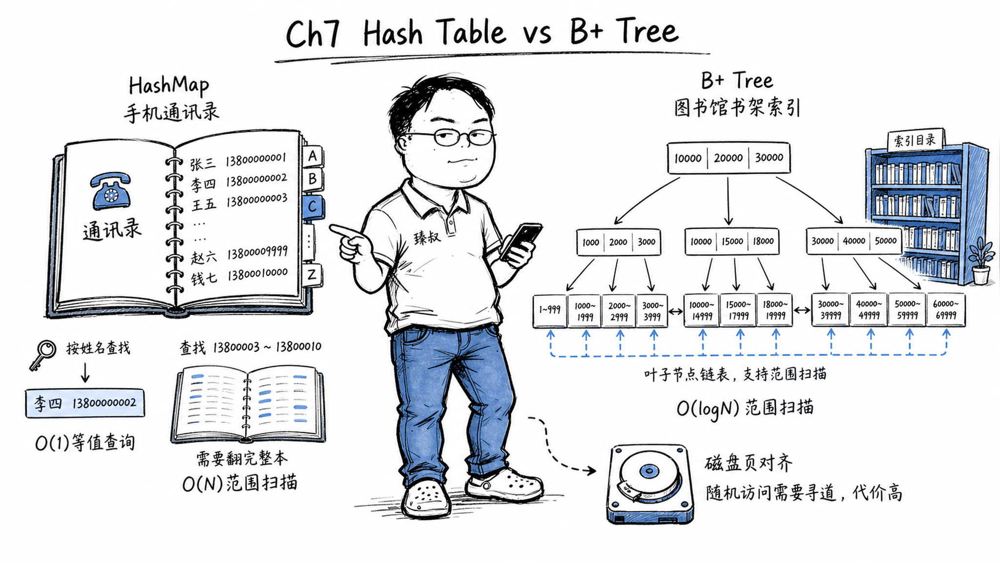

# 索引数据结构：哈希表与B+树的适用边界与选型



---

> 📌 **关注「程序员臻叔」，获取更多硬核技术干货**


---

### "主键查询用哈希表不是更快吗？O(1)啊"

一次数据库优化讨论中，一个同事提出："你把InnoDB主键索引从B+树改成哈希表，主键查询直接O(1)，不是更快吗？"

这个问题的答案在于：数据库不是做一次查询。是做范围扫描、排序、前缀匹配、范围分页，哈希表在"等于"之外全都不会。B+树几乎在所有真实查询场景上都碾压哈希表，虽然它在"等于"上只提供O(log n)而非O(1)。

这就是内存数据结构和磁盘数据结构之间的鸿沟：算法的复杂度分析如果不带上"访问模式"和"存储介质特性"，就是纸上谈兵。

### 核心结论

1. **工程层**：哈希表为内存随机访问优化，O(1)点查询但无范围能力。B+树为磁盘顺序访问优化，扇出高、树高极低、叶子节点形成有序链表，支持高效范围扫描。
2. **原理层**：B+树的设计目标是"最小化磁盘寻道次数"。每个节点存储数百个键+子节点指针（和磁盘页（4KB/8KB/16KB）对齐），一次磁盘IO读取一个节点，得到数百个键的范围定位。
3. **本质层**：两者不是竞争关系，而是"内存vs磁盘"这两种物理约束下各自最优的数据结构。

### 拆解

**哈希表的极致：O(1)——但有代价**

哈希表的逻辑：Hash(key) → 数组槽位 → 直接读写。

```
查找 "user:12345":
  hash("user:12345") = 88342
  数组[88342] → 取value
```

O(1)的前提：
1. 哈希函数计算快且分布均匀
2. 哈希冲突处理高效（拉链法/开放寻址）
3. **全部数据在内存中**——随机访问内存不贵

问题：
- ❌ 范围查询："年龄在20到30岁之间的用户"→哈希表需要扫全表，因为键是无序的。
- ❌ 前缀匹配："所有姓名以'张'开头的用户"→同上，全表扫描。
- ❌ 顺序遍历："按注册时间排序"→必须先把所有键取出来，额外排序。

哈希表的"O(1)"在单点等值查询上是王者，但真实世界的查询远不止"等于"。

**B+树的设计哲学：为磁盘而生**

B+树，平衡多路搜索树：
- 数据只存在叶子节点
- 所有叶子节点通过指针串联成有序链表
- 内部节点只存索引（键+子节点指针），不存数据

关键设计决策：**内部节点扇出极大，不只两个子节点，而是数百甚至数千个。**

一个4KB的磁盘页，如果每个键16字节+子节点指针8字节=24字节→一个节点可以存约170个键。三层B+树可以索引 170³ ≈ 490万个键。四层→约8300万个。五层→约14亿个。

MySQL中InnoDB默认页大小16KB→扇出更大，一般3-4层足以索引数十亿行数据。

这带来的核心优势：**磁盘寻道次数极少**。磁盘的随机读写（一次寻道）约5-10ms，而内存随机访问是纳秒级。3层B+树的每次查询只需3次磁盘IO（如果有缓存层、根节点常在内存中→可能只需2次）。这就是"O(log_B N)"而非"O(log_2 N)"对磁盘场景的意义，B代表扇出，它把"层数"压到极小。

**叶子节点链表——B+树的结构之美**

比"3次IO的等值查询"更重要的优势：

B+树的所有叶子节点从左到右用指针串成有序链表。这意味着：做一次`WHERE id >= 1000 ORDER BY id LIMIT 20`，先找到id=1000的叶子节点（一次B+树查找）→然后沿着叶子链表向右遍历20条记录→完成。

不需要"找到所有>=1000的→全部取出来→排序→取前20"。对哈希表，这种查询就是灾难。

**MySQL InnoDB的索引设计**

InnoDB有两个核心索引结构：
- **聚簇索引**（主键索引）：叶子节点存储完整行数据，表本身就是以主键为键的B+树。
- **二级索引**：叶子节点不存完整行，存的是主键值。查询先走二级索引→取到主键→再到聚簇索引查完整数据（这叫"回表"）。

这也是为什么InnoDB特别建议主键尽量短、自增。短主键让二级索引的叶子节点存的主键值不占太多空间；自增主键让插入永远发生在最右叶子节点，减少页分裂。

**那哈希表在数据库中永远没用于索引吗？**

不是。MySQL有Memory引擎，数据在内存中，支持`HASH`索引，用于等值查询的极致性能。自适应哈希索引（Adaptive Hash Index）：InnoDB自动在B+树页的热等值访问路径上构建内存哈希索引，加速热点等值查询。

还有Redis，本身就是内存KV存储，哈希表就是核心数据结构。

关键：场景说了算，不是算法说了算。

### 怎么讲给产品经理听

> 哈希表=电话本，要查"张三的电话"→直接翻到Z开头→找张→找到→O(1)。但要查"所有姓张的人"→得翻遍电话本。B+树=图书馆的分类索引，每个书架分隔层只存索引标签不存书→要找"所有计算机类"→找到第一个"计算机"标签→沿着书架顺序拿所有的书→不用跳来跳去。电话本更快但只能查"等于谁"；图书馆索引稍慢但能查"从哪到哪"、"有哪些"，真实世界有大量"范围"问题。

✓ 说明了哈希表的"O(1)单点"和B+树的"范围扫描"的互补关系。

✗ 不能体现"内存随机访问便宜vs磁盘顺序访问便宜"这种介质差异——这个类比中没有"信息存储介质"的区分。

### 一个核心洞察

> 哈希表 vs B+树的本质分歧不在算法复杂度上，而在**物理世界的代价上**。内存中随机访问和顺序访问差别不大（都是纳秒级），所以哈希表的随机跳转不是问题。磁盘中随机访问和顺序访问差几个数量级（5-10ms vs 顺序吞吐几百MB/s），所以B+树的"把数据聚类在连续的磁盘页上+叶子链表顺序遍历"才是正确的设计。**最好的数据结构永远是被硬件约束最紧的那个，因为硬件约束不能被优化掉。**

---

**臻叔踩坑笔记**
- InnoDB下自增主键最好，UUID/随机字符串主键会导致大量页分裂和B+树平衡操作→插入性能暴跌。
- 覆盖索引（Covering Index）：查询需要的列全部在一个二级索引中，避免回表，查询效率大幅提升。用`EXPLAIN`看Extra列有没有"Using index"。
- 不要给每个字段都建索引，索引不是免费的，每次插入/更新都需要维护索引。全表扫描有时反而更优（如查70%以上的数据）。

**一句话**：O(1)不是在任何介质上都是O(1)。在磁盘上，O(1)如果意味着每次随机查找都要一次磁盘IO，它还不如O(logn)的顺序读取快。

---

### 🎯 觉得有帮助？关注「程序员臻叔」


---
