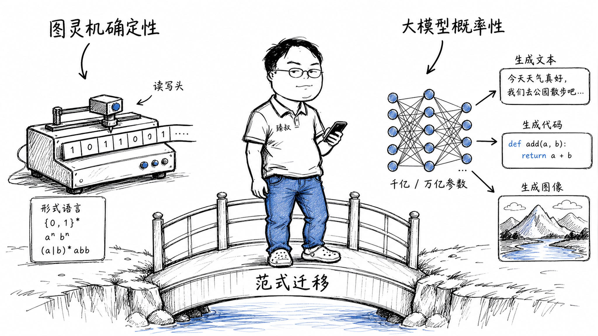

## 从图灵机到大语言模型——计算机科学最深刻的范式变迁是什么？



### 十年前我在IDE里敲下第一行代码时，以为"编程"就是"精确地告诉计算机做什么"

现在，我看着同事们用自然语言和Cursor对话，描述一个需求——AI输出可运行的代码——通过几次对话调整——十几分钟做完的活，放五年前可能要半天。

这不是"工具变得更好了"——这是计算机科学的根本范式在变化：从"精确编程告诉机器怎么做"，到"给机器看海量例子让它自己学会怎么做"。

### 核心结论

1. **工程层**：经典计算范式的核心假设——"问题可以用形式语言精确描述、程序行为可确定验证、复杂度可事先分析"——在AI新范式中全部被打破。
2. **原理层**：图灵机的"可计算性"和神经网络的"泛化能力"是两种完全不同的能力维度——前者保证"一定能算"，后者追求"算对了"但不保证"一定对"。
3. **本质层**：下一个十年的软件工程师不是在"写代码"和"调模型"之间二选一——而是把AI组件嵌入经典软件栈——设计"AI+确定性代码"的混合系统。

### 拆解

**图灵-冯·诺依曼范式——凡事皆有确定答案**

图灵机在1936年回答了一个根本问题：什么是"可计算的"？只要一个问题的求解过程可以被形式化描述为一组有限步骤——就存在一个图灵机可以计算它。

冯·诺依曼架构（1945）把图灵的理论变成了可制造的机器：存储程序——指令和数据存在同一内存中——CPU按序取指令→执行。

这个范式带给世界的确定性：
- 程序行为是可预测的（同样的输入→同样的输出）
- 程序正确性在原理上可以被形式验证（你可以证明一个排序算法在所有可能的输入上都正确）
- 性能复杂度可以被事先分析（你知道O(n²)比O(nlogn)差多少）
- Bug是可复现的（同样的输入触发同样的代码路径→同样的异常）

**AI新范式——统计归纳取代确定性推导**

一个大语言模型不是一个被"编程"的系统——它是一个被"训练"的系统：

- 没有人用Python写了"回答中文问题的规则"——模型通过万亿token的预训练和人类反馈微调，自己学会回答中文问题
- 你问同一个问题两次——两次答案的字面表述大概率不同（尽管语义一致）——没有"确定输出"
- 你无法证明"模型在所有情况下都不会输出有害内容"——只能通过大量测试统计它的行为
- 模型的"代码"不再是可debug的源代码——权重矩阵中没有"这一个数字代表'记住这个人是总统'"的对应关系

这是根本性的范式转移：从"精确描述规则→系统按规则执行"到"系统从海量示例中提取统计规律→按规律做近似推断"。

**两个范式不是谁取代谁——是融合**

AI组件嵌入经典软件栈的架构已经成型：

```
┌─────────────────────────────────────┐
│  经典软件栈（确定性逻辑）              │
│  - 用户认证、事务管理、数据持久化       │
│  - 精确定义的API契约和状态机           │
│  - 审计、合规、安全校验               │
├─────────────────────────────────────┤
│  AI 组件（概率性智能）                │
│  - 自然语言接口（对话/搜索）           │
│  - 内容生成（文字/代码/图片）          │
│  - 异常检测、意图识别、推荐排序         │
└─────────────────────────────────────┘
```

经典代码做"硬逻辑"——订单状态机、支付扣款、权限校验——这些不能有分毫偏差的确定性操作。AI做"软智能"——理解用户意图、生成回复、识别异常模式——这些容忍模糊性和近似正确性的任务。

这就是为什么"用AI写一个金融交易引擎"在可预见的未来不现实——不是AI不会写代码，是金融交易的代码必须经过形式化验证和审计追溯——AI生成的代码缺乏这种"确定性保障"。

但"用AI做一个客服对话系统"——这是AI最拿手的——容忍非确定性输出，准确率90%以上已经非常有用。

**下一个十年对工程师意味着什么**

不会"AI取代程序员"——会"不用AI的程序员被用AI的程序员取代"。

但更本质的变化——工程师的角色从"代码生产者"变成"AI代码的审核者、集成者、和系统设计师"：
- 你不再花80%时间写代码——你花80%时间设计系统架构、定义接口契约、审核AI生成的代码
- 你需要的新能力：评估AI输出的质量、识别AI的盲区（什么逻辑AI容易出错）、设计人-AI协作的工作流
- 经典计算机科学的核心依然有不可替代的价值——复杂度分析、系统设计原则、数据结构和算法、并发控制——这些是你审核和纠正AI的基础，没有它们你没法判断AI的代码是否正确

### 怎么讲给产品经理听

> 图灵机=一个能做三件事的机器——"在纸上写字、擦掉、读纸上的符号"——这三件事的组合，理论上能计算任何可计算的问题。大语言模型=一个读过几乎所有书的神经网络——它没被人告诉"怎么做翻译"——但它从海量翻译文本中归纳出了翻译的规律。从"精确告诉机器怎么做"到"给机器看足够多例子让它自己学会"——这个转变就是计算机科学70年来最大的范式变迁。

✓ 说明了确定性和概率性两种范式的核心差异。

✗ 不能说明涌现现象——类比中缺少了"读到某个量级后突然出现完全新能力"的质变描述。

### 一个核心洞察

> 从图灵机到大语言模型，计算机科学走过的是同一条河流的两岸：左岸是"确定性"——形式语言、图灵机、P/NP复杂度、类型系统、形式化验证。右岸是"概率性"——神经网络、反向传播、注意力机制、涌现。左岸追求"这个程序在所有情况下都正确"。右岸追求"这个模型在大多数情况下做对了"。我们争论的不是"哪一边是对的"——争论的是"在什么地方走左岸，在什么地方走右岸"。优秀的工程师，左手握着对确定性的信仰，右手张开迎接概率性的可能性——在两岸之间搭桥，而非选择站队。

---

**臻叔踩坑笔记**
- 别让AI生成涉及资金安全、访问控制、数据加密等关键逻辑的代码而不人工审核——AI生成的代码通常在"看起来正确"级别——超过这个级别需要人的理解。
- AI最适合的工作是你自己会做但觉得重复枯燥的——因为你最擅长的就是评估它的输出是否正确。
- 学会写好的prompt和学会写好的代码同样重要——这不是"未来"——这是现在已经发生的、每个工程师需要的核心技能。

**一句话**：70年前，图灵告诉我们"什么事可以做"。今天，大语言模型告诉我们"做什么样的事可以不靠精确编程"——两者加在一起，才完整定义了什么叫"计算机能做"。
