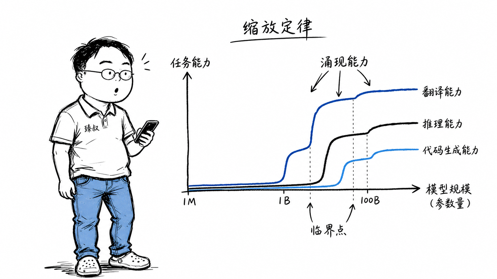

## 为什么大模型"越大反而越聪明"？



### "这个模型什么时候学会翻译的？"

2022年，使用GPT-3做内部工具的团队发现了一件意外的事：有一天群里突然出现一条消息——"你试试用日语问它一个问题，它竟然能用日语回答——从来没训练它做翻译。"

一试之下——确实。GPT-3的训练目标只有一个：根据前面的token预测下一个token。没人告诉它"你要会翻译"、"你要会写代码"、"你要会做数学题"——但这些能力在足够大的规模下全部"自动出现"了。

这就是"涌现"（Emergence）——让整个AI领域困惑又着迷的现象。

### 核心结论

1. **工程层**：涌现=某些能力在大模型（如>100B参数）中突然出现、在小模型中完全不存在——这些能力不是被显式训练的，而是"预测下一个token"这个简单目标在大规模下的副产物。
2. **原理层**：缩放定律（Scaling Laws）表明模型性能随参数量、数据量、计算量的增加而按幂律平滑提升——但涌现是"在某些能力上突然出现的阶跃"——这和平滑的缩放定律形成了张力。
3. **本质层**：涌现存在的根本原因可能是——某些任务需要"组合多个领域知识"——小模型的容量不足以同时记住所有需要的子知识，而大模型的容量跨过了这个最低门槛。

### 拆解

**缩放定律：越大的模型loss越低——这很直观**

OpenAI在2020年的经典论文"Scaling Laws for Neural Language Models"中实证发现：语言模型的测试loss（交叉熵）和参数量、数据量、计算量三者之间呈平滑的幂律关系。

```
L(N) ≈ (N_c / N)^α_N
```

N是参数量，L(N)是测试loss。α_N是经验常数。翻译成人话：**模型越大，预测下一个token的误差越小——而且这个改善是可预测的。**

但缩放定律说的是"平均loss的平滑下降"——不是"某些能力的突然出现"。

**涌现：量变到质变**

涌现的定义（引用Jason Wei等人在2022年提出的框架）：**某项任务在较小规模（<10B）时模型的性能等于随机猜测，但当规模超过某一阈值后性能突然大幅提升。**

经典的涌现能力列表：
- 多步算术推理（能做2位数加法→能做多步推理）
- 多语言翻译（完全没被训练过的语言对）
- 代码生成和调试
- 上下文学习（In-Context Learning——不用fine-tune，给几个例子就能做新任务）
- 思维链（Chain-of-Thought——"让我们一步一步想"触发分步推理能力）

这些能力的共同点是：没有人在训练时告诉模型"你要学会做这些"。

**为什么"预测下一个token"会带来涌现？**

目前还没有严格的理论解释。但最被接受的假设是——"预测下一个token"是一个极其丰富的训练信号。

试想：要准确预测一段维基百科文章的下一句话——你需要理解语言语法、理解文章主题、理解因果关系、理解时间顺序、甚至理解文章作者可能有偏见。这些知识在单个token的预测任务中以隐含形式存在——当模型容量足够大时，模型"发现了"这些隐含结构。

就像一个人从小读了海量的书——他是一个"预测下一个单词"的机器——但最终的理解能力远超了单纯的词汇预测。涌现=读者的"开窍时刻"。

**涌现的工程挑战**

涌现最大的问题是——不可预测。开发团队在训练100B模型之前，不知道这个模型会出现什么新能力（也不能保证不会出现有害能力）。

这也是为什么AI安全领域对涌现特别关注——如果一个危险能力（如生成虚假信息、操纵用户）在>500B时突然涌现——你上次测300B版本时这个能力根本不存在——无法在训练前审计。

### 怎么讲给产品经理听

> 一个小孩读了10本书→能复述故事。读了1000本→能分析故事结构。读了一万本→突然有一天他写了一篇小说——结构完整、人物鲜明——从来没人教他"怎么写小说"。他知道怎么编故事，不是因为他学过"小说写作课"——而是"读得太多，模式自己浮现了"。涌现=读到某个数量级后，大脑自动组成了"写作能力"——没人明确教过。大模型的涌现同理——算力和数据堆积到临界点→新能力从量变中诞生。

✓ 说明了"被动的token预测"如何产生"主动的新能力"。

✗ 不可说明涌现的不可预测性——类比中的小孩是"突然有一天会写小说"，但现实中我们无法提前知道哪个小孩到第几本书后会开窍。

### 一个核心洞察

> 涌现揭示了深度学习最深刻的哲学问题：**当系统足够复杂时，它的行为不能从组件行为中推导——这是涌现的定义。** 这不是AI特有——水分子没有"湿"的特性，但足够多的水分子聚在一起就"湿了"。我们训练大模型时面对的是同一个谜：单个神经元只做简单的矩阵运算，千亿个神经元聚在一起却产生了"理解"——这个跃迁的过程至今没有完整的理论。实战者们不靠理论——靠实验：更大、更多数据、更多算力→测试→观察涌现。

---

**臻叔踩坑笔记**
- 不要期待"15B模型通过严格训练达到100B的水平"——涌现是规模现象，大概率不可通过优化绕过去。
- 思维链提示（"Let's think step by step"）在<10B模型上几乎没有提升——这是一个典型的涌现能力——小模型不必为之特别设计。
- 涌现能力和基准测试数字不完全对应——某个benchmark高分≠某个涌现能力出现了。评测要区分"背诵答案"和"实际推理"。

**一句话**：涌现是AI领域最像"魔法"的现象——它提醒我们，规模不只是一个工程变量，它在某些维度上就是答案本身。
