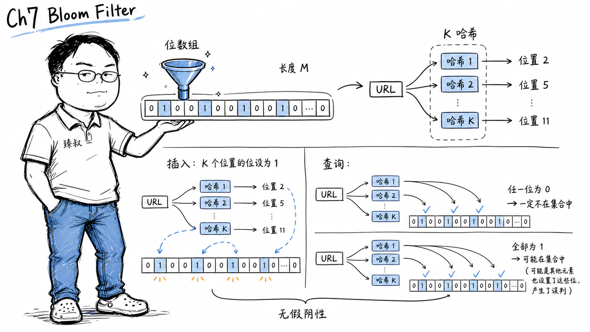

# 布隆过滤器：概率数据结构原理与误判率控制



---

> 📌 **关注「程序员臻叔」，获取更多硬核技术干货**


---

### "那个缓存穿透是谁干掉的？"

2019年我们有个Redis缓存的接口频繁被穿透，恶意用户故意查大量不存在的key，请求直接打到了数据库，数据库的CPU飙到顶上。

上线了一个布隆过滤器的中间件后，这些"查不存在key"的请求在缓存之前就被拦住了，永远不会到Redis、更不会到DB。而在运维指标上没有看到"正确拦截的请求"的数字变大，因为布隆是一个"先排除不可能"的过滤器。

### 核心结论

1. **工程层**：布隆过滤器保证"如果它说不存在→一定不存在（无假阴性）"、"如果它说可能存在→需要进一步去数据源确认（有假阳性）"，用极小的空间实现了"排除不可能"的快速筛检。
2. **原理层**：布隆的核心是K个哈希函数 + 一个M位的位数组。插入时把K个哈希值对应的位都置1，查询时检查这K位是否全为1，只要有一位不为1，这个元素绝对不在此集合中。
3. **本质层**：布隆过滤器是一种"概率型数据结构"的代表，用准确度换空间效率。它是一个"不管假阳性率的加速器"，而不是"精确的集合判断器"。

### 拆解

**为什么不用HashSet？**

用HashSet判断"一个key在不在数据库里"，你需要把所有key存进内存。如果数据库有10亿条记录，每条记录80字节→80GB内存→太贵。

布隆过滤器解决的是："我不需要精确知道在不在，我只需要知道如果它说'不在'那一定不在"。

**布隆过滤器的数据结构——一个位数组**

一个M位的位数组（M=1,000,000位≈125KB），初始全是0。K个独立的哈希函数。

**插入一个元素x**（如URL "https://example.com"）：
```
hash1(x) = 42    → 把第42位置1
hash2(x) = 1037  → 把第1037位置1
hash3(x) = 5999  → 把第5999位置1
```

**查询x是否在集合中**：
```
hash1(x) = 42    → 第42位是1 ✓
hash2(x) = 1037  → 第1037位是1 ✓
hash3(x) = 5999  → 第5999位是1 ✓
→ 三位全为1 → "可能存在"（概率上大概率在）
```

**假阳性怎么发生的？**

如果另一个元素y的三个哈希值恰好和已经插入的其他元素的某些哈希值碰撞，这些位已经是1但不是y写入的，布隆就会说"可能存在"，虽然y实际上从未被插入过。

比如：x1的hash2=1037，x2的hash1=1037，两者不相关但共享了一个位。对y来说，hash(y)=1037的位被"别人的写入"置1了，无法区分是被谁置的。

但反过来，如果有一位是0，它一定没有被任何已插入元素置为1，布隆说"一定不存在"→100%保证。

**公式：假阳性率**

```
假阳性率 p ≈ (1 - e^(-K·N/M))^K
```

N=已插入元素数，M=位数组大小，K=哈希函数个数。

关键tradeoff：M越大→假阳性越低→空间越大。K太小→每个元素只标记1-2个位→碰撞概率高；K太多→位数组里全是1→假阳性爆炸。最优K ≈ (M/N) · ln(2)。

实战：1%假阳性率、1亿个元素→只需要约120MB。相比之下，HashSet可能要几GB。

**布隆过滤器的实战场景**

- **缓存穿透保护**：Redis/数据库前放一个布隆，记录"数据库中确实存在的key"。请求过来→布隆判断"不在"→直接返回404→不查数据库。
- **Chrome安全浏览**：Chrome维护一个布隆记录已知恶意URL的集合→用户访问任何URL前先在布隆中检查，不在布隆列表→放行。如果在→再联网查询确认（因为可能假阳性）。本地布隆只需要几MB，远小于把所有恶意URL加载到浏览器。
- **去重**：爬虫系统爬了10亿个URL不想重复爬，布隆记录"已经爬过的URL"。假阳性意味着"偶尔会漏爬一些URL"（可以接受）而非重复爬（不可接受）。

### 怎么讲给产品经理听

> 一个超小的图书馆目录，只记录一本书的ISBN末三位×××而非完整ISBN。你要查一本书，目录上看不到你的完整ISBN→书一定不在。看到末三位×23，可能是一本ISBN末三位×23的书，但不一定是你要的那本，要去书架上确认。这个目录占的空间极小，但能过滤掉"肯定不在"的绝大多数查询，让"可能在"的少数再去做精确查找。

✓ 说明了"排除不可能"vs"确认存在"的不对称性。

✗ 不能说明"别人把我的位占了"也是假阳性的来源——类比中不同的书共享同一个末三位，这不是你写入的却让你的书"看起来可能在"。

### 一个核心洞察

> 布隆过滤器的哲学反直觉：**有时"宁可错杀好人也不放过一个坏人"更高效——前提是你有后续的精确机制帮你纠正"错杀"**。布隆的假阳性是可以控制的已知代价，而你支付这个代价换来的是"用MB级内存加速TB级数据查询"。从精确性到概率性的转变，不是降级，是"知道什么信息可以牺牲、什么必须保留"的系统工程智慧。

---

**臻叔踩坑笔记**
- 布隆过滤器不支持删除，因为把位从1变回去0会让共享该位的其他元素变成"假阴性"，破坏布隆的核心保证。要支持删除用Counting Bloom Filter（每个位计数而非二进制）。
- 初始M大小要根据预期数据量合理估计，太小→假阳性快速恶化；太大→浪费空间。
- 别把布隆过滤器和缓存放在同一层。布隆应该在缓存前面，先过滤掉"一定不存在"的请求，剩下来"可能存在"再经过缓存层。两者顺序反过来就白干了。

**一句话**：布隆过滤器的智慧——在"我不确定"和"我确定不"之间，精确的否定比模糊的肯定更有用。

---

### 🎯 觉得有帮助？关注「程序员臻叔」


---
