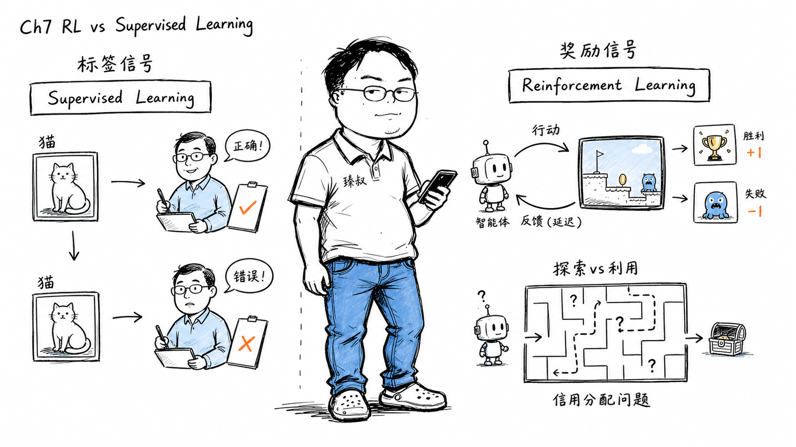

## 强化学习和监督学习本质区别是什么？



### 一个围棋AI要下180手的棋——怎么标答案？

做一个猫狗分类器——标注非常简单：看图片→标"猫"或"狗"→模型学到的就是"看图→输出标签"的映射。这是监督学习：有标准答案。

现在做一个五子棋AI——每一步该下哪？答案是"最终赢了的那步棋是对的"——但一局棋有几十步，最终的胜利是几十步共同作用的结果——到底哪一步贡献了胜利、哪一步差点导致输掉？这是强化学习的核心难题——信用分配。

### 核心结论

1. **工程层**：监督学习有逐样本的精确标签（ground truth），强化学习只有延迟的标量奖励（最终赢/输的+1/-1信号）。
2. **原理层**：强化学习的核心挑战是信用分配问题——"稀疏奖励函数的信号如何反向传播到导致收益的关键动作"。经典解法是时间差分学习（TD-Learning）和策略梯度。
3. **本质层**：强化学习 = 监督学习 + 时间维度上的不确定性。监督学习说"这个样本=猫"；强化学习说"在某个状态下做了某个动作后，你在未来会得到一个不确定的奖励"。

### 拆解

**监督学习的训练范式**

```
输入: 一张猫的图片 (x)
标签: "猫" (y)
模型学习: 映射 f(x) → 尽可能接近 y
loss: CrossEntropy( f(x), y )
```

训练循环：喂图片→输出概率→跟"猫"真值比较→反向传播→调整权重。每一张图片都有"标准答案"。

**强化学习的训练范式**

没有标准答案。有的是一套"环境-智能体-奖励"的交互：

```
智能体观察 → 状态S
智能体选择 → 动作A
环境反馈 → 奖励R + 新状态S'
（R可能是延迟的——可能几百步后才出现）
```

训练的目标：让智能体学会一个策略π（给定状态→选择动作的函数），使预期累计奖励最大化。

**信用分配——RL最核心的难题**

一局围棋你赢了（R=+1）。你在第37手下的那步妙手——它直接贡献了多少胜率？你在第52手的随手棋——它贡献了多少劣势？

标准的解决框架是**时间差分学习（TD-Learning）**：

```
V(S_t) ← V(S_t) + α [ R_{t+1} + γ·V(S_{t+1}) - V(S_t) ]
```

翻译：当前状态S_t的"价值"（预期未来奖励总和）应该等于"这一步的实际奖励R_{t+1} + 下一状态的折扣价值γ·V(S_{t+1})"。如果当前估计V(S_t)和目标有差距→更新让它靠近。

直觉：你评估一步棋好不好——不是看这一步落子后马上得了几分（通常没分），而是看这一步后——你在棋局上是否处于更有利的位置（V(S_{t+1})高于V(S_t)）。TD学习就是不断调整"状态的估值"来逼近这个逻辑。

**探索 vs 利用——RL特有的困境**

监督学习不需要做"探索"——因为每张图都有正确答案——跟着答案走就行。

强化学习永远面对一个两难：
- **利用（Exploitation）**：按当前已知的最好策略做——稳，但可能错过更好的策略。
- **探索（Exploration）**：尝试一个从来没试过的动作——可能发现更好的路，也可能掉进坑。

经典的ε-greedy策略：以概率ε随机探索，以概率1-ε选择当前最优。训练初期ε大（多探索），后期ε衰减到接近0（多利用）。

DeepMind的AlphaGo就是强化学习的巅峰——不是"按围棋大师棋谱学的"（那是监督学习），而是通过"和自己下了几千万盘棋"，只以"最终的胜负"为奖励信号——自己从零发现了全新的围棋策略。

**为什么不把所有问题都当RL做？**

RL的样本效率极低。监督学习看10万张猫图就能分类猫——RL的智能体要玩几百万局游戏才能学会走迷宫。

而且RL训练极不稳定——策略网络的微小变化→动作分布变化→访问的状态分布变化→之前学到的"V(S_t)估值"全部过时→循环震荡。

### 怎么讲给产品经理听

> 监督学习=有标准答案的考试——给你10万道题+答案去刷，考你一道没做过的题→输出最接近标准答案的答案。强化学习=打一个没玩过的游戏——没人告诉你什么操作是好操作——你只有"赢了+1"、"死了-1"这种终极信号。你得自己试：跳上去踩乌龟→加一条命→跳是对的；撞到乌龟→死→跳是错的吗？不——跳是对的，但时机错了。哪一个动作导致了赢？不知道——这就是强化学习的"功过难分"。

✓ 说明了标签和奖励信号的根本差异 + 信用分配。

✗ 不能体现RL中的"探索vs利用"困境——类比可以补充："一直用已知的策略打能通关但永远发现不了隐藏关卡"。

### 一个核心洞察

> 强化学习解决的是人类学习中更真实的场景：**现实不是有参考答案的习题集——现实是"做了这个选择后，你会在不确定的未来得到一个不确定的后果"**。监督学习帮你"识别已经存在的东西"——这是一张猫。强化学习帮你"在不确定中做决策"——这一刻，我应该点哪步棋、转哪个方向？它比监督学习更像真实的决策过程——但也因此更不稳定、更慢、更难调。

---

**臻叔踩坑笔记**
- RL训练极其敏感于超参数——特别是reward的scale和discount factor γ。γ=0.99意味着"看未来100步的奖励"，γ=0.9是"看未来10步"。
- 不要用"赢了+1输了-1"这种纯稀疏奖励训练——在复杂环境中几乎学不到任何东西。人工设计"中间奖励"（如"吃了豆子+0.1分"）是标准实践——这叫奖励塑形（Reward Shaping）。
- RL的policy网络和value网络如果共用一个底层网络——两者对参数更新的方向经常矛盾→需要仔细平衡loss权重。

**一句话**：监督学习告诉你什么是对的，强化学习让你在犯错中找到对的。
