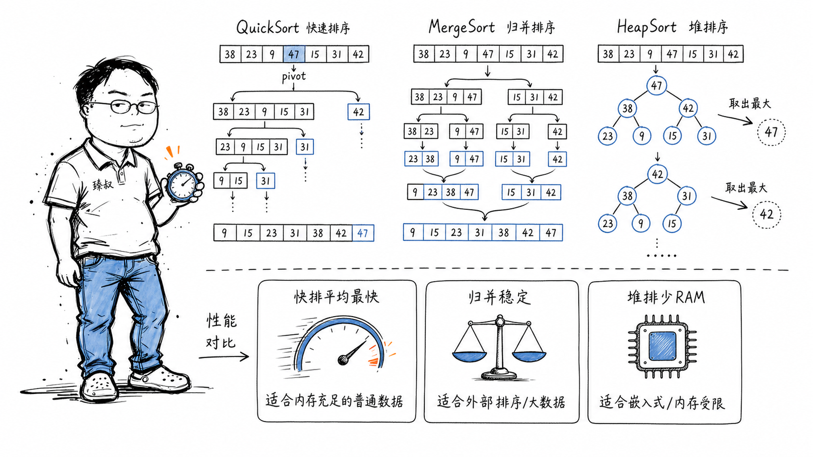

## 堆排序、快排、归并排序——在什么场景选哪个？



### 线上P99延迟从50ms暴涨到2秒——排序选错了

一个后台管理系统的列表排序——产品要求"支持按任意字段排序"——开发直接用Python的`sorted()`（TimSort，归并+插入的混合）。数据量从几百行涨到十万行后——P99延迟从50ms暴增到2秒多。

问题不是"sorted太慢"——是它在每次请求时都复制整个列表然后排序——大量的内存分配和GC——而实际上后台管理的排序是"一页20条，用户只看前2页"——用堆排序取Top-K比全量排序然后再分页高效得多。

这个经历让我意识到——不是排序算法有优劣——是场景决定了哪个算法最优。

### 核心结论

1. **工程层**：选排序算法看四个维度——数据量大小、内存约束、稳定性需求、数据是否基本有序。
2. **原理层**：快排平均O(nlogn)但最坏O(n²)，归并稳定和O(nlogn)但额外O(n)空间，堆排原地O(nlogn)但不稳定。
3. **本质层**：没有"最好"的排序算法——只有"在特定约束下最优"的排序算法。

### 拆解

**三种经典排序的参数对比**

| | 快排 | 归并排序 | 堆排序 |
|---|---|---|---|
| 平均时间 | O(nlogn) | O(nlogn) | O(nlogn) |
| 最坏时间 | O(n²) | O(nlogn) | O(nlogn) |
| 空间复杂度 | O(logn) | O(n) | O(1) |
| 稳定 | ✗ | ✓ | ✗ |
| 缓存友好 | ✓✓✓ | ✓✓ | ✓ |

**快排——为什么实践中最快**

快排的核心逻辑：
1. 选一个pivot（基准值）
2. 把数组分成三部分——小于pivot的在左、等于的在中间、大于的在右
3. 左右两部分各自递归应用相同的逻辑

快排快的理由：极好的缓存局部性。分区过程中，数组元素在内存中是连续访问的——现代CPU的缓存预取可以提前加载。而堆排序在"上浮/下沉"操作中跳跃访问内存——不断cache miss。

快排的危险：每次都选到最小/最大的pivot→分区不平衡——退化到O(n²)。标准库的对策：三数取中（选首、尾、中三个数的中位数作为pivot）——大概率避开极端情况。

**归并排序——当你需要稳定性时的不二选择**

归并排序的核心：
1. 把数组递归地切成单个元素——单个元素天然有序
2. 两两合并——合并过程中保持原始顺序

稳定性 = 相等元素的相对顺序在排序后保持不变。这很重要：比如先按姓名排序，再按年龄排序——第二次排序后，同年龄的人仍然保持按姓名排序的顺序——这就是因为归并排序是稳定的——它不会打乱你上一轮排序的结果。

归并的代价：需要额外的O(n)空间做合并——内存敏感的嵌入式环境不适用。

**堆排序——内存最有限的场景**

堆排序建立在一个最大/最小堆的基础上：

```
建堆: O(n) —— 把所有元素建成一个完全二叉树，
      每个父节点大于等于子节点（最大堆）
排序: O(nlogn) —— 重复：取出堆顶（最大值）
      → 移到数组末尾 → 重建堆 → 再取
```

堆排序的优势：原地排序——不需要额外数组（归并需要O(n)额外空间）。这在内存极度受限的场景（嵌入式、底层系统）下至关重要。

劣势：不稳定+缓存不友好（跳跃访问内存）。

**工程中的"取巧"方案**

**IntroSort（C++ std::sort）**：快排为主，但如果递归深度超过2·log₂n（快排已经开始退化）→切换到堆排序。两个算法互补——快排的正常路径性能+堆排的最坏情况保证。

**TimSort（Python sorted、Java Arrays.sort）**：现实中大量数据"基本有序"——比如用户的交易记录天然按时间排序。TimSort利用这个特性——先扫描数据找**run**（已经有序的连续片段）→再用归并排序合并这些run。如果数据几乎排好了——复杂度接近O(n)——比快排的O(nlogn)快得多。

**Top-K 场景用堆排序——只取前K个**

"找了全量再截前面"这种思考在数据量很大的时候是灾难。对于找出最大的K个元素——只需要维护一个大小为K的最小堆：

1. 遍历所有元素
2. 如果堆的大小<K → 直接加入
3. 如果堆的大小=K 且当前元素大于堆顶 → 替换堆顶 → 下沉调整
4. 遍历结束 → 堆中就是前K大元素

时间复杂度O(nlogK) ——当K远小于n时，远快于O(nlogn)的全排序。

### 怎么讲给产品经理听

> 快排=随便抽一本书当标杆→比它薄的放左、厚的放右→左右分别再重复——通常极快，但如果每次刚好抽到最厚/最薄的就慢了。归并=把所有书分成N小堆各自排好，再像洗牌一样两两合并——稳定但需要一张备用的桌子。堆排=把书扔进一个自动整理箱，每次从顶上取最小那本——省桌面，但书在整理箱里跳来跳去。

✓ 说明了三种算法的核心机制。

✗ 不能准确说明缓存友好性——类比中没有"数据在内存中是连续放还是到处跳"的概念。

### 一个核心洞察

> 排序算法的最根本教训不是"不同算法不同速度"——是 **"输入数据的特性比算法本身的特性更重要"** 。TimSort在近乎有序的数据上O(n)、快排在随机数据上O(nlogn)——算法的效率判断永远不能脱离你的数据的实际分布。数据科学家的第一守则："先看数据的分布，再选算法"——而非"先学最好的算法，再去找数据"。

---

**臻叔踩坑笔记**
- 别自己手写排序——标准库的实现经过了几十年优化（TimSort/IntroSort），你的手写快排大概率比不过。
- 自定义对象的排序，注意Comparator里不要做昂贵操作——Comparator会被排序算法调用成千上万次——里面放一个数据库查询或网络请求=玩火。
- 如果只是需要"最大的10个"而不是"所有排序后分页展示"——用堆排取Top-K，别全排序。

**一句话**：排序算法的最佳选择，从来不是看"算法多优秀"，而是看"数据和算法多匹配"。
