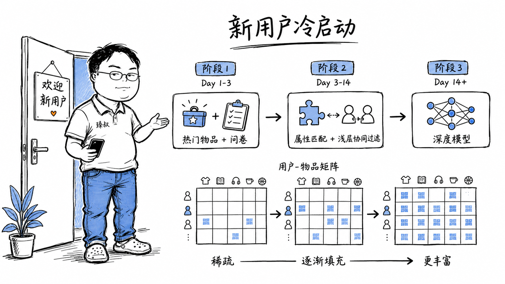

## 推荐系统的"冷启动"为什么这么难？

### 一个新用户打开App——系统沉默了

电商后台的推荐系统日志显示：新注册用户在前10次浏览中的转化率只有老用户的1/10。不是系统推荐了错的东西——是系统几乎没有这个用户的任何信息，只能给一个中位数的推荐。

冷启动是推荐系统的"鸡生蛋蛋生鸡"：没有用户行为数据 → 没法精准推荐 → 用户没有好的体验 → 不给行为反馈 → 还是没有数据。

这是2000年代初就有的老问题，但直到2024年，所有大厂仍然在花大精力优化冷启动——因为它直接决定了用户留存。

### 核心结论

1. **工程层**：冷启动有三种形态——新用户（没有行为）、新物品（没有交互）、新平台（什么都没）——每种形态的解法不同但本质相同：在"无数据"的情况下找"替代信号"。
2. **原理层**：推荐系统的主流模型（协同过滤、深度学习召回）都依赖"交互数据"——用户-物品的矩阵越密效果越好。冷启动时矩阵几乎为空——必须退回到基于内容的推荐或规则策略。
3. **本质层**：冷启动的元问题是——在没有用户-物品交互矩阵的条件下，如何构建一个和"已有大量交互数据后"的模型输出接近的推荐结果。

### 拆解

**为什么协同过滤对老用户效果好，对新用户没用？**

协同过滤的核心假设："和你有相似行为的用户也喜欢的东西，你应该也会喜欢"。

比如你和我都看了《三体》+《球状闪电》+《流浪地球》——你还看了一本《北京折叠》——协同过滤就推荐给我："和你相似的用户也喜欢《北京折叠》"。

这个逻辑成立的前提：我知道你看了哪些书（你的交互历史）。新用户——一本书都没看过——你在"用户-物品"矩阵里是完全空白的一行——任何基于协同的算法都失灵。

**三种冷启动场景的区别**

| | 新用户冷启动 | 新物品冷启动 | 新平台冷启动 |
|---|---|---|---|
| 有什么 | 人口统计（年龄/性别/地区） | 物品自身属性（类别/描述/图片） | 什么数据都没有 |
| 缺什么 | 用户行为历史 | 用户交互数据 | 全局用户+物品+交互 |
| 策略 | 热门推荐+问卷+属性匹配 | 基于内容推荐+相似物品引流 | 编辑精选+外部知识图谱 |

**新用户冷启动的策略演变**

**第一阶段（Day 1-3）：纯热门 + 显式偏好收集**

用户刚注册——系统不知道他喜欢什么——推荐全局最热门的内容（被最多用户喜欢的）——大概率不会错。

同时，在注册流程或首页引导中让用户选几个偏好（"你对什么领域感兴趣？科技/财经/体育/..."）——这叫"显式反馈"——虽然只给了粗粒度的兴趣方向——但这些signals价值极高。

**第二阶段（Day 3-14）：属性匹配 + 浅层协同**

用户开始有一些零散行为后（点击了几篇文章、看了几个视频）——系统开始工作：
- 从用户点击的内容中提取属性（如"科技类+AI主题+中文"）
- 推荐同属性簇的其他热门内容
- 不依赖于"协同"——仍然基于内容相似度

**第三阶段（14天以后）：深层模型可以上场了**

当用户积累了足够的交互（几十到上百次）后——矩阵开始有密度——协同过滤、深度召回模型（双塔DNN）逐步切上场——冷启动阶段结束。

**新物品冷启动——经典的"信息不对称"**

一个刚上架的冷门商品几乎没有交互数据——协同过滤的选择是直接忽略它——因为"没有数据=没有证据证明它好"。

解决：
- 内容特征向量：基于物品描述、图片、标题的文本embedding，和用户历史偏好的embedding计算相似度——"这个冷门商品的描述和你喜欢的东西有共同关键词"→"值得推荐"
- 探索流量：有意识地在推荐结果中插入少量新物品→给它们"曝光机会"→收集交互数据→进入良性循环
- 冷热度调控：一个新品天然地需要一个"热度boost"权重，让它在冷门阶段得到更多曝光

### 怎么讲给产品经理听

> 你开了一家新书店——第一位客人推门进来，你不知道他喜欢什么书，他也不知道你的店有什么。你只能猜"大家最常买的畅销书"推荐给他→这是热门推荐。如果有1000个客人的借书记录，你就能说"借了《三体》的人也借了《球状闪电》"——推荐《球状闪电》→这是协同过滤。冷启动=在没有任何借书记录的时候开店——你只能靠"这本书是科幻+刘慈欣写的+好评多"——这是基于内容的推荐。

✓ 把热门推荐/协同过滤/内容推荐三种策略都解释清楚了。

✗ 不能说明探索vs利用的权衡——有时明知一个选项不是最优，但为了"收集数据"也要推荐它。

### 一个核心洞察

> 冷启动的本质不是技术问题——是信息论问题：**任何预测模型的最低信息需求门槛无法突破**，冷启动只是暴露了这个门槛的存在。实战中最有效的不是"更好的算法"，而是"在信息极少时，主动创造信息"——问卷、探索流量、属性补全、跨域知识迁移——都是"空手套白狼"地收集信号。最强的冷启动策略是让你的系统尽快摆脱冷启动状态。

---

**臻叔踩坑笔记**
- 别把"热门推荐"当成冷启动的终点——热门会让马太效应加剧（热的东西越来越热），冷门商品永远没有曝光——打破它需要探索流量。
- 跨域迁移（如用微信阅读的偏好初始化你的新闻推荐）可以极大缓解冷启动——但前提是有用户授权和跨域ID打通。
- 新物品的冷启动也别盲目——一个同质化严重的新商品（如"又一种充电宝"）不必强推——用户对冗余推荐极其敏感。

**一句话**：冷启动不是"推荐了什么"的问题——是"怎么在不知道用户喜好时不把他吓跑"的问题。
