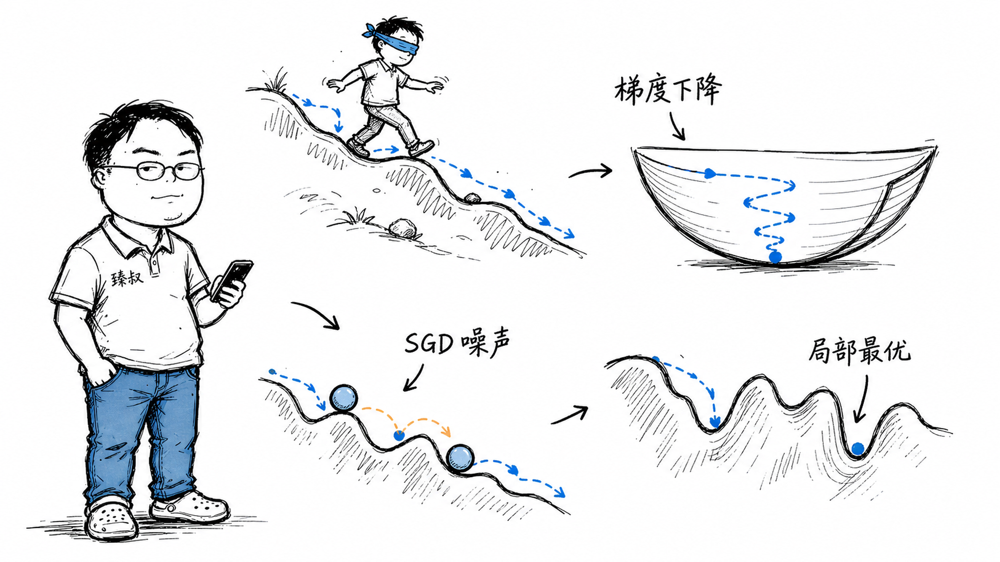

# 梯度下降算法：神经网络优化的核心原理与变体



---

> 📌 **关注「程序员臻叔」，获取更多硬核技术干货**


---

### "它怎么知道往哪走？"

刚学深度学习时我最大的困惑不是数学，而是直觉。一个神经网络可能有几十亿个参数，损失函数的曲面在这些参数张成的高维空间里弯弯绕绕，梯度下降在这片"黑暗中"居然能找到最低点？

我带着这个问题回头翻吴恩达的课，看到他画的那个"盲人在山上找最低点→感受脚下坡度→朝最陡下坡走一小步"的图，豁然开朗。

### 核心结论

1. **工程层**：梯度=方向导数最大的方向，沿梯度负方向更新参数是"这一步最快下山"的局部策略。
2. **原理层**：梯度下降能工作不是因为Loss曲面是完美的碗形，而是因为神经网络参数初始化合理、学习率控制得当、SGD的随机噪声帮助跳出鞍点。各种技巧让"局部最优"不是深度学习的瓶颈。
3. **本质层**：深度学习的真正困难不是"掉进局部最优"，而是"困在鞍点"。在高维空间中，鞍点比局部极小值数量大得多。

### 拆解

**梯度到底是什么意思？**

一个函数 f(x, y) 在一个点上的梯度是一个向量——指向f增长最快的方向，大小是这个方向的增长率。

在参数空间中，Loss函数L(θ)的梯度▽L(θ)告诉你：**如果我想让Loss增大，应该往哪个方向调整参数**。

所以参数更新方向 = θ - α·▽L，负梯度方向 = Loss减小的方向。α是学习率（步长）。

**一维类比：盲人下山**

想象你站在山上（Loss = 参数空间中的高度），完全看不见（不知道整个山形），但你能感受脚下的坡度。

每一步：
1. 感受坡——哪个方向最陡（计算梯度）
2. 朝最陡的下坡方向迈一小步（沿负梯度更新参数）
3. 停下来→重新感受→再迈一步

如果山是凸的（碗形）→无论你从哪开始，最终都走到碗底（全局最优）。逻辑回归的Loss函数就是凸的，梯度下降一定收敛到全局最优。

**深度学习的图景不是碗**

深度神经网络的Loss曲面是多峰多谷的高维非凸地形，有无数个"看着像最低但其实旁边还有更深"的局部最优，还有大量"看起来平的但其实是山坡的转折点"——鞍点。

那为什么SGD还能work？

**SGD的噪声反而是优势**

先区分两个概念：
- **GD（批量梯度下降）**：每次用全部训练数据算精确梯度→方向精确但每次计算极慢，且完全确定性的走，容易困在鞍点。
- **SGD（随机梯度下降）**：每次随机抽一小批数据（如32条）算近似梯度→梯度不精确，有噪声，但这些随机噪声恰好能帮你跳出鞍点。

鞍点有一个特点：梯度几乎是零，GD到了鞍点就停住了。但SGD因为用子集算的梯度有摆动，这个摆动在鞍点处可能恰好把你推出"平的陷阱"方向。

**Momentum——积累惯性**

Momentum的核心思想：不只是这一轮的梯度决定方向，而是过去所有轮梯度的指数加权平均。

```
v_t = β·v_{t-1} + (1-β)·▽L_t
θ_t = θ_{t-1} - α·v_t
```

物理直觉：就像从山上滚下来的球，不光受当前坡度影响，还有惯性，惯性帮你滑过小的上坡和浅凹坑。深度学习中Momentum几乎标配β=0.9。

**Adam——自适应步长**

不同参数在Loss曲面上"敏感度"不同，有的参数稍微一动Loss变化极大，有的参数乱动也不影响Loss。用统一的学习率对前者太大（震荡）、对后者太小（慢）。

Adam给每个参数独立的学习率，根据历史上这个参数的梯度大小自适应调整。梯度的历史波动大→说明这个参数敏感→减小步长；历史波动小→说明稳定→增大步长。

### 怎么讲给产品经理听

> 盲人在完全黑暗的多山地带找最低点，只能感受脚下的坡度（梯度）→沿最陡下坡走一小步→停→重新感受→再走。如果山谷是个完美的碗（凸函数），他一定走到碗底。如果山里坑坑洼洼（非凸），他可能走错，好在有"惯性"（Momentum）帮他滑过浅坑，还有"随机晃一晃"（SGD噪声）帮他爬出陷阱。

✓ 说明了基本思想 + SGD噪声的好处。

✗ 不能说明为什么"随机晃"恰好有利而非有害——这个类比太隐喻了。

### 一个核心洞察

> 梯度下降教会我们一个反直觉的统计原则：**在极高维度中，"随机"不是敌人，而是帮手。** 确定性方法在光滑的低维空间是最优的，但一旦维度爆炸、曲面变得复杂，一点噪音反而帮你跳出伪陷阱。这和"刻意引入随机性来增强系统鲁棒性"的设计哲学高度一致。

---

**臻叔踩坑笔记**
- 学习率设太大→Loss震荡甚至爆炸（NaNs everywhere）；太小→训练好比老牛拉车。训练前先用一小段数据做lr range test：从极小到大试lr→看loss曲线→选loss下降最快时对应的lr。
- Adam是主流默认但有时候要切回SGD，特别是最后fine-tuning阶段，SGD+Momentum的泛化能力有时优于Adam。
- 梯度爆炸（数值溢出）→梯度裁剪（gradient clipping）——`torch.nn.utils.clip_grad_norm_`直接把过大的梯度截断。

**一句话**：梯度下降的工程核心不是"往哪走"，而是"步子多大 + 掉坑里怎么办"。

---

### 🎯 觉得有帮助？关注「程序员臻叔」


---
