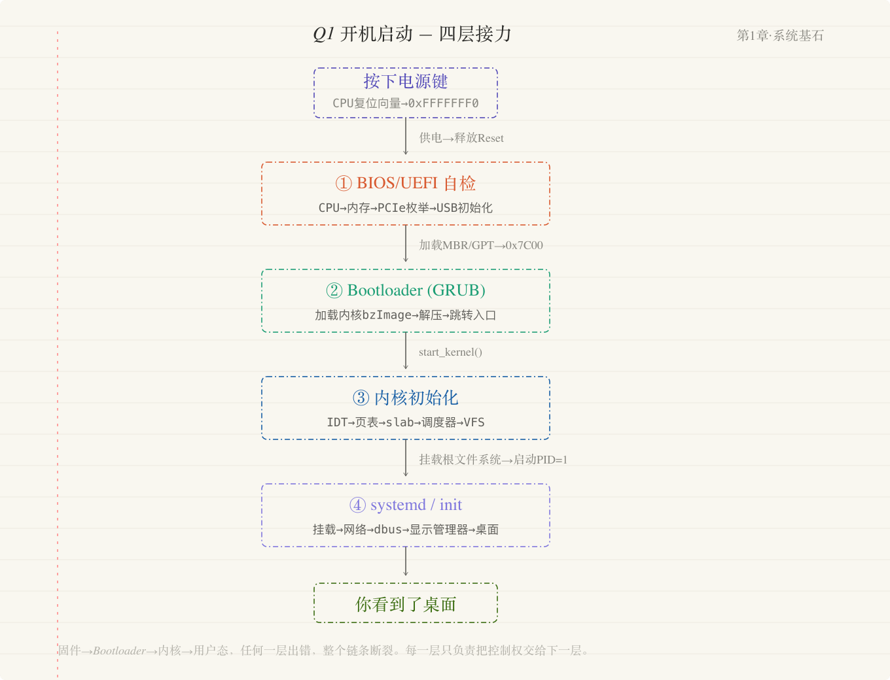
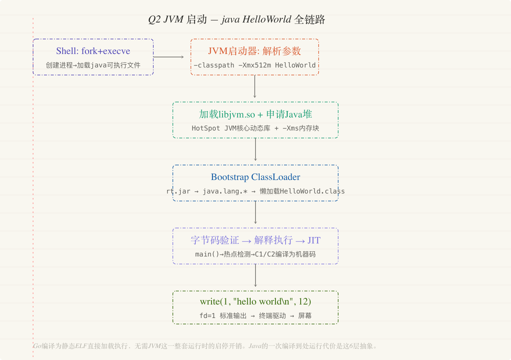
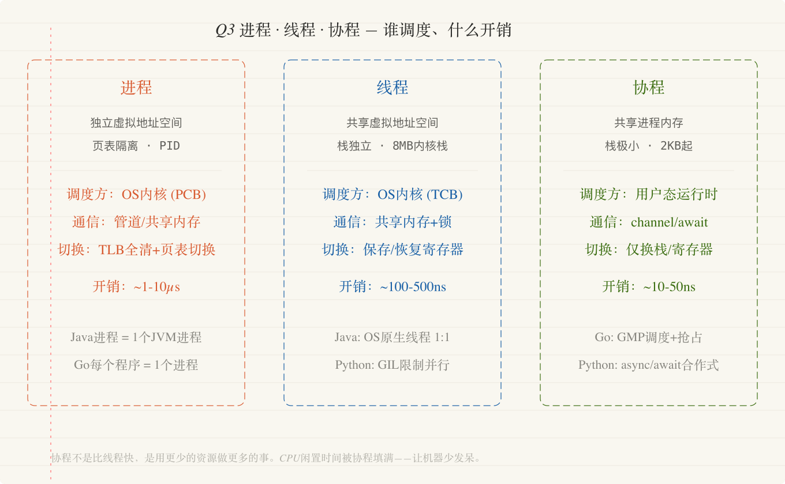
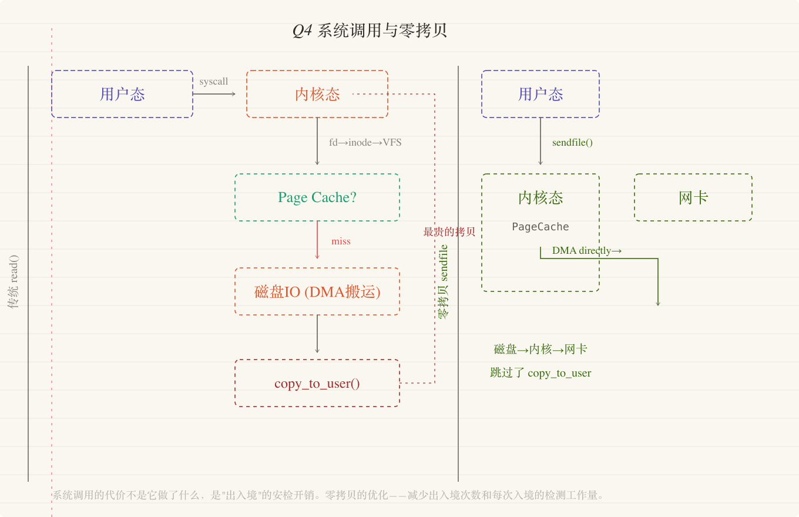
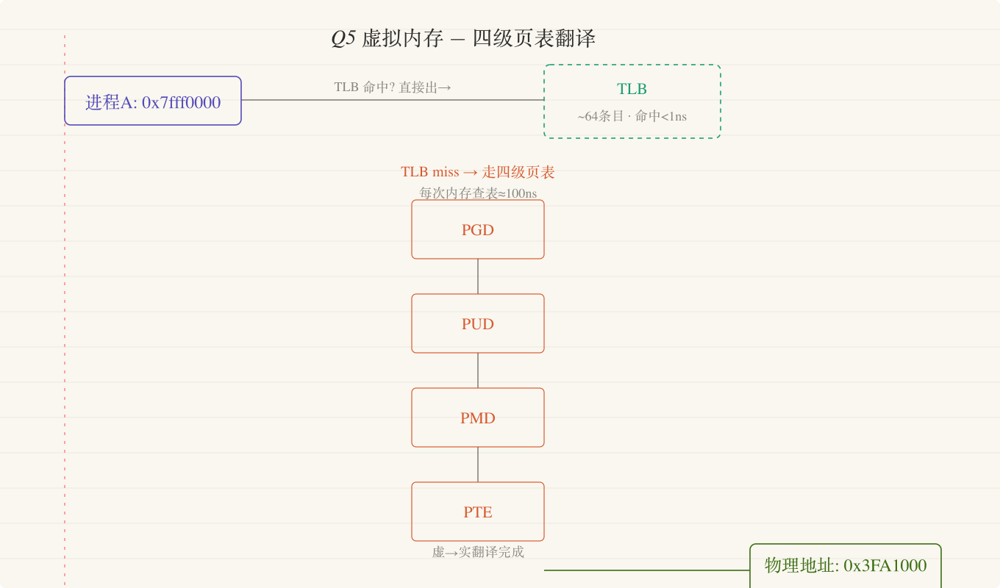

# 第一章 | 系统基石

> 从按下开机键到你的代码在 CPU 上跑起来——计算机最底层的运行逻辑。读完这一章，你不会觉得"电脑是个黑盒"，你会觉得"它是一台我能拆开看懂每一步的机器"。

---

## Q1 · 按下电源键到桌面出现——CPU在这3秒内执行的指令序列是什么？




### 你有没有思考过这么一个问题？

你每天按几十次开机键。

但你有没有盯着屏幕，看着那个转圈的加载图标，想过一个问题：**在这几秒钟里，CPU 到底在执行什么？**

它不是"在启动"——它在跑一条条具体的指令，每一步都有明确的目的、输入和输出。如果你能逐条说出这些步骤，你就真正理解了**"计算机是怎么活过来的"**。

### 底层发生了什么？

按下电源键的那一刻，CPU 还没有开始干活。

主板上的一块小芯片——南桥/芯片组中的**电源管理单元**——先收到信号，给 CPU 供电并释放 Reset 信号。

CPU 醒来后，它的**程序计数器（PC）** 被硬件强制指向一个固定地址。在 x86 架构下是 `0xFFFFFFF0`，位于 BIOS/UEFI 固件芯片的顶部 16 字节区域。

**这是 CPU 出生后会执行的第一条指令。**

---

**第一阶段：BIOS/UEFI 自检（POST）。**

固件做的第一件事是检查硬件是否"活着"。

- 初始化 CPU 寄存器
- 检测内存
- 枚举 PCIe 总线上的设备（显卡、网卡、NVMe 控制器）
- 初始化 USB 控制器以便键盘鼠标可用

如果内存检测失败，你会听到"滴滴"的蜂鸣声。这是固件在没有任何显示设备可用的情况下，**唯一能跟你"说话"的方式**。

---

**第二阶段：加载 Bootloader。**

固件从启动设备（硬盘的第一个扇区，或 EFI 系统分区）找到 Bootloader。

传统 BIOS 模式下，它读硬盘的**第 0 扇区（512 字节的 MBR）** 到内存地址 `0x7C00`，然后跳转过去。

这 512 字节里放不下完整的操作系统加载器。所以通常它只是一个**"二级加载器"**，负责找到并加载真正的 GRUB 或 systemd-boot。

UEFI 更现代——它理解 FAT32 文件系统，直接从 EFI 分区找到 `.efi` 文件执行。

---

**第三阶段：内核初始化。**

Bootloader 把 Linux 内核映像（bzImage）加载到内存，设置好启动参数，跳转到内核入口点。

内核先**解压自己**（是的，内核映像是压缩过的），然后从 `start_kernel()` 开始执行：

- 初始化**中断描述符表（IDT）**
- 初始化**内存管理子系统**（页表、slab 分配器）
- 初始化**调度器**
- 初始化 **VFS（虚拟文件系统层）**

最后，内核挂载根文件系统，执行第一个用户态进程——**`init`（或 systemd）**。PID 永远是 1，它是所有用户态进程的祖先。

---

**第四阶段：用户态启动。**

systemd 读取配置文件，按依赖关系启动服务：

```
挂载文件系统 → 设置网络 → 启动 dbus → 启动显示管理器 → 拉起图形会话 → 加载桌面环境
```

你看到了桌面。

整个过程中，CPU 执行的指令从**固件（BIOS/UEFI 的 SPI Flash 中的机器码）** → **内核（内存中的 x86 指令）** → **用户态程序（同样是 x86 指令，但通过系统调用与内核交互）**。

指令的"身份"在切换，**"执行"却在同一个 CPU 上从未停止**。

### 大白话解释

你的电脑启动，不是"啪一下就亮了"。

它像一个人每天早上起床的流程，但每一步都不能跳：

- 🧠 **先睁眼确认四肢健全**（BIOS 自检）
- 👔 **找出今天要穿的制服**（Bootloader 加载内核）
- 🔧 **穿戴整齐**（内核初始化内存、驱动、一切基础设施）
- 🚪 **推开家门开始新一天**（拉起登录界面）

你看到的桌面，是这个流程的**最后一步**——前面三步你已经错过了。

### 核心启示

> 开机流程教会我们一件事：**系统的"活过来"需要的不是魔法，是层层接力。** 每一层只负责把控制权交给下一层——固件交给 Bootloader、Bootloader 交给内核、内核交给 init。任何一层出错，整个链条断裂。分布式系统中"链式启动依赖"的风险，根源就在这个模型里。

---

## Q2 · `java HelloWorld`到屏幕打印出来——JVM到底做了什么？




### 你有没有思考过这么一个问题？

你写了三行 Java：

```java
public class HelloWorld {
    public static void main(String[] args) {
        System.out.println("hello world");
    }
}
```

敲下 `java HelloWorld`——屏幕上出现了"hello world"。熟悉吗？太熟悉了。

但如果被问到 **"JVM 从收到这行命令到打印出字，中间具体做了什么"**，你能说明白吗？

类从哪加载的？字节码什么时候变成机器码的？`System.out` 这个字段是谁初始化的？这背后是一条完整的链路。

### 底层发生了什么？

当你敲下 `java HelloWorld`：

---

**第一步：操作系统创建进程。**

shell 调用 `fork()` 创建一个子进程，然后 `execve()` 将当前进程的地址空间替换为 java 可执行文件。

此时，操作系统加载的是 java 命令本身（`/usr/bin/java`），也就是 **JVM 的启动器**。

---

**第二步：JVM 启动器初始化运行时环境。**

java 启动器做三件事：

- 解析**命令行参数**（`-classpath`、`-Xmx512m`、类名 `HelloWorld`）
- 定位 `JAVA_HOME` 下的 **`libjvm.so`**（HotSpot JVM 的核心动态库）
- 根据 `-Xms` 和 `-Xmx` 向操作系统申请一大块内存作为 **Java 堆**的初始空间

---

**第三步：类加载（Class Loading）。**

JVM 启动 **Bootstrap ClassLoader**——JVM 内置的、用 C++ 实现的加载器——从 `rt.jar` 加载核心类：

- `java.lang.Object`
- `java.lang.String`
- `java.lang.System`

接着启动 **Extension ClassLoader** 和 **Application ClassLoader**。

**关键：类加载是"懒加载"的。** 不是你指定的所有类一次性加载，而是用到谁才加载谁。所以你的 `HelloWorld.class` 被加载的同时，它引用的 `System` 类也被加载了。

---

**第四步：字节码验证和准备。**

类加载进来不是直接就用。

JVM 先对它做**字节码验证**——检查格式是否正确、跳转指令目标是否合法、操作数栈和局部变量表的类型是否一致。

验证通过后进入"准备"阶段：为静态变量分配内存并赋零值（不是你的初始化值，那是后面"初始化"阶段做的）。

---

**第五步：执行 `main()` 方法。**

JVM 调用 `HelloWorld.main(String[])`。

HotSpot JVM 默认**混合模式**：先**解释执行**，收集"热点"信息。

如果某段代码被反复执行（默认 10000 次触发 C1 编译），HotSpot 的 **JIT 编译器（C1 或 C2）** 会把它编译成**本地机器码**。

**这就是为什么 Java 越跑越快——JIT 在运行时不断优化热点代码。**

---

**第六步：`System.out.println` 怎么到屏幕？**

`System.out` 是一个 `PrintStream` 对象，底层封装了一个 `FileOutputStream`，再底层封装了一个文件描述符——**fd=1（标准输出）**。

`println` 最终调用 `write()` 系统调用，把 `"hello world\n"` 写入 fd=1。

操作系统收到 `write(1, "hello world\n", 12)` → 内核缓冲区里找到 fd=1 对应的终端驱动 → 终端驱动把字符渲染到你的屏幕上。

### 大白话解释

写 Java 就像你在一家跨国连锁餐厅点菜。

你给服务员一张中文菜单（**源代码**）→ 服务员把它翻译成后厨通用的"暗号"（**字节码**）→ 不同国家的后厨用的是不同的炉子和锅（**不同操作系统**）→ 这道"暗号"要在当地厨房里被翻译成厨师能直接操作的动作（**JIT 编译成本地机器码**）。

Go 语言的做法不同：它提前把所有中文菜单翻译成了各语种版本，让客人带着正确的版本直接去对应国家的厨房——不用现场翻译，更快，但失去了"当场调整"的灵活性。

另外，`System.out.println` 打印到屏幕，就像你给前台打电话说"帮我在大厅公告屏上打一行字"——你的话被传到公告屏的控制台（**标准输出 fd=1**），公告屏才显示字。

### 核心启示

> JVM 的存在证明了计算机科学里一条被无数次验证的铁律：**加一层抽象，解决一个问题，但引入一个新问题。** 字节码让你"一次编译，到处运行"（解决了跨平台问题），但引入了"运行时编译（JIT）的开销"和"预热问题"。这层抽象的价值取决于你的场景——如果你需要跨平台部署，JVM 是天才设计；如果你只需要在 Linux x86_64 上跑一个服务，Go 的静态编译更干净。

---

## Q3 · 进程、线程、协程——为什么Go用协程、Java用线程池？




### 你有没有思考过这么一个问题？

面试官问："进程和线程有什么区别？"

你脱口而出："进程是资源分配的基本单位，线程是 CPU 调度的基本单位。"

然后他追问："那**协程**呢？为什么 Go 用协程、Java 用线程池、Python 的异步又走了一条完全不同的路？"

这时候你发现，标准答案只能回答"是什么"，没法回答**"为什么"**。

"为什么"的答案藏在**调度成本**和**内存模型**的差异里。

### 底层发生了什么？

进程、线程、协程的本质区别，不是"谁轻谁重"。

核心问题是：**谁在管理这些执行单元——操作系统还是用户态运行时？**

---

**进程：最重的执行单元。**

每个进程有独立的**虚拟地址空间**（通过页表隔离），操作系统为每个进程维护一个 PCB（进程控制块）。

进程之间通信（IPC）必须通过内核——管道、共享内存、消息队列——因为它们的地址空间是互相隔离的。

**进程切换的代价极高：** 不仅要保存/恢复 CPU 寄存器，还要切换页表（导致 TLB 全部失效）、切换内存上下文。一次进程切换通常在 1-10 微秒量级，而且会有大量后续的 TLB miss。

---

**线程：进程内的执行流。**

同一进程的线程**共享虚拟地址空间**——所以线程切换不需要切换页表，代价远小于进程切换（通常在几十到几百纳秒）。

但共享地址空间也意味着**线程之间的数据竞争**——两个线程同时写同一个内存地址，结果不可预测。

这就是为什么需要互斥锁、原子操作、内存屏障——这些同步原语是"多线程共享内存"这个设计选择的代价。

Java 的线程是操作系统原生线程（**1:1 映射到内核线程**），优势是真正的并行——多核 CPU 上多个线程可以同时运行。代价是线程数受制于内核，通常一个进程只能创建几千个线程。

**这就是"线程池"存在的原因——复用固定数量的线程，避免频繁创建销毁。**

---

**协程：用户态调度的执行单元。**

关键区别：**协程的调度不由操作系统做，由语言的运行时或异步框架在用户态完成。**

Go 的 goroutine 启动时只有 2KB 的栈（按需增长），创建成本极低——一个 Go 程序可以轻松创建几十万个 goroutine。

**Go 的 GMP 调度模型：**
- **G（goroutine）**：你的协程
- **M（操作系统线程）**：实际执行者
- **P（逻辑处理器）**：P 的数量通常等于 CPU 核数

当一个 G 执行阻塞操作（如网络 IO、channel 操作），调度器不阻塞 M——而是把 G 放到等待队列，M 从 P 的本地队列取下一个 G 继续执行。

**这就是为什么 Go 可以用"同步的写法写出异步的性能"——阻塞操作被调度器透明地接管了，不浪费 CPU 周期。**

协程的代价：CPU 密集型的协程（比如一个 for 循环跑 10 秒）会一直占着 P 不放。**Go 1.14 引入异步抢占**——通过发送信号给阻塞的 M，强行打断长时间运行的 G。

Python 的异步（asyncio）和 Go 的协程走了一条不同的路。Python 没有真正的协程抢占调度——它是**合作式调度**：你必须显式地用 `await` 交出控制权。而且 Python 有 **GIL**，同一时刻只有一个线程执行 Python 字节码。

### 大白话解释

- **进程** = 一个独立的小公司，有自己的办公室和营业执照。开新公司很贵。
- **线程** = 同一家公司的不同员工，共享办公设备。沟通快但容易冲突。
- **协程** = 公司里的"灵活用工"。一个员工干到某一步需要等外卖（网络 IO），他不会傻站着——跟调度台说"我等等，你先让别人干活"。调度台在公司内部（用户态），切换成本极低。

Go 的 goroutine = 有智能排班系统的公司。  
Python 的 async/await = 员工必须主动举手说"我好了，下一个"。

### 核心启示

> 协程不是"比线程快"，它是**用更少的资源做更多的事**。线程池让你用 100 个线程处理 1000 个连接——每个连接轮流用线程。协程让你用协程处理 1000 个连接——当某个连接在等网络 IO 时，调度器自动切去做别的连接的计算。CPU 总数没变，但 CPU 的"闲置时间"被协程填满了。性能优化的本质，很多时候不是你让机器算得更快——而是**让机器少发呆**。

---

## Q4 · 一次 `read()` 系统调用从用户态到内核态到底发生了什么？




### 你有没有思考过这么一个问题？

你写：

```java
byte[] buf = new byte[1024];
new FileInputStream("data.txt").read(buf);
```

这行代码帮你从磁盘读了一个文件。

但"读文件"不是一个动作——是**一次跨越两个世界（用户态和内核态）的漫长旅程**。而且这个跨越比你想象的要贵得多。

### 底层发生了什么？

当 Java 的 `FileInputStream.read()` 调用发生时：

---

**第一步：用户态 → 触发系统调用。**

Java 的 read 经过几层 JVM 封装（`FileInputStream → FileDescriptor → native 方法`），最终调用 C 标准库的 `read()` 函数。

C 标准库通过 CPU 指令——在 x86-64 上是 **`syscall`**——触发从用户态到内核态的切换。

这个切换本身就不便宜：CPU 把当前用户态程序的寄存器状态（RIP、RSP、EFLAGS）保存到内核栈上，把栈指针切换到内核栈，把 CPU 的 CPL 从 Ring 3（用户态）切换到 Ring 0（内核态）。

**这是开销来源一：保存和恢复上下文。**

---

**第二步：内核态处理。**

内核的 `sys_read()` 函数被调用。

从文件描述符 fd 找到对应的 `struct file` → 从 `struct file` 找到对应的 inode（文件元数据）→ 调用 VFS 的 `vfs_read()` → 根据文件系统类型（ext4/xfs/btrfs）分发到对应的文件系统驱动。

---

**第三步：磁盘 IO。**

如果数据不在内核的 **page cache** 中（缓存未命中），文件系统驱动构造一个磁盘 IO 请求，交给块设备层，再由 IO 调度器把请求发给 NVMe 驱动。

驱动用 **DMA（直接内存访问）** 把磁盘数据搬到内存——**这一过程 CPU 不参与**。

DMA 完成后，磁盘控制器向 CPU 发一个硬件中断。"数据到了"，内核中断处理程序把等待这个 IO 的进程标记为"可运行"。

---

**第四步：数据复制。**

数据已经到了内核的 page cache 里。但用户程序要的是数据在**用户态内存**中。

内核做最后一次复制：用 **`copy_to_user()`** 把数据从内核空间复制到用户态提供的 `buf` 数组中。

**这是开销来源二——数据在内核态和用户态之间的拷贝。** 你读 100MB 的数据，这 100MB 就从内核内存复制到了用户内存。

---

**第五步：返回用户态。**

`syscall` 指令执行完毕，CPU 从内核栈恢复之前保存的用户态寄存器，CPL 切回 Ring 3，继续执行用户程序的下一条指令。

一次"读文件"的总开销 = **上下文切换（~几百纳秒）+ 磁盘 IO（如果未命中缓存，毫秒级）+ 数据复制（和读取量成正比）**。

**零拷贝优化：** Kafka 大量使用 **sendfile / mmap**——跳过"内核到用户态"的复制步骤，直接把数据从内核页缓存发到网卡，性能可以提高数十倍。

### 大白话解释

你和内核之间的交互，就像你去办证大厅办业务。

你填好表（**准备好 buf 参数**），走到窗口前说"我要读 1024 字节"（**发起 read 系统调用**）。

窗口工作人员（**内核**）接过你的申请，转身去数据库（**磁盘**）查。如果数据不在手边的文件夹里（**Page Cache 未命中**），他要去地下档案室（**磁盘**）一趟。

在档案室，他不需要自己搬箱子——有搬运工（**DMA 控制器**）帮他搬。搬运工搬完按铃（**发中断**）。工作人员把文件复印一份（**`copy_to_user`**）递到你手里。

**零拷贝（sendfile / mmap）** = 我不需要你复印给我了——你直接把文件发给网卡就行。步骤从"磁盘→内核→用户→内核→网卡"变成了"磁盘→内核→网卡"，少了两次穿越办证大厅的往返。

### 核心启示

> 系统调用的代价不是它做了什么，而是**每次"越境"的安检开销**。用户态和内核态的隔离是操作系统安全的基石——但安全有成本。高性能 IO 的几乎所有优化——零拷贝、IO 多路复用、io_uring——本质上都在做同一件事：**减少"出入境"的次数和每次入境的开销。**

---

## Q5 · 虚拟内存——每个进程都以为独占全部内存，这个幻象是怎么维持的？




### 你有没有思考过这么一个问题？

你在一个 16GB 内存的电脑上打开 50 个 Chrome 标签页、两个 IDE、一个 Docker、一堆后台服务。

每个进程都以为自己是这个电脑上**唯一的住户**，拥有 2^48 ≈ 256TB 的地址空间。它们互相看不见，永远碰不到对方的"地盘"。

这个幻象——叫**虚拟内存**——是操作系统的基石之一。但它是怎么实现的？

### 底层发生了什么？

虚拟内存的本质是一个**翻译层**。每个进程有自己的**页表（Page Table）**——一张巨大的映射表，把"虚拟地址"翻译成"物理地址"。

---

**四级页表翻译。**

虚拟地址的 48 位被切成 5 段：4 个 9 位段 + 1 个 12 位段。每一段是在四级页表中"查目录"的索引：

```
PGD → PUD → PMD → PTE → 物理页框号 + 偏移 → 最终物理地址
```

四级页表，四次内存访问——"查一次地址"本身就是在内存里"散步"。这太慢了。

---

**TLB：页表的缓存。**

CPU 内部有一个小缓存——**TLB（翻译后备缓冲区）**。

TLB 存储最近翻译过的虚拟地址→物理地址的映射。CPU 翻译地址时先查 TLB：

- **TLB 命中** → 一次 CPU 周期（<1ns）直接拿到物理地址
- **TLB 未命中** → 走完整的四级页表翻译 → 慢几十倍

这解释了为什么**上下文切换很贵**：CPU 从进程 A 切换到进程 B 时，A 的页表被换出（CR3 寄存器指向 B 的页表），**TLB 里的所有 A 的映射瞬间全部失效**。B 开始执行时，每次内存访问都在 TLB miss——直到 TLB "预热"回来。

---

**缺页（Page Fault）。**

当你访问一个有效虚拟地址、但它对应的物理页不在内存中时，MMU 触发缺页异常。

CPU 暂停当前指令 → 跳转到内核的缺页处理程序 → 内核分配物理页，从磁盘取数据 → 更新页表 → 重新执行那条触发异常的指令。

从进程的角度看，它完全不知道缺页发生过。它的指令只是执行得**稍微慢了一点**。

### 大白话解释

每个进程就像住在大酒店里的客人。前台（**MMU**）有一本房间分配表（**页表**）。

客人知道自己的房间号（**虚拟地址**），但实际住的房间（**物理地址**）可能跟号码不一样。前台每时每刻都在翻译"203 室客人"对应的实际房间号。

最常被访问的房间号贴在前台墙上的速查表（**TLB**）里——瞄一眼就知道。不太常用的房间号，前台要去档案柜翻分配表，慢许多。

如果新客人来了但所有房间都住满了（**物理内存不够**），经理（**内核**）把某间房的客人暂时请到地下室仓库（**swap**）去，腾出房间给新客人。整个过程客人毫不知情。

两个不同的客人可以有同样的假想房间号（**不同进程的同一虚拟地址**）——前台把他们的请求翻译到完全不同的实际房间。所以他们互相永远碰不到。

### 核心启示

> 虚拟内存是计算机科学史上最成功的抽象之一。它把一个物理上碎片化、多租户共享、容量有限的物理内存，伪装成每个进程独享的、连续的、无限的地址空间。这层抽象让进程不知道自己住在"合租房"里——这正是操作系统设计的核心哲学：**让每个进程活在自己的美好幻觉中，内核在底下收拾烂摊子。**
