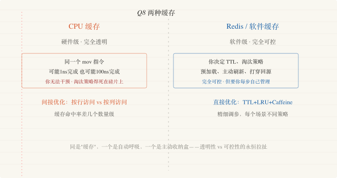
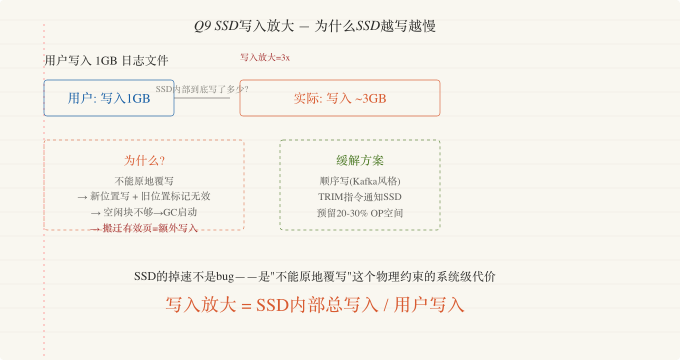
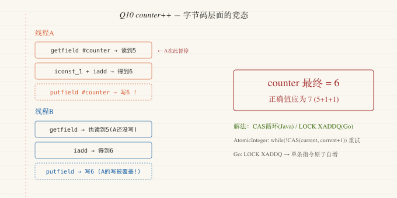
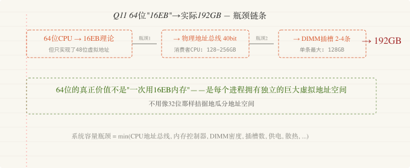
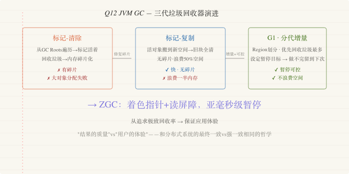

# 第一章 | 系统基石（续二）

---

## Q8 · CPU的L1/L2/L3缓存和Redis缓存——都是"缓存"，但为什么一个你完全控制不了？

### 你有没有思考过这么一个问题？

`redisTemplate.opsForValue().get("user:12345")` → 如果你打穿了 Redis、回源 MySQL、然后把结果写回 Redis——你是在手动管缓存的生命周期。你可以决定这个 key 过期多久、什么时候主动刷新。但在你的代码执行 `user.getName()` 时，CPU 内部正发生着比你快一百倍的缓存操作——L1/L2/L3 缓存完全是自动的、不可编程的。同样是缓存，一层的淘汰策略在你手里，另一层完全对你不可见。为什么？

### 底层发生了什么？

CPU 缓存和 Redis/软件缓存同名叫"缓存"，本质完全不同——关键在**透明性**。

CPU 缓存是硬件级的、完全透明的缓存。当 CPU 执行 `mov rax, [rbx]`（从内存地址 rbx 读数据到寄存器 rax）时，MMU 和缓存控制器自动做了以下事情：查 L1 缓存 → 命中则在 2-4 个 CPU 周期内返回 → 未命中则查 L2 → L3 → 主内存（~100 周期）。整个过程对 CPU 指令完全透明——同一个 `mov` 指令，可能 1ns 完成可能 100ns 完成，取决于数据当时在缓存的什么地方。CPU 缓存的替换策略（通常是伪 LRU 或自适应替换策略）是硬件焊接在硅片上的逻辑——你不能调、不能关、不能用代码干预。为什么？两个理由：一是速度——任何软件介入都会吃掉缓存速度优势（L1 命中只有 1ns，任何分支指令跳转都比这慢）；二是硬件设计哲学——缓存对程序完全透明，正是为此所有程序自动受益。如果让你写代码显式控制它，那就和直接给 GPU 手动分配 tiling buffer 一样。

软件缓存（Redis/Guava/Caffeine）是显式的、可控的——你决定什么数据放进去、TTL 设多久、怎样淘汰。这层缓存不透明，恰恰是因为你面对的数据访问模式不是均匀的：用户 12345 是 VIP——你单独给这个缓存设长 TTL。热门微博今天不同明天——你需要主动刷新和主动过期。

注意：尽管 CPU 缓存透明，你仍可以通过代码风格显著影响缓存性能——遍历矩阵时按行访问 vs 按列访问，缓存命中率相差几个数量级。这是**对隐式系统的间接优化**——你没控制缓存，但你控制了"访问模式"，间接驱动缓存行为。

### 大白话解释

CPU 缓存就像你身体的自动呼吸——你不需要想"现在吸、现在呼"，脑干替你做了。它极高效，但你不直接控制——你不能说"接下来这个深呼吸我要在肺里多憋 3 秒来优化后续 5 分钟的体能"。你只能间接影响——跑步加速时呼吸自动加深——你间接影响了呼吸频率，但你没直接"调参数"。

Redis 缓存就像你主动拿一个收纳盒把常用的东西放在手边。你知道什么东西常用，你决定放进去的时间和扔掉的标准。代价是你每次拿东西都要想"这个东西在不在盒子里，盒子满了要不要扔掉一些"——而 CPU 缓存完全不需要你做这些思考。

### 核心启示

> CPU 缓存和 Redis 缓存代表了两种截然不同的设计哲学：**"为我做一切"的透明性和"我来决定一切"的可控性**。透明系统自动优化一切但不能适应特殊场景；显式系统让你精细调整但引入认知和操作负担。这个哲学不仅适用于缓存——微服务拆分的透明通信（Service Mesh）vs 显式 RPC 调用，数据库自动查询优化 vs 手动索引设计——都是同一种在"透明"和"可控"之间的永恒拉扯。

---

## Q9 · SSD比HDD快一个数量级——但为什么写入多了会掉速？

### 你有没有思考过这么一个问题？

你给笔记本换了 SSD，启动速度从 2 分钟变成了 15 秒。但一年后你发现写入大文件变慢了——同一个 SSD，为什么"越用越慢"？这不是老化——是 SSD 内部的一个叫 GC（垃圾回收）的进程在背后疯狂擦除旧数据块。更坑的是：你的日志系统每天写入 500GB，一年后 SSD 可能提前报废。为什么会这样？你在设计写入密集型系统时，怎么避免这个问题？

### 底层发生了什么？

SSD 的核心矛盾——**NAND 闪存不能覆盖写入**。HDD 可以直接在原有磁道上覆写数据（原地更新），但 NAND 闪存在物理上必须先擦除一整个块（block，通常 128KB-256KB），然后才能写入新数据。擦除的单位（块）远远大于写入的单位（页，通常 4KB-16KB）。这就是"写入放大"的根源。

当你修改一个 4KB 的页时，SSD 的 FTL（闪存转换层）不能直接覆写那个页——它标记这个页为"陈旧"，在新位置写新数据，更新逻辑地址到物理地址的映射表。这会产生"陈旧的"页——数据被标记为无效但物理上仍占据空间。当空闲页不足时，SSD 的 GC 进程启动：找到一个有少量有效页的块 → 把其中仍然有效的页搬到新块 → 擦除整个旧块 → 标记旧块为空闲。但这个过程本身在写数据——把有效页搬到新块也消耗写入寿命——导致写入放大：你实际写入 1GB 用户数据，SSD 内部可能做了 3GB 物理写入（原始写入 + GC 搬迁写入）。

写入放大是 SSD 掉速和寿命缩短的根本原因。你的日志系统每天写入 500GB → SSD 每天内部写入 ~1.5TB → 一个 600TBW 耐用度的 SSD 只能撑约 400 天。

优化方案：
- **顺序写入比随机写入好**——顺序写不会产生大量碎片 → GC 搬迁少 → 写入放大低。这就是为什么 Kafka 用顺序写日志而不是随机更新索引。
- **TRIM 指令**——让 OS 主动告诉 SSD "这些块已经不要了" → SSD 在 GC 时可以跳过这些块的数据搬迁。你的文件系统需要启用 TRIM（Linux fstrim / Windows 的优化驱动器）。
- **预留 OP（Over-Provisioning）空间**——SSD 空闲块越多，GC 压力越小。留 20-30% 未分配空间可以显著降低写入放大。

### 大白话解释

SSD 写数据慢和寿命问题，就像你有一块白板。你不能只擦其中一个字——要擦就擦整块板。所以你写了一个新字，不是把旧字擦掉写新字，而是写在另一块干净的白板位置，在记事本（FTL 映射表）上记下"第 5 个字现在实际在板 3 位置"。时间长了，白板上到处是无效的旧字（陈旧的垃圾页）。忍无可忍时，你得把所有仍然有效的字一件件抄到新板（GC 搬迁），刷整个旧板（擦除块），才释放出可以写新字的干净空间。这个抄旧字的过程就是你文件写入之外的"隐形写入"——多做的动作消耗了白板的擦写次数。

### 核心启示

> SSD 的掉速不是 bug——**是"不能原地覆写"这个物理约束的系统级代价**。任何声称"解决了写入放大"的存储方案都在两个极端之间找平衡：要么接受覆写的性能开销（HDD 的随机 IO），要么接受 GC 的不可预测延迟（SSD 的写入放大）。没有免费的午餐——只有"把午饭的成本放在哪个环节"的选择。

---

## Q10 · `counter++`在线程下为什么不是"加1"那么简单？

### 你有没有思考过这么一个问题？

Java 里 `counter++` 不是原子操作——这个结论你知道。但你被问到"为什么 Java bytecode 的 `getfield` + `iadd` + `putfield` 三条指令为什么就导致了它不安全？AtomicInteger 的 `incrementAndGet()` 又是怎么保证原子性的？Go 的 `sync/atomic` 和 Python 的 GIL 又各自走上了什么不同的路？"——如果你只能回答"因为不是原子的"，你就错过了真正重要的部分：**不同语言的并发模型，本质上是不同的'共享内存安全契约'**。

### 底层发生了什么？

`counter++` 之所以不安全，不是因为它本身是条指令——是因为即使在字节码层面，它也是三条独立的指令，而线程可以在任何两条之间被切换。

Java 字节码：`getfield #counter`（从堆读取 counter 当前值到操作数栈）→ `iconst_1`（常量 1 入栈）→ `iadd`（两个栈顶值相加）→ `putfield #counter`（把结果写回堆）。线程 A 执行前三条后、`putfield` 前被暂停——线程 B 在这期间也执行了 getfield + iadd + putfield。B 写入增量值后，A 恢复——**A 把 B 的增量写盖过了**（A 在 B 修改之前读的值 + 1）。最终 counter 只加了 1 而不是 2。叫"lost update"——读-改-写有竞态。

AtomicInteger 解决：用 CAS——`while (!UNSAFE.compareAndSwapInt(this, valueOffset, current, current + 1))`——读到 current 后，在写回 value 之前的瞬间，如果在自己执行读取之间 value 已被别人改了，CAS 检测到→ 循环重试，直到它没有被改过而自己的更新写入成功。CAS CPU 指令（`cmpxchg` 在 x86 上 + LOCK 前缀）保证这个读-判断-写入的过程不会被中断——它是一个连续的、不可打断的硬件操作。

Go 用的是 `sync/atomic.AddInt64(&counter, 1)`——它被编译成单一汇编指令 `LOCK XADDQ`，直接对内存地址做原子自增。它不需要 CAS 循环。Python 有 GIL——同一时刻只执行一个 Python 线程——看似解决了竞争，但在 Python 中 `counter += 1` 跨多字节码指令时仍可被抢断——GIL 只保护字节码的解释执行不被同时另一解释执行篡改，不保护多层指令之间的间隔。

### 大白话解释

`counter++` 的问题就像你和小王在同一个表格的一个共用格子里填数：你扫一眼看到格子里是 5，脑子算一下 5+1=6，拿起笔准备写 6——小王动作快，先看到 5，算 6，写进去了。格子现在是 6。你再把自己的 6 写上去——你覆盖了他刚写的 6。正确的结果应该是 7（两个人各加 1），但格子里的数字被一个人的写入覆盖了。

AtomicInteger（CAS）就像你在写之前多了个"核验"步骤：看一下格子里的数字是不是还是刚才你看到的那个数。如果不是（有人已经改了），把你的计算作废，重新扫、重新算、重新写。`LOCK XADDQ`（Go）就像你直接跟格子说"给我把数字加 1"——格子确认并保证在它接受你的"加 1"指令时，没有任何人能插入别的修改。这是硬件级别的保证。

### 核心启示

> 线程安全不是"加把锁"或"用原子类"——**是选择你的程序在哪个抽象层级接收来自硬件的保证**。CPU 能保证单个 `LOCK` 前缀指令的原子性，但保证不了你的业务模型。"保证金额只减不增、金额到零就停、多个账户同时操作不冲突"——这些不是原子类能解决的，他们是你设计并发控制（乐观锁/悲观锁/事务隔离级别）的任务。理解硬件的原子性保证，不意味着"用它代替锁"——意味着"在其之上构建你业务需要的安全保证"。

---

## Q11 · "64位系统支持16EB内存"——实际上为什么只能插192GB？

### 你有没有思考过这么一个问题？

你买新电脑，"64 位 CPU，支持 16EB 内存"——听起来很高级。但你往主板上插内存条，最多插 192GB。服务器主板能插到好几 TB。为什么伟大的"64 位"承诺没有兑现？瓶颈不在 CPU 的字长（64 位）——在各个更小的环节。

### 底层发生了什么？

首先明确一个关键误解：64 位 CPU 不等于能使用 2^64 字节内存。目前主流 64 位 CPU（AMD Zen、Intel Core）实际实现了 48 位虚拟地址（256TB 虚拟空间）——高 16 位要么全 0 要么全 1，不用作地址翻译。物理地址总线的宽度更小——目前消费者 CPU 大约支持 40-46 位物理地址。

这就到了第一个瓶颈——CPU 物理地址总线。你的 CPU 封装中的内存控制器决定了最多能接多少根地址线——也就决定了支持的最大物理内存。消费者 CPU 通常支持 128-256GB，工作站 CPU 支持 2-8TB。

第二个瓶颈——DIMM 插槽和内存条密度。主板物理上只有 2-4 个内存插槽。单条内存条的最大容量受制于 DRAM 芯片密度。当前技术下单条最高 128GB（高端服务器 RDIMM）。

第三个瓶颈——内存控制器通道数。消费者 CPU 通常有双通道内存——你插的所有内存条共享这个带宽。一个通道配一个 DIMM 时带宽最优，但容量上限也因此被物理插槽限制。

### 大白话解释

CPU "64 位"就像你有一本可以写 1 万页的地址本，理论上有无限的记录容量。但实际上：你的笔最多写 30 行/页（CPU 没那么多物理线），你的抽屉只放了 200 页本子（主板 DIMM 槽有限），你的每张纸最多写 10 行（内存条密度有限）。最终你能用的远不到 1 万页。但没关系——你的大部分生活不需要记比 50 个地址更多的事。"64 位"更多是为了虚拟地址空间——不是为了让你一次用 1000 页，而是让你在这 50 页之间自由移动的"地图坐标"足够宽。

### 核心启示

> 技术规格里的"最大XXX"通常是个理论值，它由链条中最细的一环决定。存储的"最大容量"是地址总线、内存控制器、DIMM 密度、供电散热等几十个因素的"最小值"'。这给我们做系统设计的一个教训：不要被顶层规格蒙蔽——**任何系统容量瓶颈都发生在最底层物理实现的一个小环节**。

---

## Q12 · JVM的GC——它怎么知道一块内存可以回收了？

### 你有没有思考过这么一个问题？

你写 `String s = new String("hello"); s = null;`——你声明了不再需要这块内存。但这不是 GC 回收它的方式。GC 靠的是"从 GC Roots 可达的对象活，不可达的会被回收"——但它是怎么知道一个对象"不可达"的？整个过程怎么做到不卡死你的程序？G1 和 ZGC 为什么能大幅降低暂停时间？

### 底层发生了什么？

GC 的基础算法——标记-清扫：从 GC Roots（栈上局部变量、静态变量、JNI 引用）出发，遍历对象图。被遍历到的对象标记为"活"，遍历不到的对象标记为"垃圾"——清扫阶段回收垃圾。标记-清扫的问题是：回收后的内存是不连续的——大对象可能找不到连续空间分配，触碰"分配失败"。

标记-复制算法解决碎片：内存分成两块，一块活跃空间存放对象，空间满时把仍然活着的对象搬到另一块空白空间，整块旧空间一次性变成空白。它的弊端：浪费一半内存永远闲置——两块之一一直空着。

G1（Garbage First）：分代假设——大多数对象活不长（年轻代），少量长寿对象（年老代）。G1 把堆划分为相同大小的区域——一个区域可以属于 Eden 或 Survivor 或 Old——每次 GC 只回收少量区域（"优先回收垃圾最多的区域"——Garbage First）。这种"增量回收"让你可以设定暂停时间目标——GC 在目标时间内做尽可能多的工作，剩下的留到下次 GC。

ZGC：使用着色指针和读屏障——标记阶段和应用程序同步运行，清扫也不暂停应用。核心是在指针的 64 位里借出几位元数据标志，通过硬件 MMU 维持隔离。这让暂停时间降到亚毫秒级。

### 大白话解释

GC 就像一个图书馆整理系统。每个进去过的人和登记过的书（GC Roots）都有一个专属读者。如果你进图书馆但从来没在任何登记表上出现、所有登记表也没有你的名字——你是一本"没人知道存在的书"——被清理。标记-清扫就是管理员在登记表上把所有在表上的书做个记号，没记号的书被清掉。标记-复制就是把"活着的书"搬到一座新书架，旧书架直接扔掉——速度快但浪费一个空书架。

### 核心启示

> GC 的历史是从"垃圾回收"到"垃圾管理"的演进。早期 GC 在意"能收回多少"——尽力回收任何垃圾。当代 GC 在意的是"用户够流畅吗"——在暂停时间目标内回收该回收的垃圾，剩余垃圾"先放着"，留到下次 GC。**从"追求极致回收率"到"保证应用体验"——这个关键转换在几乎所有分布式系统和缓存设计中反复出现：最终一致性 vs 强一致、允许丢帧的实时视频 vs 要求精确的数据库事务——都是"结果的质量"vs"用户的体验"之间的取舍。**
